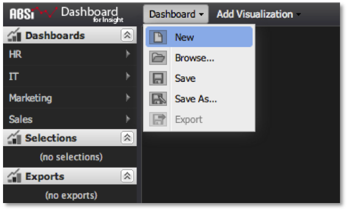

# Creazione di un dashboard{#creating-a-dashboard}

La creazione di un dashboard è consigliata anche per esigenze analitiche a breve termine e ad hoc.

>[!NOTE]
>
>Gli utenti di sola lettura non possono creare dashboard. Questa sezione si applica solo agli utenti e agli amministratori regolari.

Gli utenti possono decidere di creare dashboard per diversi motivi:

* È possibile iniziare da zero una nuova dashboard per l’analisi immediata, senza l’intento di riutilizzare o condividere la dashboard.
* È possibile creare una nuova dashboard allo scopo di eseguire analisi personali che si desidera salvare e riutilizzare, ma non condividere.
* È possibile creare, salvare e condividere una nuova dashboard, accessibile anche agli altri utenti. In ogni caso, ogni scenario inizia allo stesso punto: un quadro dashboard vuoto.

>[!NOTE]
>
>Prima di iniziare a creare il dashboard, è consigliabile ridurre la percentuale di query a un valore basso, ad esempio 10 o 25 percento. Questo consente di estrarre campioni di dati dal workbench dati molto più velocemente rispetto all&#39;esecuzione di una query completa. Poiché questi risultati campionati restituiscono molto più rapidamente, offre la capacità di risposta ideale durante la definizione del dashboard e dell&#39;analisi. Una volta pronti per eseguire le query per il completamento, potete aggiornare il parametro query-to al 100%. Per regolare il completamento della query, consultate il parametro [Query-to](../../../home/c-adobe-data-workbench-dashboard/c-dashboards/c-query-to-parameter.md#concept-33db106e28bc4108bca9e8d0a440d323).

Per creare una nuova dashboard, selezionate **[!UICONTROL New]** nel menu Dashboard.

Vi verrà presentato un quadro dashboard vuoto pronto per l&#39;aggiunta e la configurazione di visualizzazioni in base alle vostre esigenze di analisi. Durante il lavoro, non verrà aggiornato nulla sul server fino al salvataggio.

Quindi, decidete quale tipo di dati visualizzare e come visualizzarlo. In genere è utile iniziare con le visualizzazioni delle tabelle per visualizzare i dati non elaborati e quindi creare altri grafici in base alle esigenze. Per informazioni dettagliate su come aggiungere e configurare le visualizzazioni, consulta [Creazione di visualizzazioni](../../../home/c-adobe-data-workbench-dashboard/c-visualizations/t-creating-visualizations.md#task-c6f1d20fa2484aeeb9a8487625054ecf). Dopo aver aggiunto e configurato le visualizzazioni per creare il dashboard, si ottiene quanto segue:

Da questo punto è possibile eseguire semplicemente l&#39;analisi ed eliminare il dashboard, oppure scegliere di salvare il dashboard sul server per riutilizzarlo e/o condividerlo. Per informazioni su come interagire con un dashboard per eseguire l&#39;analisi, consultate la sezione [Selezione all&#39;interno del dashboard](../../../home/c-adobe-data-workbench-dashboard/c-making-selections-within-the-dashboard/c-making-selections-within-the-dashboard.md#concept-0989862de0044cc4bbfd7f4441275fc4).
