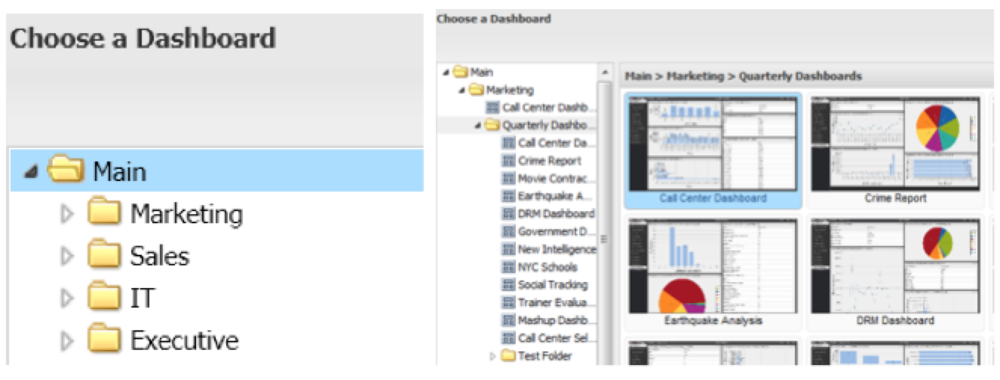

# Visualizzazioni del browser del dashboard{#dashboard-browser-views}

Spiega la visualizzazione miniature e la vista a elenco.

Sono disponibili due visualizzazioni che possono essere utilizzate per navigare tra le dashboard nel browser del dashboard: la Vista miniature e la Vista a elenco. La visualizzazione miniature fornisce le miniature delle dashboard durante la navigazione, mentre la visualizzazione a elenco è una visualizzazione basata su tabelle più dettagliata delle dashboard disponibili.

## Visualizzazione miniature {#section-b522ce5e6e184ef9a0e1b9a42f7a9ae0}

La visualizzazione miniature fornisce una raccolta di miniature corrispondenti alle dashboard a cui puoi accedere. Se un&#39;icona di una miniatura visualizza un&#39;icona predefinita, contatta l&#39;amministratore per avere una miniatura impostata per tale dashboard. Le icone a sinistra della barra di ricerca consentono di passare da Miniatura a Vista elenco e viceversa.

Nella visualizzazione miniature, nel pannello di navigazione a sinistra del Browser dashboard viene visualizzata la gerarchia delle cartelle che organizza l’archiviazione delle dashboard. Per visualizzare il contenuto di una cartella, fate clic su di essa per visualizzarne il contenuto come miniature nel pannello centrale del Browser del dashboard. Se non sono presenti dashboard salvati in quel livello della cartella, nel pannello centrale della finestra verrà visualizzato il messaggio &quot;no dashboards in this location&quot; (nessuna dashboard in questa posizione).

È inoltre possibile esplorare le sottocartelle facendo clic sulla freccia a sinistra della cartella di interesse. Verrà espanso un elenco di sottocartelle e dashboard all’interno della cartella selezionata. Selezionando una cartella che contiene almeno un dashboard, il pannello centrale visualizza una miniatura per ciascuna delle dashboard situate al livello della selezione. Il titolo del pannello centrale viene modificato anche per indicare il percorso della cartella selezionata.

Per selezionare il dashboard di interesse, fai clic su di esso. Dopo aver fatto clic sulla miniatura di un dashboard, il frame destro si popolerà con i dettagli del dashboard. I dettagli del dashboard contengono una visualizzazione in miniatura del dashboard selezionato, il suo nome, una breve descrizione, il proprietario, la data di creazione, l&#39;ultima data di modifica, i profili utilizzati per compilare i dati, i controlli di visibilità e offre una selezione di operazioni.

## Vista a elenco {#section-aa79d51168a7430ea2816413dc6cc73a}

Nella Vista a elenco sono disponibili informazioni basate su tabelle sulle dashboard a cui puoi accedere. Ogni riga nella tabella della Vista a elenco rappresenta un dashboard univoco. Facendo clic sulle intestazioni di colonna potrai ordinare la tabella in base a tale colonna in ordine decrescente o crescente.

Facendo clic su una voce del dashboard verranno visualizzati i dettagli del dashboard nel pannello di destra del browser del dashboard. Per passare da una visualizzazione all’altra, seleziona nuovamente l’opzione di visualizzazione desiderata.
