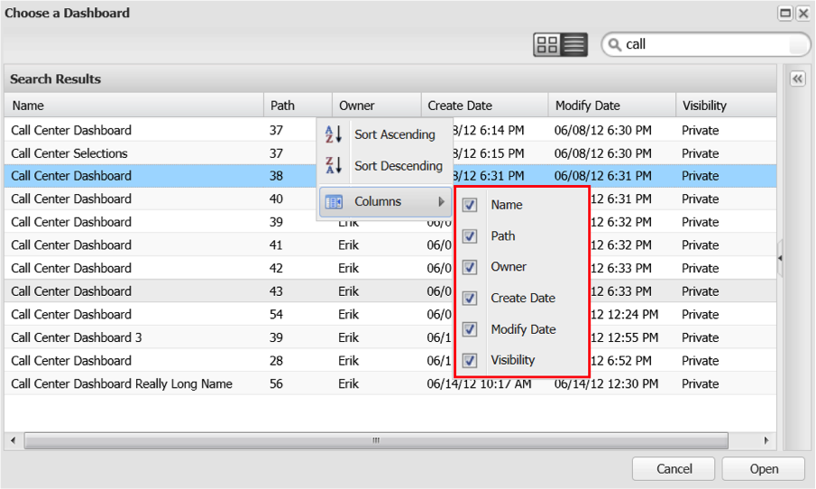

# Ricerca nel browser Dashboard{#searching-within-the-dashboard-browser}

Il Browser dashboard consente inoltre di eseguire ricerche per trovare le dashboard esistenti.

Per eseguire una ricerca, usate la casella di ricerca nella barra degli strumenti del browser del dashboard. I risultati della ricerca verranno visualizzati nel Browser dashboard durante la digitazione. Per cancellare una ricerca in qualsiasi momento, eliminate il testo di ricerca o fate clic sull’ **[!UICONTROL X]** icona nella casella di ricerca.

Potete anche ordinare i risultati utilizzando le funzioni di ordinamento in ciascuna intestazione di colonna. Facendo clic sull’intestazione di una colonna, verrà attivato l’ordinamento della colonna. Potete inoltre accedere alle opzioni di ordinamento mediante il menu a discesa in ogni intestazione di colonna.

Questo **[!UICONTROL Columns]** menu consente inoltre di modificare le colonne visibili nella vista elenco del dashboard. Qui è possibile attivare o disattivare la visibilità delle colonne selezionando o deselezionando le colonne desiderate.

## Pannello Dettagli {#section-e1e5a5a0f9cc4eb89b0b94764587ae9c}

Nel pannello Dettagli dashboard sono visualizzate le informazioni dettagliate di un dashboard insieme a una versione in miniatura del dashboard. Le informazioni presenti nel pannello includono il nome del dashboard, una breve descrizione, il proprietario e la data di creazione, l’ultima data in cui è stato modificato e i profili utilizzati per creare il dashboard. In questo pannello è disponibile anche la visibilità del dashboard (privata o condivisa).
