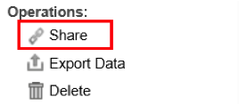

# Altre funzioni del dashboard{#other-dashboard-functions}

Le funzioni speciali includono la condivisione, l&#39;esportazione e l&#39;eliminazione di dashboard e vengono eseguite dal pannello dei dettagli di una dashboard selezionata.

## Condivisione di un collegamento ipertestuale del dashboard {#section-16b592f157de404fb25bd2c739d2e2c1}

L&#39; **[!UICONTROL Share]** operazione fornisce un URL che può essere utilizzato per contrassegnare il dashboard o per inviare un collegamento a un altro utente per accedere al dashboard. Viene visualizzata una finestra Collegamento dashboard che fornisce le informazioni necessarie per condividere il collegamento al dashboard desiderato.

>[!NOTE]
>
>I destinatari del collegamento devono inoltre avere accesso al dashboard per visualizzare il dashboard.

## Esportazione dei dati del dashboard {#section-ace2f5f8807548ee8436f5c1dc2cd9d2}

L&#39; **[!UICONTROL Export Data]** operazione avvia un&#39;esportazione del dashboard selezionato da salvare come file Excel o CSV (Comma Separated Values).

## Eliminazione di dashboard {#section-adc10cb1b3174ff699c024ddc8f994fa}

L&#39; **[!UICONTROL Delete]** operazione elimina una dashboard. Per eliminare un dashboard, l&#39;utente deve essere il proprietario del dashboard o avere accesso amministratore. Facendo clic sull&#39;operazione Elimina viene visualizzata una finestra per confermare l&#39;eliminazione del dashboard.

