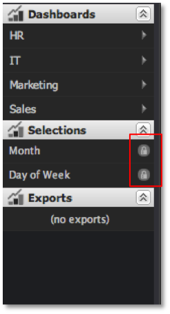

# Rimozione di selezioni{#removing-selections}

Le selezioni possono essere rimosse in qualsiasi momento.

È sufficiente fare clic sull&#39;icona **[!UICONTROL X]** all&#39;interno della voce di selezione corrispondente nel Menu di selezione.

Se le selezioni di una visualizzazione sono bloccate, viene visualizzata una piccola icona a forma di lucchetto che sostituisce l’ icona **[!UICONTROL X]** . Le selezioni bloccate non possono essere rimosse senza prima sbloccare la visualizzazione.

