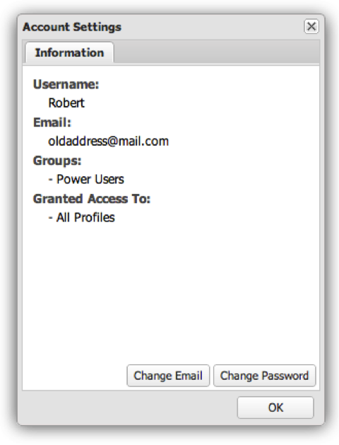

# Gestione account utente{#user-account-management}

{{eol}}

Informazioni su come accedere alle impostazioni del tuo account e modificare la tua password.

## Accesso alle informazioni sull’account {#section-7c39e79d8d6445059c9a6237e140bc6a}

Per accedere alle informazioni sul tuo account, seleziona Impostazioni account dal menu Utente.

Viene visualizzata una finestra che descrive le informazioni sul tuo account. Questo include il tuo nome utente, l&#39;indirizzo e-mail, l&#39;iscrizione al gruppo e i profili dati disponibili. Per verificare che il tuo profilo utente sia stato configurato correttamente e che tu abbia accesso a tutti i profili dati, puoi esaminare i profili elencati nella sezione Accesso concesso a . Se mancano i profili dati, contatta l’amministratore.

## Modifica della password {#section-4ba1ee3d5d584455a1a77e992b7b876c}

Per cambiare la password, accedi innanzitutto alle informazioni del tuo account. Per accedere alle informazioni sul tuo account, seleziona **[!UICONTROL Account Settings]** dal **[!UICONTROL User]** menu. Fai clic su **[!UICONTROL Change Password]**.
