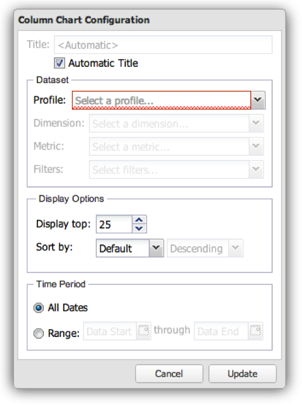
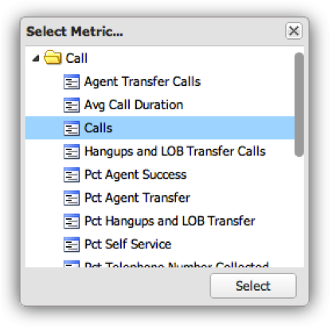

# Configurazione delle visualizzazioni{#configuring-visualizations}

Mostra come configurare Titolo, Profilo, Dimension, Metrica, Filtro, Visualizza in alto, Ordina per e Periodo di tempo.

Ogni visualizzazione nell’area di lavoro del dashboard presenta una propria configurazione. Quando una visualizzazione viene aggiunta per la prima volta all’area di lavoro del dashboard, la relativa finestra di configurazione viene visualizzata automaticamente. Una volta configurata, puoi modificare la visualizzazione in qualsiasi momento facendo clic sull’icona a forma di ingranaggio nella parte superiore destra della finestra di visualizzazione.

>[!NOTE]
>
>Le opzioni di configurazione variano leggermente a seconda del tipo di visualizzazione visualizzato.

## Titolo visualizzazione {#section-0414844283d745ae912e85f8ea14a51d}

Questo campo ti consente di personalizzare il titolo visualizzato nella parte superiore della visualizzazione. Per impostazione predefinita, il titolo è impostato su **[!UICONTROL Automatic Title]**, che genera automaticamente un titolo per la finestra di visualizzazione. Deselezionando il pulsante **[!UICONTROL Automatic Title]** , puoi inserire un titolo in questo campo. Questo campo si applica a tutte le visualizzazioni.

## Profilo {#section-16eb0def0a2d4eb289f5bb9200d14754}

Questo campo ti consente di selezionare il profilo da cui visualizzare i dati. Fai clic sul menu a discesa per ottenere un elenco di profili a cui hai accesso. Questo campo non è applicabile alle visualizzazioni Rich Text.

I profili sono set di dati definiti all’interno di Data Workbench che contengono dati su un determinato dominio, insieme a dimensioni, metriche e filtri che accompagnano i dati. Un profilo è spesso progettato per soddisfare uno scopo specifico (come il marketing o il traffico del sito web).

>[!NOTE]
>
>Puoi visualizzare solo i profili a cui ti è stato concesso l’accesso. Per ulteriori informazioni, vedere Controlli di accesso.

## Dimensione {#section-4ebb8c4308a146c3a35c7ac7ab6b579f}

Consente di selezionare la dimensione da visualizzare. L’elenco viene compilato dall’elenco delle dimensioni disponibili dal profilo selezionato nel campo Profilo . Fai clic sulla dimensione desiderata, quindi fai clic sul pulsante Seleziona . Questo campo non è applicabile alle visualizzazioni Metric Legends (Legende metriche) e Rich Text (Testo avanzato).

I Dimension sono categorie di tipi di dati simili. Ad esempio, la dimensione Giorni della settimana è composta dai seguenti elementi dati: Domenica, lunedì, martedì, mercoledì, giovedì, venerdì e sabato. I Dimension mostrano cosa viene misurato.

## Metriche {#section-7d46f2f1b9fe4e539b5eb0a0dc6e5ad3}

Consente di selezionare le metriche da visualizzare. Le metriche sono oggetti quantitativi e sono definite da alcune espressioni quantificabili. Ad esempio, Visualizzazioni pagina per sessione viene derivata dall’espressione del conteggio delle visualizzazioni pagina diviso per il conteggio delle sessioni. Le metriche rispondono alla domanda &quot;quanti?&quot;

Le visualizzazioni a metrica singola presentano una finestra di selezione a metrica singola:

Le visualizzazioni con più metriche presentano una finestra di selezione con più metriche:

L’elenco viene compilato dall’elenco delle metriche disponibili dal profilo selezionato nel campo Profilo .

Fai clic sulle metriche desiderate e quindi fai clic su **[!UICONTROL Select]**. Questo campo non è applicabile alle visualizzazioni Rich Text.

## Filtri {#section-f8619ae2f8e54735a2c1b0fbb8bb1281}

Seleziona i filtri da applicare alla visualizzazione. La finestra di selezione del filtro consente di selezionare più filtri dall’elenco dei filtri. L’elenco viene compilato dall’elenco dei filtri disponibili nel profilo selezionato nel campo Profilo . Fai clic sul filtro desiderato, quindi fai clic su **[!UICONTROL Select]**.

>[!NOTE]
>
>I filtri applicati qui vengono applicati solo alla visualizzazione corrispondente, non all’intero dashboard. È utile per confrontare i risultati di due visualizzazioni diverse con i diversi filtri applicati.

## Mostra punti massimi {#section-7ce71cb0fa6446998b710b427e68b133}

Le visualizzazioni nel dashboard non sono progettate per visualizzare tutti i dati. Consentono invece di specificare il numero di record di dimensioni da visualizzare sulla visualizzazione. In questo modo viene visualizzato il numero superiore di dimensioni in base al valore di ordinamento fornito di seguito. Questo campo non è applicabile alle visualizzazioni Tabelle, Legende metriche e Rich Text.

## Ordina per {#section-f686249e20444359bff87c00cc2ba29f}

Ciò ti consente di specificare in che modo i dati devono essere ordinati quando vengono visualizzati all’interno della visualizzazione. Questo campo non è applicabile alle visualizzazioni Tabelle, Legende metriche e Rich Text. Sono disponibili diverse opzioni di ordinamento:

* **[!UICONTROL Default]** - Restituisce i dati non ordinati in base all’ordinamento memorizzato in Data Workbench. Questa è l’opzione da utilizzare per i dati basati sul tempo, ad esempio ora, giorno, settimana o mese.
* **[!UICONTROL Dimension]** - Ordina i dati in base al valore della dimensione alfanumerica.
* **[!UICONTROL Metric]** - Ordina i dati in base al valore della metrica ed è utile per visualizzare rapidamente le dimensioni principali.
* **[!UICONTROL Descending]** - Ordinare i dati in ordine decrescente.
* **[!UICONTROL Ascending]** - Ordinare i dati in ordine crescente.

## Periodo di tempo {#section-6220368e9e524b46ac735add6ab9edb0}

Questa visualizzazione ti consente di specificare la data di inizio e/o di fine desiderate per i dati da visualizzare all’interno della visualizzazione.

Selezionando **[!UICONTROL All Dates]**viene visualizzato l’intero intervallo di date disponibile nel profilo.

Selezionando **[!UICONTROL Range]** vengono visualizzati solo i dati che rientrano in un intervallo specificato. Per inserire l’intervallo di date, è possibile digitare la data di inizio e/o di fine oppure utilizzare un input del calendario selezionando l’icona del calendario.

Questo campo non è applicabile alle visualizzazioni Rich Text.

>[!NOTE]
>
>Gli intervalli di date applicati qui vengono applicati solo alla visualizzazione corrispondente, non all’intero dashboard. È utile per confrontare i risultati di due visualizzazioni diverse con intervalli di date diversi applicati.

