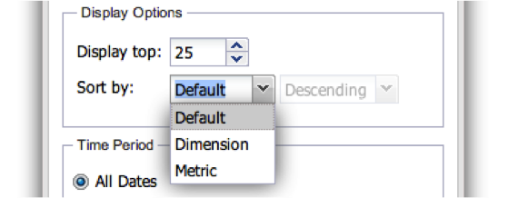

# Configurazione delle visualizzazioni{#configuring-visualizations}

Mostra come configurare Titolo, Profilo, Dimensione, Metrica, Filtro, Visualizza in alto, Ordina per e Periodo di tempo.

Ogni visualizzazione nel quadro del dashboard ha una propria configurazione. Quando una visualizzazione viene aggiunta per la prima volta al quadro comandi, viene visualizzata automaticamente la relativa finestra di configurazione. Una volta configurata, la visualizzazione può essere modificata in qualsiasi momento facendo clic sull’icona a forma di ingranaggio nella parte superiore destra della finestra di visualizzazione.

>[!NOTE]
>
>Le opzioni di configurazione variano leggermente a seconda del tipo di visualizzazione visualizzato.

## Titolo visualizzazione {#section-0414844283d745ae912e85f8ea14a51d}

Questo campo consente di personalizzare il titolo visualizzato nella parte superiore della visualizzazione. Per impostazione predefinita, il titolo è impostato su **[!UICONTROL Automatic Title]**, che genererà automaticamente un titolo per la finestra di visualizzazione. Deselezionando il **[!UICONTROL Automatic Title]** pulsante, è possibile inserire un titolo in questo campo. Questo campo si applica a tutte le visualizzazioni.

## Profilo {#section-16eb0def0a2d4eb289f5bb9200d14754}

Questo campo consente di selezionare il profilo dal quale visualizzare i dati. Fai clic sul menu a discesa per ottenere un elenco dei profili a cui puoi accedere. Questo campo non è applicabile alle visualizzazioni RTF.

I profili sono insiemi di dati definiti all&#39;interno del workbench dati che contengono dati su un determinato dominio, insieme a dimensioni, metriche e filtri che accompagnano i dati. Un profilo è spesso progettato per soddisfare uno scopo specifico (ad esempio, marketing o traffico di siti Web).

>[!NOTE]
>
>Potete visualizzare solo i profili per i quali vi è stato concesso l’accesso. Per ulteriori informazioni, vedere Controlli di accesso.

## Dimensione {#section-4ebb8c4308a146c3a35c7ac7ab6b579f}

Consente di selezionare la dimensione da visualizzare. L’elenco viene compilato dall’elenco delle dimensioni disponibili dal profilo selezionato nel campo Profilo. Fate clic sulla quota desiderata, quindi fate clic sul pulsante Seleziona. Questo campo non è applicabile alle visualizzazioni Leggende metriche e RTF.

Le dimensioni sono categorie di tipi di dati simili. Ad esempio, la dimensione Giorni della settimana è composta dai seguenti elementi di dati: Domenica, lunedì, martedì, mercoledì, giovedì, venerdì e sabato. Le dimensioni mostrano cosa si sta misurando.

## Metriche {#section-7d46f2f1b9fe4e539b5eb0a0dc6e5ad3}

Consente di selezionare le metriche da visualizzare. Le metriche sono oggetti quantitativi e sono definite da alcune espressioni quantificabili. Ad esempio, Visualizzazioni di pagina per sessione è derivato dall&#39;espressione del numero di Visualizzazioni di pagina divise per il numero di Sessioni. Le metriche rispondono alla domanda &quot;quanti?&quot;

Le visualizzazioni a metrica singola dispongono di una finestra di selezione a metrica singola:

Le visualizzazioni multi-metriche dispongono di una finestra di selezione multi-metrica:

L&#39;elenco viene compilato dall&#39;elenco di metriche disponibili dal profilo selezionato nel campo Profilo.

Fai clic sulle metriche desiderate, quindi fai clic su **[!UICONTROL Select]**. Questo campo non è applicabile alle visualizzazioni RTF.

## Filtri {#section-f8619ae2f8e54735a2c1b0fbb8bb1281}

Seleziona i filtri che desideri applicare alla visualizzazione. La finestra di selezione del filtro consente di selezionare più filtri dall&#39;elenco dei filtri. L&#39;elenco viene compilato dall&#39;elenco di filtri disponibili dal profilo selezionato nel campo Profilo. Fate clic sul filtro desiderato, quindi fate clic **[!UICONTROL Select]**.

>[!NOTE]
>
>I filtri applicati qui vengono applicati solo alla visualizzazione corrispondente, non all’intero dashboard. Questo è utile per confrontare i risultati di due diverse visualizzazioni con diversi filtri applicati.

## Visualizza suggerimenti {#section-7ce71cb0fa6446998b710b427e68b133}

Le visualizzazioni nel dashboard non sono progettate per visualizzare tutti i dati. Consentono invece di specificare il numero di record di dimensione che desideri visualizzare sulla visualizzazione. Viene visualizzato il numero superiore di dimensioni in base al valore di ordinamento indicato di seguito. Questo campo non è applicabile alle visualizzazioni Tabelle, Leggende metriche e RTF.

## Ordina per {#section-f686249e20444359bff87c00cc2ba29f}

Questo consente di specificare l’ordine dei dati quando vengono visualizzati all’interno della visualizzazione. Questo campo non è applicabile alle visualizzazioni Tabelle, Leggende metriche e RTF. Sono disponibili diverse opzioni di ordinamento:

* **[!UICONTROL Default]** - Restituisce i dati non ordinati in base all&#39;ordinamento memorizzato nel workbench dati. Questa è l&#39;opzione da utilizzare per i dati temporizzati come ora, giorno, settimana o mese.
* **[!UICONTROL Dimension]** -Ordinare i dati in base al valore della dimensione alfanumerica.
* **[!UICONTROL Metric]** - Ordinare i dati in base al valore della metrica ed è utile per visualizzare rapidamente le dimensioni principali.
* **[!UICONTROL Descending]** - Ordinare i dati in ordine decrescente.
* **[!UICONTROL Ascending]** - Ordinare i dati in ordine crescente.

## Periodo di tempo {#section-6220368e9e524b46ac735add6ab9edb0}

Questa visualizzazione consente di specificare la data iniziale e/o finale desiderata per i dati da visualizzare all’interno della visualizzazione.

Selezionando **[!UICONTROL All Dates]**viene visualizzato l&#39;intero intervallo di date disponibile nel profilo.

Selezionando **[!UICONTROL Range]** vengono visualizzati solo i dati che rientrano in un intervallo specificato. Per immettere l&#39;intervallo di date, è possibile digitare la data di inizio e/o di fine, oppure utilizzare l&#39;input del calendario selezionando l&#39;icona del calendario.

Questo campo non è applicabile alle visualizzazioni RTF.

>[!NOTE]
>
>Gli intervalli di date applicati qui vengono applicati solo alla visualizzazione corrispondente, non all’intero dashboard. Questo è utile per confrontare i risultati di due diverse visualizzazioni con diversi intervalli di date applicati.

