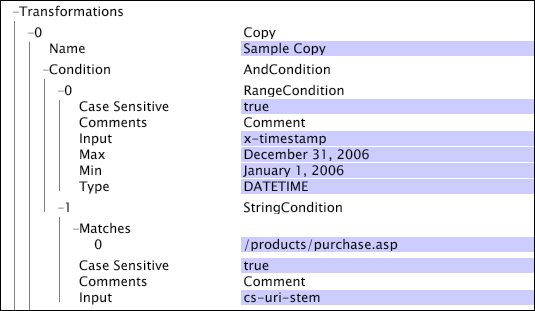

# Operazioni booleane{#boolean-operations}

Le operazioni booleane combinano i risultati delle operazioni di test, che funzionano come elementi secondari delle operazioni booleane.

Per informazioni sulle operazioni di test, vedere Operazioni [di](../../../../home/c-dataset-const-proc/c-conditions/c-test-ops/c-test-ops.md#concept-c4bf6cb9e7a94cc7ac49ca9b0b1a2144)test. Quando si definisce un&#39; [!DNL boolean] operazione, è possibile definire zero o più elementi secondari per l&#39;operazione.

**Aggiunta di una condizione figlio a un&#39;operazione booleana**

1. Fare clic con il pulsante destro del mouse sul nome o sul numero corrispondente all&#39; [!DNL Boolean] operazione.
1. Fate clic su **[!UICONTROL Add new child]** e scegliete uno dei tipi di condizioni disponibili da aggiungere.
1. Ripetere i passaggi 1 e 2 finché non sono state aggiunte tutte le condizioni figlio desiderate per l&#39; [!DNL Boolean] operazione.

   >[!NOTE]
   >
   >Quando si fa clic con il pulsante destro del mouse sul nome o sul numero corrispondente a un&#39; [!DNL Boolean] operazione, viene visualizzata l&#39;opzione di [!DNL Add new sibling] menu. Un elemento di pari livello è un’altra condizione che si trova nella stessa posizione relativa nella gerarchia delle condizioni dell’ [!DNL Boolean] operazione su cui si è fatto clic con il pulsante destro del mouse. L&#39;aggiunta di un nuovo elemento di pari livello per un&#39; [!DNL Boolean] operazione equivale all&#39;aggiunta di una nuova condizione facendo clic con il pulsante destro del mouse sul [!DNL Condition] parametro o [!DNL Log Entry Condition] .

**Per rimuovere una condizione figlio da un&#39;operazione booleana:**

1. Fare clic con il pulsante destro del mouse sul nome della condizione figlio o sul numero corrispondente alla condizione figlio che si desidera rimuovere dall&#39; [!DNL Boolean] operazione.
1. Fare clic su **[!UICONTROL Remove]** &lt;* **[!UICONTROL #number]***>, dove il numero corrisponde alla condizione figlio che si desidera rimuovere.

In questa sezione vengono illustrate le seguenti condizioni:

* [E](../../../../home/c-dataset-const-proc/c-conditions/c-test-ops/c-boolean-ops.md#section-a14dba4b07cc4ab9aeb20868f773db7c)
* [Nessuno](../../../../home/c-dataset-const-proc/c-conditions/c-test-ops/c-boolean-ops.md#section-7e48b61266aa43ecbc48b979bf5e939b)
* [Oppure](../../../../home/c-dataset-const-proc/c-conditions/c-test-ops/c-boolean-ops.md#section-a3aa0f56b6234f2680fa81939228326b)

## E {#section-a14dba4b07cc4ab9aeb20868f773db7c}

La [!DNL And] condizione può avere zero o più condizioni figlie e restituisce true se nessuno dei nodi figlio restituisce false.

La [!DNL And] condizione forma l&#39;operazione principale di tutti i test di condizione all&#39;interno del server workbench dati. Se la [!DNL And] condizione non contiene elementi secondari, la condizione restituisce true e l&#39;operazione associata procede. Questo è il motivo per cui le azioni che hanno solo la [!DNL And] condizione come test di condizione vengono sempre eseguite e per cui vengono utilizzate come radice per tutti i test di condizione.

In questo esempio viene illustrato come viene utilizzata una [!DNL And] condizione per garantire che la [!DNL Copy] trasformazione si verifichi solo quando la data della voce di registro si è verificata nell&#39;anno 2006 e che la pagina richiesta è stata [!DNL /products/purchase.asp].

## Nessuno {#section-7e48b61266aa43ecbc48b979bf5e939b}

La [!DNL Neither] condizione può avere zero o più condizioni figlio e restituisce false se una delle condizioni figlio restituisce true. Se la [!DNL Neither] condizione non contiene elementi figlio, nessuno dei relativi elementi figlio può restituire true. Di conseguenza, la [!DNL Neither] condizione restituisce true.

L&#39;esempio seguente mostra una [!DNL Neither] condizione con due [!DNL Range] condizioni come elementi secondari. Come definito, la [!DNL Neither] condizione esclude le voci di registro che si sono verificate tra il 1° gennaio 2007 e il 10 gennaio 2007 o tra il 12 gennaio 2007 e il 14 gennaio 2007. Tale condizione può essere utilizzata come [!DNL Log Entry Condition] per eliminare le transazioni da un set di dati nei periodi in cui si è verificato un problema noto con i dati raccolti.

## Oppure {#section-a3aa0f56b6234f2680fa81939228326b}

La [!DNL Or] condizione può avere zero o più condizioni figlio e restituisce true se almeno una delle condizioni figlio restituisce true. Se la [!DNL Or] condizione non contiene elementi figlio, nessuno dei relativi elementi figlio può restituire true. Di conseguenza, la [!DNL Or] condizione restituisce false.

Questo esempio mostra la [!DNL Or] condizione con una [!DNL String Match] condizione e una [!DNL Range] condizione come elementi secondari. La [!DNL Or] condizione è soddisfatta solo se il valore della voce di registro è [!DNL x-hasproblem] impostato su yes o se la voce di registro si è verificata nell’intervallo compreso tra il 1 gennaio 2007 e il 10 gennaio 2007.

