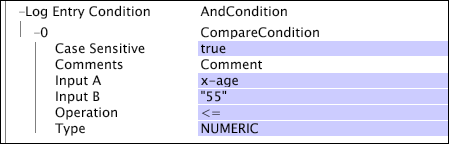

# Condizioni di funzionamento del test{#test-operation-conditions}

{{eol}}

Informazioni sulle condizioni delle operazioni di test, tra cui confronto, non vuoto, intervallo, espressione regolare e corrispondenza delle stringhe.

* [Confronto](../../../../home/c-dataset-const-proc/c-conditions/c-test-ops/c-test-op-con.md#section-fb2bdb3838504099b324b9838cdeeaac)
* [Non vuoto](../../../../home/c-dataset-const-proc/c-conditions/c-test-ops/c-test-op-con.md#section-1decb9d887894073a1b6b3d985729ac8)
* [Range](../../../../home/c-dataset-const-proc/c-conditions/c-test-ops/c-test-op-con.md#section-1db31583bb09418b8f49481a897b08a6)
* [Regular Expression (Espressione regolare)](../../../../home/c-dataset-const-proc/c-conditions/c-test-ops/c-test-op-con.md#section-ae9c016502cb44128760c58f2d2d5297)
* [Corrispondenza stringa](../../../../home/c-dataset-const-proc/c-conditions/c-test-ops/c-test-op-con.md#section-f8d132085c6b4500bfbe4515b848142f)

## Confronto {#section-fb2bdb3838504099b324b9838cdeeaac}

La [!DNL Compare] condizione confronta valori stringa o numerici. Per i confronti dei valori stringa, è possibile specificare se considerare il caso.

I parametri del [!DNL Compare] Le condizioni sono descritte nella tabella seguente:

<table id="table_05B1FBB2AED242D99081E62BE2FBEC60"> 
 <thead> 
  <tr> 
   <th colname="col1" class="entry"> Parametro </th> 
   <th colname="col2" class="entry"> Descrizione </th> 
   <th colname="col3" class="entry"> Impostazione predefinita </th> 
  </tr> 
 </thead>
 <tbody> 
  <tr> 
   <td colname="col1"> Distintivo tra maiuscole e minuscole </td> 
   <td colname="col2">True o false. Utilizzato solo se il tipo è  LEXICO. Se è impostato su false, le lettere maiuscole e minuscole vengono considerate uguali. </td> 
   <td colname="col3"> true </td> 
  </tr> 
  <tr> 
   <td colname="col1"> Commenti </td> 
   <td colname="col2"> Facoltativo. Note sulla condizione. </td> 
   <td colname="col3"> Commenti </td> 
  </tr> 
  <tr> 
   <td colname="col1"> Ingresso A </td> 
   <td colname="col2"> Il primo dei due valori da confrontare. Questo valore rappresenta l'operando sinistro nella condizione . </td> 
   <td colname="col3"> </td> 
  </tr> 
  <tr> 
   <td colname="col1"> Ingresso B </td> 
   <td colname="col2"> Il secondo dei due valori da confrontare. Questo valore rappresenta l'operando corretto nella condizione . </td> 
   <td colname="col3"> </td> 
  </tr> 
  <tr> 
   <td colname="col1"> Funzionamento </td> 
   <td colname="col2"> 
Operazione di confronto. Le operazioni disponibili (e il loro significato) sono i seguenti: 
     <ul id="ul_74F3C298E9CC4FE89897BA0052A9EB9F"> 
      <li id="li_1605FA73474E404A84056D40E7082623"> = o == (l'input A è uguale all'input B) </li> 
      <li id="li_F694A262ED7A4787B2A68B877339620C"> &lt;&gt; oppure != (l'input A non è uguale all'input B) </li> 
      <li id="li_1A75437E23B64BEB92297E1C771092B0"> &lt; (L'input A è inferiore all'input B) </li> 
      <li id="li_B80ED6BE9DEA41FE84BC6BA3B7759276"> &lt;= (l'input A è minore o uguale all'input B) </li> 
      <li id="li_93148F34065F489E8E198DFB9F9F0E70"> &gt; (L'ingresso A è maggiore dell'ingresso B) </li> 
      <li id="li_8A98EE9AED2445429805169040BB253D"> &gt;= (L'input A è maggiore o uguale all'input B) </li> 
     </ul> 
 </td> 
   <td colname="col3"> = </td> 
  </tr> 
  <tr> 
   <td colname="col1"> Tipo </td> 
   <td colname="col2">Tipo di confronto da effettuare. I tipi disponibili sono  LEXICO,  NUMERICOe  DATETIME. Per una descrizione dei tipi, consulta <a href="../../../../home/c-dataset-const-proc/c-conditions/c-test-ops/c-test-types.md#concept-a9fca97a2f03464cb0cbab8b5f809d0a"> Tipi di test per le operazioni di test</a>. </td> 
   <td colname="col3">  LEXICO </td> 
  </tr> 
 </tbody> 
</table>

In questo esempio viene utilizzato un [!DNL Compare] condizione per definire [!DNL Log Entry Condition]. Mentre il server di Data Workbench legge ogni record di dati evento, confronta i valori numerici x-age e 55. Se per una data voce di registro, x-age è minore o uguale a 55, la voce di registro è inclusa nel processo di costruzione del set di dati.

## Non vuoto {#section-1decb9d887894073a1b6b3d985729ac8}

La [!DNL Not Empty] verifica un campo per verificare se contiene un valore o se è vuoto. La condizione viene soddisfatta per qualsiasi voce di registro il cui valore per [!DNL Input] campo non vuoto.

I parametri del [!DNL Not Empty] Le condizioni sono descritte nella tabella seguente:

| Parametro | Descrizione | Impostazione predefinita |
|---|---|---|
| Commenti | Facoltativo. Note sulla condizione. | Commenti |
| Ingresso | Nome del campo dalla voce di registro per verificare il contenuto. |  |

Questo esempio prende come input x-some-field e verifica se il campo non è vuoto. La condizione viene soddisfatta se il campo è compilato.

## Range {#section-1db31583bb09418b8f49481a897b08a6}

La [!DNL Range] La condizione prende un campo di input e determina se il valore di quel campo rientra, globalmente, nei valori di parametro minimi (Min) e massimi (Max) specificati.

I parametri del [!DNL Range] Le condizioni sono descritte nella tabella seguente:

<table id="table_1587D8D333804FC28024C0DFC2F2D4D3"> 
 <thead> 
  <tr> 
   <th colname="col1" class="entry"> Parametro </th> 
   <th colname="col2" class="entry"> Descrizione </th> 
   <th colname="col3" class="entry"> Impostazione predefinita </th> 
  </tr> 
 </thead>
 <tbody> 
  <tr> 
   <td colname="col1"> Distintivo tra maiuscole e minuscole </td> 
   <td colname="col2">True o false. Utilizzato solo se  Tipo è  LEXICO. Se è impostato su false, le lettere maiuscole e minuscole vengono considerate uguali. </td> 
   <td colname="col3"> true </td> 
  </tr> 
  <tr> 
   <td colname="col1"> Commenti </td> 
   <td colname="col2"> Facoltativo. Note sulla condizione. </td> 
   <td colname="col3"> Commenti </td> 
  </tr> 
  <tr> 
   <td colname="col1"> Ingresso </td> 
   <td colname="col2"> Nome del campo dalla voce di registro da utilizzare come input. </td> 
   <td colname="col3"> </td> 
  </tr> 
  <tr> 
   <td colname="col1"> Min </td> 
   <td colname="col2"> 
Limite inferiore dell'intervallo. 
 
 Il valore di questo parametro deve essere un valore letterale o una stringa, non un nome di campo. Se si utilizza una data per questo campo, è necessario specificare un fuso orario. Per un elenco delle abbreviazioni del fuso orario supportate, vedi <a href="../../../../home/c-dataset-const-proc/c-time-zone.md#concept-9b540ec3e770490d94e9d5a985765477"> Codici del fuso orario</a>. 
 </td> 
   <td colname="col3"> </td> 
  </tr> 
  <tr> 
   <td colname="col1"> Max </td> 
   <td colname="col2"> 
Limite superiore dell'intervallo. 
 
 
Nota: Il valore di questo parametro deve essere un valore letterale o una stringa, non un nome di campo. Se si utilizza una data per questo campo, è necessario specificare un fuso orario. Per un elenco delle abbreviazioni del fuso orario supportate, vedi <a href="../../../../home/c-dataset-const-proc/c-time-zone.md#concept-9b540ec3e770490d94e9d5a985765477"> Codici del fuso orario</a>. 
 
 </td> 
   <td colname="col3"> </td> 
  </tr> 
  <tr> 
   <td colname="col1"> Tipo </td> 
   <td colname="col2">Tipo di confronto da effettuare. I tipi disponibili sono  LEXICO,  NUMERICOe  DATETIME. Per una descrizione dei tipi, consulta <a href="../../../../home/c-dataset-const-proc/c-conditions/c-test-ops/c-test-types.md#concept-a9fca97a2f03464cb0cbab8b5f809d0a"> Tipi di test per le operazioni di test</a>. </td> 
   <td colname="col3"> </td> 
  </tr> 
 </tbody> 
</table>

In questo esempio viene utilizzato un [!DNL Range] condizione per definire [!DNL Log Entry Condition]. Come il server di Data Workbench legge tutti [!DNL event data] record, confronta i valori numerici x-age e 55. Se per una data voce di registro, x-age è almeno 55, la voce di registro è inclusa nel processo di costruzione del set di dati. In questo esempio viene eseguita la stessa funzione di [!DNL Compare] esempio di condizione. Vedi [Confronto](../../../../home/c-dataset-const-proc/c-conditions/c-test-ops/c-test-op-con.md#section-fb2bdb3838504099b324b9838cdeeaac).

>[!NOTE]
>
>Se il parametro Min o Max viene lasciato vuoto, il server di Data Workbench sostituisce i valori interi minimi o massimi disponibili. Il valore minimo è zero (0) e il valore massimo è infinito.

## Espressione regolare {#section-ae9c016502cb44128760c58f2d2d5297}

La [!DNL Regular Expression] il test delle condizioni utilizza la corrispondenza dei pattern delle espressioni regolari (vedi [Espressioni regolari](../../../../home/c-dataset-const-proc/c-reg-exp.md#concept-070077baa419475094ef0469e92c5b9c)) per determinare se il valore del campo di input specificato contiene una stringa che corrisponde a uno dei pattern specificati nel parametro Matches .

Se l’input è un vettore di stringhe, per il test viene utilizzato solo il primo valore nel vettore. La [!DNL Regular Expression] esegue confronti stringa completi. Se desideri identificare le sottostringhe, devi anteporre e aggiungere &quot;.&#42;&quot; nella stringa.

I parametri del [!DNL Regular Expression] Le condizioni sono descritte nella tabella seguente:

<table id="table_0BF5F89F87C9493B8DABA97620074FAD"> 
 <thead> 
  <tr> 
   <th colname="col1" class="entry"> Parametro </th> 
   <th colname="col2" class="entry"> Descrizione </th> 
   <th colname="col3" class="entry"> Impostazione predefinita </th> 
  </tr> 
 </thead>
 <tbody> 
  <tr> 
   <td colname="col1"> Distintivo tra maiuscole e minuscole </td> 
   <td colname="col2"> True o false. Se è impostato su false, le lettere maiuscole e minuscole vengono considerate uguali. </td> 
   <td colname="col3"> true </td> 
  </tr> 
  <tr> 
   <td colname="col1"> Commenti </td> 
   <td colname="col2"> Facoltativo. Note sulla condizione. </td> 
   <td colname="col3"> Commenti </td> 
  </tr> 
  <tr> 
   <td colname="col1"> Ingresso </td> 
   <td colname="col2"> Nome del campo dalla voce di registro da utilizzare come input. </td> 
   <td colname="col3"> </td> 
  </tr> 
  <tr> 
   <td colname="col1"> Corrisponde </td> 
   <td colname="col2"> 
Pattern di espressioni regolari da confrontare con il valore del campo di input. 
 
 <b> Per aggiungere un pattern di espressione regolare</b> 
     <ol id="ol_6D6467FF74334DEA8E8625C3B155D11D"> 
      <li id="li_9E13A63558FF44749C2E49BD50B7F770">Fai clic con il pulsante destro del mouse  Corrisponde. </li> 
      <li id="li_195A2F3B6B9442F5B1DACDE0FC96CE5C">Fai clic su  Aggiungi nuovo &gt;  Espressione regolare. </li> 
      <li id="li_225E98F8EF39426A9483B86EA2CFE6DF">Immettere l'espressione regolare desiderata nella casella di testo. </li> 
     </ol> 
 </td> 
   <td colname="col3"> </td> 
  </tr> 
 </tbody> 
</table>

Questo esempio illustra l&#39;utilizzo del [!DNL Regular Expression] condizione per far corrispondere un campo di dati raccolti dal traffico del sito web. La condizione restituisce true solo se il campo cs(referrer-query) contiene una stringa corrispondente all&#39;espressione regolare `campaign=C[1-9][0-9]{4}`. Questa espressione regolare corrisponde a qualsiasi stringa contenente `campaign=C12345`. Tuttavia, il pattern non corrispondeva alla stringa `campaign=C0123&` perché il primo carattere dopo il `C` non è compreso nell&#39;intervallo `1-9`.

## Corrispondenza stringa {#section-f8d132085c6b4500bfbe4515b848142f}

La [!DNL String Match] test di condizione per l&#39;uguaglianza delle stringhe. Prende un campo specificato come input e verifica il valore di quel campo in ogni voce di log rispetto alle stringhe specificate nel parametro Matches dell&#39;operazione. Se una di queste stringhe di corrispondenza sensibili all&#39;uso di maiuscole e minuscole corrisponde al valore nel campo di input specificato, l&#39;operazione restituisce true. Nel caso in cui [!DNL StringCondition] non contiene stringhe di corrispondenza, la condizione restituisce false. Se l’input è un vettore di stringhe, per il test viene utilizzato solo il primo valore (stringa) nel vettore.

<table id="table_BD599BAA5DD54B278813B6C38AC8DE6B"> 
 <thead> 
  <tr> 
   <th colname="col1" class="entry"> Parametro </th> 
   <th colname="col2" class="entry"> Descrizione </th> 
   <th colname="col3" class="entry"> Impostazione predefinita </th> 
  </tr> 
 </thead>
 <tbody> 
  <tr> 
   <td colname="col1"> Distintivo tra maiuscole e minuscole </td> 
   <td colname="col2"> True o false. Se è impostato su false, le lettere maiuscole e minuscole vengono considerate uguali. </td> 
   <td colname="col3"> true </td> 
  </tr> 
  <tr> 
   <td colname="col1"> Commenti </td> 
   <td colname="col2"> Facoltativo. Note sulla condizione. </td> 
   <td colname="col3"> Commenti </td> 
  </tr> 
  <tr> 
   <td colname="col1"> Ingresso </td> 
   <td colname="col2"> Nome del campo dalla voce di registro da utilizzare come input. </td> 
   <td colname="col3"> </td> 
  </tr> 
  <tr> 
   <td colname="col1"> Corrisponde </td> 
   <td colname="col2"> 
Stringa o stringhe corrispondenti al valore del campo di input. 
 
 <b>Per aggiungere una stringa</b> 
     <ol id="ol_9E32218C771445D88357960475FAD6EB"> 
      <li id="li_A700747858D0470491783E9B3933DAFE">Fai clic con il pulsante destro del mouse  Corrisponde. </li> 
      <li id="li_9D1A2462EA404B0F84426176737CAFED">Fai clic su  Aggiungi nuovo &gt;  Stringa. </li> 
      <li id="li_E84D2439B59548E5B1803C64A295A18E">Immettere la stringa desiderata nella casella di testo. </li> 
     </ol> 
 </td> 
   <td colname="col3"> </td> 
  </tr> 
 </tbody> 
</table>

In questo esempio vengono utilizzati i dati raccolti dal traffico del sito Web per illustrare l’utilizzo di [!DNL String Match] condizione. La condizione verifica se il campo di input (cs-uri-stem) corrisponde a una delle due stringhe specificate nel parametro Matches ed ha successo se il campo cs-uri-stem è la stringa esatta [!DNL /navigation/footer.asp] o la stringa esatta [!DNL /navigation/header.asp].

