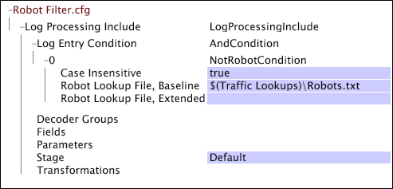

# Impostazioni specifiche per il web per l’elaborazione del registro{#web-specific-settings-for-log-processing}

{{eol}}

Informazioni sulle impostazioni specifiche per il Web definite in Elaborazione del registro Dataset Include files che vengono consegnati con i profili di Adobe per il sito.

Il filtro definito da queste impostazioni si verifica dopo che le voci di registro lasciano i decoder e le trasformazioni vengono applicate, ma prima della valutazione da parte del [!DNL Log Entry Condition].

* [Filtro dello stato HTTP](../../../home/c-dataset-const-proc/c-config-web-data/c-web-spec-log-proc.md#section-ac66acdcb6aa467d81c3721199e540fd)
* [Filtro robot](../../../home/c-dataset-const-proc/c-config-web-data/c-web-spec-log-proc.md#section-7f43681dfbc64b969619cb88f97d5ad5)

## Filtro dello stato HTTP {#section-ac66acdcb6aa467d81c3721199e540fd}

Puoi configurare la tua implementazione di [!DNL Site] per rimuovere dal set di dati le voci di registro con codici di stato sc pari o superiori a 400. Le richieste riuscite hanno codici di stato inferiori a 400. L’implementazione predefinita include un [!DNL Log Processing Dataset Include] file in cui è configurato il filtro dello stato HTTP.

**Per modificare le impostazioni di configurazione per il filtro dello stato HTTP**

1. Apri [!DNL Profile Manager] nel profilo del set di dati e apri la [!DNL Dataset\Log Processing\Traffic\HTTP Status Filter.cfg] file.

   >[!NOTE]
   >
   >Se hai personalizzato la tua implementazione di [!DNL Site], il file in cui esistono queste impostazioni di configurazione può essere diverso dalla posizione descritta.

1. Rivedi o modifica i valori dei parametri del file come desiderato. Utilizza il seguente esempio come guida.

   

   Per informazioni sulla [!DNL Range] condizione, vedi [Condizioni](../../../home/c-dataset-const-proc/c-conditions/c-abt-cond.md).

1. Salva il [!DNL HTTP Status Filter.cfg] facendo clic con il pulsante destro del mouse **[!UICONTROL (modified)]** nella parte superiore della finestra e facendo clic su **[!UICONTROL Save]**.

1. Per rendere effettive le modifiche apportate localmente, nella [!DNL Profile Manager], fai clic con il pulsante destro del mouse sul segno di spunta per il file nel [!DNL User] , quindi fai clic su **[!UICONTROL Save to]** > *&lt;**[!UICONTROL profile name]**>*, dove nome profilo è il nome del profilo di set di dati o del profilo ereditato a cui appartiene il file di set di dati include .

   >[!NOTE]
   >
   >Non salvare il file di configurazione modificato in nessuno dei profili interni forniti dall’Adobe, in quanto le modifiche vengono sovrascritte quando installi gli aggiornamenti a tali profili.

## Filtro robot {#section-7f43681dfbc64b969619cb88f97d5ad5}

Puoi configurare la tua implementazione di [!DNL Site] per utilizzare i file di ricerca per rimuovere dal set di dati le voci di registro generate da robot noti, script di test e indirizzi IP per gli utenti interni. L’implementazione predefinita include un [!DNL Log Processing Dataset Include] file in cui è configurato il filtraggio del robot.

**Per modificare le impostazioni di configurazione per il filtro robot**

1. Apri [!DNL Profile Manager] nel profilo del set di dati e apri la [!DNL Dataset\Log Processing\Traffic\Robot Filter.cfg] file.

   >[!NOTE]
   >
   >Se hai personalizzato la tua implementazione di [!DNL Site], il file in cui esistono queste impostazioni di configurazione può essere diverso dalla posizione descritta.

1. Rivedi o modifica i parametri del file utilizzando l’esempio seguente e le informazioni come guide:

   

   Il file include un [!DNL NotRobotCondition] è definito dai tre parametri seguenti:

   * **Filtro del robot senza distinzione maiuscole/minuscole:** True o false. Se true, la lettera maiuscola/inferiore non viene considerata nel filtro robot.
   * **File di ricerca robot, linea di base:** Il percorso e il nome del file di testo che contiene un elenco di agenti utente del browser che sono robot noti e devono essere filtrati fuori dal set di dati. L&#39;Adobe fornisce il file di ricerca robot della linea di base. Se non si specifica un percorso, il server di Data Workbench cerca questo file nella directory di ricerca all’interno della directory di installazione del server di Data Workbench.
   * **File di ricerca robot, esteso:** Il percorso e il nome del file di un file di testo facoltativo che contiene un elenco di agenti utente del browser o indirizzi IP che definiscono robot specifici per la tua implementazione. Questo elenco può includere robot di monitoraggio interni, script di test e indirizzi IP per gli utenti interni che devono essere filtrati fuori dal set di dati. Se non si specifica un percorso, il server di Data Workbench cerca questo file nella directory di ricerca all’interno della directory di installazione del server di Data Workbench.

   Se l’agente utente del browser di una voce di registro non è elencato in entrambi i file di ricerca, la voce di registro è considerata generata da un visitatore reale e non viene filtrata dal set di dati.

   >[!NOTE]
   >
   >La corrispondenza nei file di ricerca robot utilizza sottostringhe da confrontare con i campi c-ip e cs(user-agent) log. Se la stringa di ricerca inizia con &quot;$&quot;, deve corrispondere alla parte anteriore della stringa in fase di test e, se termina con &quot;$&quot;, la stringa di ricerca deve corrispondere alla fine della stringa in fase di test. Se la stringa di ricerca inizia con e termina con &quot;$&quot;, le stringhe devono corrispondere esattamente affinché la voce di registro venga filtrata. Ad esempio, per testare tutti gli indirizzi IP in un blocco di classe C, si utilizza una stringa come $231.78.123. per forzare una corrispondenza nella parte anteriore della stringa. Questo corrisponderebbe agli indirizzi da 231.78.123.0 a 231.78.123.255.

1. Salva il file facendo clic con il pulsante destro del mouse **[!UICONTROL (modified)]** nella parte superiore della finestra e facendo clic su **[!UICONTROL Save]**.

1. Per rendere effettive le modifiche apportate localmente, nella [!DNL Profile Manager], fai clic con il pulsante destro del mouse sul segno di spunta per il file nel [!DNL User] , quindi fai clic su **[!UICONTROL Save to]** > *&lt;**[!UICONTROL profile name]**>*, dove nome profilo è il nome del profilo di set di dati o del profilo ereditato a cui appartiene il file di set di dati include .

   Non salvare il file di configurazione modificato in nessuno dei profili interni forniti dall’Adobe, in quanto le modifiche vengono sovrascritte quando installi gli aggiornamenti a tali profili.

   >[!NOTE]
   >
   >Se è fondamentale che le voci di registro sottostanti utilizzate per creare un set di dati non vengano modificate (anche se le trasformazioni utilizzate per creare e aggiornare il set di dati e le relative dimensioni cambiano), è necessario controllare la versione i file di ricerca robot, la baseline e il file di ricerca robot, Extended. L&#39;inserimento di un numero di versione su questi file assicura che gli aggiornamenti ai file di ricerca robot predefiniti non cambino involontariamente i set di dati di reporting creati in precedenza aggiungendo o eliminando voci in questi file.
