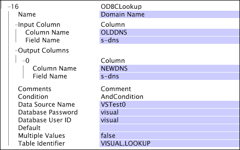

# Definizione delle trasformazioni di ricerca{#defining-lookup-transformations}

Informazioni sulle trasformazioni che è possibile utilizzare per incorporare dati di ricerca nel dataset.

Si noti che non tutti i tipi possono essere utilizzati durante entrambe le fasi del processo di costruzione del set di dati.

* [Categorizzare](../../../../home/c-dataset-const-proc/c-data-trans/c-int-lookup-data/c-def-lookup-transf.md#section-8474376c14e54d14ae73749696ada468)
* [FlatFileLookup](../../../../home/c-dataset-const-proc/c-data-trans/c-int-lookup-data/c-def-lookup-transf.md#section-e09b2eeb96444a859b14f03cdaab31f2)
* [ODBCLookup](../../../../home/c-dataset-const-proc/c-data-trans/c-int-lookup-data/c-def-lookup-transf.md#section-4dcc3747e42e45c0a057e85f308a83cc)

## Categorizzare {#section-8474376c14e54d14ae73749696ada468}

La [!DNL Categorize] trasformazione utilizza una tabella di ricerca a due colonne composta da coppie di pattern-stringa/valore. Durante questa trasformazione, il server workbench dati legge a turno ogni record di dati evento e confronta il contenuto di un campo designato nel record con ciascuna delle stringhe del pattern elencate nella prima colonna della tabella di ricerca. Se il campo designato corrisponde a una delle stringhe del pattern, il server workbench dati scrive il valore (trovato nella seconda colonna) associato alla stringa del pattern in un campo di output designato nel record.

Facoltativamente, le stringhe nella prima colonna della tabella di ricerca possono iniziare con il carattere ^ e/o terminare nel carattere $ per forzare la corrispondenza all&#39;inizio e/o alla fine. Questa trasformazione non accetta espressioni regolari per la definizione delle condizioni di corrispondenza nella prima colonna. Se il valore di input è un vettore di stringhe, ogni stringa viene eseguita attraverso la trasformazione e i risultati vengono aggiunti a una stringa di output vettore.

Una [!DNL Categorize] trasformazione è generalmente più semplice e veloce che utilizzare una [!DNL Regular Expression] trasformazione per ottenere lo stesso risultato.

>[!NOTE]
>
>Il test della sottostringa utilizzato in [!DNL Categorize] è sensibile alle maiuscole/minuscole, salvo diversa indicazione utilizzando il [!DNL Case Sensitive] parametro.

<table id="table_1773344FAAE34BD4919CC4414249FDEE"> 
 <thead> 
  <tr> 
   <th colname="col1" class="entry"> Parametro </th> 
   <th colname="col2" class="entry"> Descrizione </th> 
   <th colname="col3" class="entry"> impostazione predefinita </th> 
  </tr> 
 </thead>
 <tbody> 
  <tr> 
   <td colname="col1"> Nome </td> 
   <td colname="col2"> Nome descrittivo della trasformazione. Potete inserire un nome qualsiasi qui. </td> 
   <td colname="col3"> </td> 
  </tr> 
  <tr> 
   <td colname="col1"> Distinzione tra maiuscole e minuscole </td> 
   <td colname="col2"> True o false. Specifica se il test della sottostringa fa distinzione tra maiuscole e minuscole. </td> 
   <td colname="col3"> true </td> 
  </tr> 
  <tr> 
   <td colname="col1"> Commenti </td> 
   <td colname="col2"> Facoltativo. Note sulla trasformazione. </td> 
   <td colname="col3"> </td> 
  </tr> 
  <tr> 
   <td colname="col1"> Condizione </td> 
   <td colname="col2"> Condizioni in cui viene applicata la trasformazione. </td> 
   <td colname="col3"> </td> 
  </tr> 
  <tr> 
   <td colname="col1"> impostazione predefinita </td> 
   <td colname="col2"> Il valore predefinito da utilizzare se il test di condizione viene superato e nessuna voce nel file di classificazione corrisponde all'input, oppure se il campo di input non è definito nella voce di registro specificata. </td> 
   <td colname="col3"> </td> 
  </tr> 
  <tr> 
   <td colname="col1"> Delimitatore </td> 
   <td colname="col2"> 
Stringa utilizzata per separare le colonne nel file di ricerca. Deve essere un singolo carattere di lunghezza. 
 
 Se si tiene premuto il tasto Ctrl e si fa clic con il pulsante destro del mouse all'interno del parametro Delimiter, viene visualizzato un menu  Inserisci . Questo menu contiene un elenco di caratteri speciali che vengono spesso utilizzati come delimitatori. 
 </td> 
   <td colname="col3"> </td> 
  </tr> 
  <tr> 
   <td colname="col1"> Valori multipli </td> 
   <td colname="col2"> True o false. Se è true, quando più righe del file corrispondono all'input, ciascuna corrispondenza determina l'aggiunta di un valore al vettore di output delle stringhe. Se è false, nell'output viene utilizzata solo la prima riga corrispondente del file. In quest'ultimo caso, se l'input è un vettore, l'output è anche un vettore di lunghezza equivalente. Se l'input è una stringa semplice, anche l'output è una stringa semplice. </td> 
   <td colname="col3"> false </td> 
  </tr> 
  <tr> 
   <td colname="col1"> File </td> 
   <td colname="col2"> Percorso e nome file del file di classificazione. I percorsi relativi riguardano la directory di installazione del server workbench dati. Questo file si trova in genere nella directory Ricerche all'interno della directory di installazione del server workbench dati. </td> 
   <td colname="col3"> </td> 
  </tr> 
  <tr> 
   <td colname="col1"> Ingresso </td> 
   <td colname="col2"> Il file di classificazione corrisponde alle relative sottostringhe rispetto al valore in questo campo per identificare la riga corrispondente nel file. </td> 
   <td colname="col3"> </td> 
  </tr> 
  <tr> 
   <td colname="col1"> Uscita </td> 
   <td colname="col2"> Nome del campo associato al risultato. </td> 
   <td colname="col3"> </td> 
  </tr> 
 </tbody> 
</table>

**Considerazioni per la classificazione**

* Le modifiche ai file di ricerca nelle [!DNL Categorize] trasformazioni definite nel [!DNL Transformation.cfg] file o in un [!DNL Transformation Dataset Include] file richiedono la riconversione del set di dati. I file di ricerca per [!DNL Categorize] le trasformazioni definite nel [!DNL Log Processing.cfg] file o in un [!DNL Log Processing Dataset Include] file non sono soggetti a questa limitazione. Per informazioni sulla rielaborazione dei dati, vedere [Rielaborazione e trasformazione](../../../../home/c-dataset-const-proc/c-reproc-retrans/c-unst-reproc-retrans.md).

* [!DNL Categorize] le trasformazioni definite nel [!DNL Log Processing.cfg] file o in un [!DNL Log Processing Dataset Include] file ricaricano i file di ricerca ogni volta che i file di ricerca cambiano. Le modifiche non vengono applicate retroattivamente, ma vengono applicate a tutti i dati di registro letti dopo la modifica.

Questo esempio illustra l’utilizzo della [!DNL Categorize] trasformazione per integrare i dati di ricerca con i dati dell’evento raccolti dal traffico del sito Web. Supponiamo che un particolare sito Web abbia sezioni di business, e che vi sia il requisito di essere in grado di guardare e fare confronti in base al flusso di traffico e al valore generato dalle varie sezioni. È possibile creare un file di ricerca in cui siano elencate le sottostringhe utilizzate per identificare queste diverse sezioni.

Il file di ricerca [!DNL Lookups\custommap.txt] contiene la tabella seguente:

| /products/ | Prodotti |
|---|---|
| ^/sport/ | Sport |
| ^/news/ | News |
| ... | ... |

Questo file di categorizzazione mappa tutto ciò che contiene la stringa &quot;/products/&quot; al valore &quot;Products&quot;, qualsiasi cosa che inizia con &quot;/Sports/&quot; al valore &quot;Sports&quot;, e qualsiasi cosa che inizia con &quot;/news/&quot; al valore &quot;News&quot;. La seguente trasformazione di categorizzazione utilizza il valore nel campo cs-uri-stem come stringa all&#39;interno della quale si sta cercando una sottostringa corrispondente. Il risultato della trasformazione viene inserito nel campo x-custommap.

Presupponendo che il parametro Valori multipli sia impostato su false, l&#39;esempio produrrà i seguenti valori per x-custommap, in base ai valori elencati per cs-uri-stem.

| [!DNL cs-uri-stem] | [!DNL x-custommap] |
|---|---|
| [!DNL /sports/news/today.php] | Sport |
| [!DNL /sports/products/buy.php] | Prodotti |
| [!DNL /news/headlines.php] | News |
| [!DNL /news/products/subscribe.php] | Prodotti |

L&#39;output è basato sull&#39;ordine delle sottostringhe nel file di ricerca. Ad esempio, l&#39; [!DNL /sports/products/buy.php] elemento cs-uri restituisce &quot;Products&quot;. Anche se lo stelo URI inizia con &quot;/Sports/&quot;,&quot; la stringa &quot;/products/&quot; è elencata prima di &quot;/Sports/&quot; nel file di ricerca. Se il parametro Valori multipli fosse impostato su true, ci sarebbe un valore aggiuntivo per x-custommap, in quanto l&#39;ultimo esempio corrisponderebbe a due righe nella tabella di ricerca: Prodotti e notizie.

## FlatFileLookup {#section-e09b2eeb96444a859b14f03cdaab31f2}

La [!DNL FlatFileLookup] trasformazione utilizza una tabella di ricerca composta da un numero qualsiasi di colonne e righe (sebbene, ricordate che si trova nella memoria). Durante questo tipo di trasformazione, il server workbench dati legge a turno ogni record di dati evento e confronta il contenuto di un campo designato nel record con ciascuno dei valori di una colonna designata della tabella di ricerca. Se esiste una corrispondenza, il server workbench dati scrive uno o più valori dalla riga corrispondente nella tabella di ricerca in uno o più campi di output designati nel record di dati dell&#39;evento.

La tabella di ricerca utilizzata durante questa trasformazione viene compilata da un file semplice la cui posizione viene specificata al momento della definizione della trasformazione.

<table id="table_772B8ABF3B44493F99069010DDB5F77A"> 
 <thead> 
  <tr> 
   <th colname="col1" class="entry"> Parametro </th> 
   <th colname="col2" class="entry"> Descrizione </th> 
   <th colname="col3" class="entry"> impostazione predefinita </th> 
  </tr> 
 </thead>
 <tbody> 
  <tr> 
   <td colname="col1"> Nome </td> 
   <td colname="col2"> Nome descrittivo della trasformazione. Potete inserire un nome qualsiasi qui. </td> 
   <td colname="col3"> </td> 
  </tr> 
  <tr> 
   <td colname="col1"> Commenti </td> 
   <td colname="col2"> Facoltativo. Note sulla trasformazione. </td> 
   <td colname="col3"> </td> 
  </tr> 
  <tr> 
   <td colname="col1"> Condizione </td> 
   <td colname="col2"> Condizioni in cui viene applicata la trasformazione. </td> 
   <td colname="col3"> </td> 
  </tr> 
  <tr> 
   <td colname="col1"> impostazione predefinita </td> 
   <td colname="col2"> Il valore predefinito da utilizzare se la condizione è soddisfatta e se nessuna voce nel file di ricerca corrisponde all'input. </td> 
   <td colname="col3"> </td> 
  </tr> 
  <tr> 
   <td colname="col1"> Delimitatore </td> 
   <td colname="col2"> 
Stringa utilizzata per separare le colonne nel file di ricerca. Deve essere un singolo carattere di lunghezza. 
 
 Se si tiene premuto il tasto Ctrl e si fa clic con il pulsante destro del mouse all'interno del parametro Delimiter, viene visualizzato un menu  Inserisci . Questo menu contiene un elenco di caratteri speciali che vengono spesso utilizzati come delimitatori. 
 </td> 
   <td colname="col3"> </td> 
  </tr> 
  <tr> 
   <td colname="col1"> File </td> 
   <td colname="col2"> Percorso e nome del file di ricerca. I percorsi relativi riguardano la directory di installazione del server workbench dati. Questo file si trova in genere nella directory Ricerche all'interno della directory di installazione del server workbench dati. </td> 
   <td colname="col3"> </td> 
  </tr> 
  <tr> 
   <td colname="col1"> Riga di intestazione </td> 
   <td colname="col2"> True o false. Indica che la prima riga della tabella è una riga di intestazione da ignorare durante l'elaborazione. </td> 
   <td colname="col3"> </td> 
  </tr> 
  <tr> 
   <td colname="col1"> Ingresso </td> 
   <td colname="col2">  Nome colonna è il nome della colonna utilizzata per far corrispondere l’input alle righe del file. Se Riga di intestazione è true, può essere il nome di una colonna nel file di ricerca. In caso contrario, deve essere il numero di colonna basato su zero a cui corrispondere.  Nome campo è il nome del campo utilizzato per individuare la riga nel file di ricerca. </td> 
   <td colname="col3"> </td> 
  </tr> 
  <tr> 
   <td colname="col1"> Valori multipli </td> 
   <td colname="col2"> 
True o false. Determina se restituire un singolo valore (una riga corrispondente) o più valori (uno per ciascuna riga corrispondente). 
 
 
Nota:  Se  Valori multipli è impostato su false, è necessario assicurarsi che non siano presenti più corrispondenze. Quando si verificano più corrispondenze, non è garantita la corrispondenza che verrà restituita. 
 
 </td> 
   <td colname="col3"> </td> 
  </tr> 
  <tr> 
   <td colname="col1"> Uscite </td> 
   <td colname="col2"> 
Un vettore di oggetti colonna (risultati) in cui ogni oggetto è definito dai nomi di colonna e campo. 
 
  Nome colonna è la colonna da cui viene ottenuto il valore di output. Se  Riga di intestazione è true, può essere il nome di una colonna nel file di ricerca. In caso contrario, deve essere il numero di colonna basato su zero a cui corrispondere. 
 
  Nome campo è il nome del campo utilizzato per acquisire l’output. Notate che questo può essere un vettore di risultati, uno per ogni riga identificata nel caso in cui il parametro Valori multipli sia true. 
 </td> 
   <td colname="col3"> </td> 
  </tr> 
 </tbody> 
</table>

**Considerazioni[!DNL FlatFileLookup]**

* La corrispondenza tra il campo di input e il file di ricerca fa sempre distinzione tra maiuscole e minuscole.
* Le modifiche ai file di ricerca nelle [!DNL FlatFileLookup] trasformazioni definite nel [!DNL Transformation.cfg] file o nei [!DNL Transformation Dataset Include] file richiedono la riconversione del set di dati. I file di ricerca per [!DNL FlatFileLookup] le trasformazioni definite nel [!DNL Log Processing.cfg] file o nei [!DNL Log Processing Dataset Include] file non sono soggetti a questa limitazione. Per informazioni sulla rielaborazione dei dati, vedere [Rielaborazione e trasformazione](../../../../home/c-dataset-const-proc/c-reproc-retrans/c-unst-reproc-retrans.md).

* [!DNL FlatFileLookup] le trasformazioni nel [!DNL Log Processing.cfg] file o nei [!DNL Log Processing Dataset Include] file ricaricano i file di ricerca ogni volta che i file di ricerca cambiano. Le modifiche non vengono applicate retroattivamente, ma vengono applicate a tutti i dati di registro letti dopo la modifica.

Questo esempio illustra l’utilizzo della [!DNL FlatFileLookup] trasformazione per integrare i dati di ricerca con i dati dell’evento raccolti dal traffico del sito Web. Supponete di voler isolare i partner del sito Web che inviano il traffico al sito Web e trasformare i loro ID partner in nomi più semplici. Puoi quindi utilizzare i nomi descrittivi per creare dimensioni estese e visualizzazioni che si mappano più chiaramente sulla relazione commerciale rispetto alla relazione sito-a-sito utilizzata per il traffico di routing.

La trasformazione di esempio esegue la ricerca nel campo cs(referrer-query) della coppia nome-valore PartnerID e, se presente, il file di ricerca [!DNL Lookups\partners.txt] viene utilizzato per confrontare il valore PartnerID con i valori nella [!DNL Partner] colonna della tabella. Se si trova una riga, al campo di output x-partner-name viene assegnato il nome dalla [!DNL PrintName] colonna della riga identificata.

Se la tabella di ricerca conteneva le informazioni seguenti:

| ID | Partner, | Avviato | PrintName |
|---|---|---|---|
| 1 | P154 | 21 agosto 1999 | Yahoo |
| 2 | P232 | 10 luglio 2000 | Microsoft |
| 3 | P945 | 12 gennaio 2001 | Amazon |

Gli esempi seguenti verranno trasformati come segue:

* Se cs(referrer)(PartnerID) ha restituito P232, al campo x-partner-name verrà assegnato il valore &quot;Microsoft&quot;.
* Se cs(referrer)(PartnerID) restituisse P100, al campo x-partner-name verrà assegnato il valore &quot;No Partner&quot;.
* Se cs(referrer)(PartnerID) non ha restituito alcun valore, al campo x-partner-name verrà assegnato il valore &quot;No Partner&quot; come specificato dal parametro Default.

## ODBCLookup {#section-4dcc3747e42e45c0a057e85f308a83cc}

La [!DNL ODBCLookup] trasformazione opera come una [!DNL FlatFileLookup] trasformazione. L&#39;unica differenza è che la tabella di ricerca utilizzata durante questa trasformazione viene compilata da un database ODBC e non da un file semplice.

>[!NOTE]
>
>[!DNL ODBCLookup] Le trasformazioni possono essere eseguite solo durante la fase di trasformazione del processo di costruzione del dataset. Quando possibile, Adobe consiglia di utilizzare la [!DNL FlatFileLookup] trasformazione invece della [!DNL ODBCLookup] trasformazione. [!DNL FlatFileLookup] Le trasformazioni sono intrinsecamente più affidabili perché non dipendono dalla disponibilità di un sistema esterno. Inoltre, è meno rischioso che la tabella di ricerca venga modificata se risiede in un file semplice controllato localmente.

<table id="table_B903DB291BCC4F44B09D54300216D288"> 
 <thead> 
  <tr> 
   <th colname="col1" class="entry"> Parametro </th> 
   <th colname="col2" class="entry"> Descrizione </th> 
   <th colname="col3" class="entry"> impostazione predefinita </th> 
  </tr> 
 </thead>
 <tbody> 
  <tr> 
   <td colname="col1"> Nome </td> 
   <td colname="col2"> Nome descrittivo della trasformazione. Potete inserire un nome qualsiasi qui. </td> 
   <td colname="col3"> </td> 
  </tr> 
  <tr> 
   <td colname="col1"> Commenti </td> 
   <td colname="col2"> Facoltativo. Note sulla trasformazione. </td> 
   <td colname="col3"> </td> 
  </tr> 
  <tr> 
   <td colname="col1"> Condizione </td> 
   <td colname="col2"> Condizioni in cui viene applicata la trasformazione. </td> 
   <td colname="col3"> </td> 
  </tr> 
  <tr> 
   <td colname="col1"> Nome origine dati </td> 
   <td colname="col2"> Un DSN, fornito da un amministratore del computer server workbench dati su cui viene elaborato il dataset, che fa riferimento al database da cui vengono caricati i dati. </td> 
   <td colname="col3"> </td> 
  </tr> 
  <tr> 
   <td colname="col1"> Password database </td> 
   <td colname="col2">La password da utilizzare per la connessione al database. Se una password è stata configurata per il DSN nell'amministratore dell'origine dati, potrebbe essere lasciata vuota. Qualsiasi password qui fornita sostituisce la password configurata per il DSN nell'amministratore dell'origine dati. </td> 
   <td colname="col3"> </td> 
  </tr> 
  <tr> 
   <td colname="col1"> ID utente database </td> 
   <td colname="col2">ID utente da utilizzare per la connessione al database. Se l'ID utente è stato configurato per il DSN nell'amministratore dell'origine dati, può essere lasciato vuoto. Qualsiasi ID utente fornito qui ha la precedenza sull'ID utente configurato per il DSN nell'amministratore dell'origine dati. </td> 
   <td colname="col3"> </td> 
  </tr> 
  <tr> 
   <td colname="col1"> impostazione predefinita </td> 
   <td colname="col2"> Il valore predefinito da utilizzare se la condizione è soddisfatta e nessuna voce nel file di ricerca corrisponde all'input. </td> 
   <td colname="col3"> </td> 
  </tr> 
  <tr> 
   <td colname="col1"> Colonna di input </td> 
   <td colname="col2">  Nome colonna è il nome della colonna o l'espressione SQL per i dati confrontati con l'input.  Nome campo è il nome del campo contenente i dati da cercare. </td> 
   <td colname="col3"> </td> 
  </tr> 
  <tr> 
   <td colname="col1"> Valori multipli </td> 
   <td colname="col2"> 
True o false. Determina se restituire un singolo valore (una riga corrispondente) o più valori (uno per ciascuna riga corrispondente). 
 
 
Nota:  Se  Valori multipli è impostato su false, è necessario assicurarsi che non siano presenti più corrispondenze. Quando si verificano più corrispondenze, non è garantita la corrispondenza che verrà restituita. 
 
 </td> 
   <td colname="col3"> </td> 
  </tr> 
  <tr> 
   <td colname="col1"> Colonne di output </td> 
   <td colname="col2"> 
Un vettore di oggetti colonna (risultati) in cui ogni oggetto è definito dai nomi di colonna e di campo. 
 
  Nome colonna è il nome o l'espressione SQL per la colonna da cui viene ottenuto il valore di output.  Nome campo è il nome del campo utilizzato per acquisire l’output. 
 </td> 
   <td colname="col3"> </td> 
  </tr> 
  <tr> 
   <td colname="col1">  Identificatore tabella </td> 
   <td colname="col2"> Un'espressione SQL che assegna un nome alla tabella o alla vista da cui devono essere caricati i dati. Un identificatore di tabella tipico è costituito dal modulo SCHEMA.TABLE. </td> 
   <td colname="col3"> </td> 
  </tr> 
 </tbody> 
</table>

* I parametri Nome origine dati, [!DNL Database User ID][!DNL Database Password]e Identificatore tabella sono gli stessi parametri degli stessi nomi descritti per le origini dati ODBC. See [ODBC Data Sources](../../../../home/c-dataset-const-proc/c-log-proc-config-file/c-odbc-data-sources.md#concept-5f2cf635081d44beab826ef5ec8cf4e3).

* A differenza delle origini dati ODBC, [!DNL ODBCLookup] le trasformazioni non richiedono una colonna ID crescente. See [ODBC Data Sources](../../../../home/c-dataset-const-proc/c-log-proc-config-file/c-odbc-data-sources.md#concept-5f2cf635081d44beab826ef5ec8cf4e3). Questo perché il contenuto della tabella di ricerca non deve essere modificato in alcun modo mentre il set di dati è attivo. Le modifiche in una tabella o vista di ricerca non possono essere rilevate fino a quando non viene eseguita la riconversione. Per informazioni sulla rielaborazione dei dati, vedere [Rielaborazione e trasformazione](../../../../home/c-dataset-const-proc/c-reproc-retrans/c-unst-reproc-retrans.md).

Si supponga di voler convertire record DNS obsoleti in record aggiornati. Entrambi i set di record sono memorizzati in un database SQL. Per eseguire questa attività, fare riferimento a una tabella di ricerca generata dal database e sostituire i record DNS obsoleti.

La nostra trasformazione di esempio cerca le voci di registro per il campo s-dns e, se si trova, la tabella di ricerca VISUAL.LOOKUP viene utilizzata per confrontare la voce s-dns con le voci nella [!DNL OLDDNS] colonna della tabella. Se una riga si trova nella tabella, al campo di output s-dns viene assegnata la voce di record DNS aggiornata dalla [!DNL NEWDNS] colonna della riga identificata.

