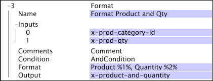

# Formato{#format}

{{eol}}

La trasformazione Format prende un set di input e li formatta per creare un output corrispondente alla struttura specificata.

La trasformazione funziona su stringhe semplici o vettori di stringhe e produce l&#39;output applicando il formato specificato a ciascun valore di input fino a quando tutti i valori di input non siano stati trasformati.

<table id="table_3953C993167248AA9A47964A51C4AB5D"> 
 <thead> 
  <tr> 
   <th colname="col1" class="entry"> Parametro </th> 
   <th colname="col2" class="entry"> Descrizione </th> 
   <th colname="col3" class="entry"> Impostazione predefinita </th> 
  </tr> 
 </thead>
 <tbody> 
  <tr> 
   <td colname="col1"> Nome </td> 
   <td colname="col2"> Nome descrittivo della trasformazione. È possibile inserire un nome qualsiasi qui. </td> 
   <td colname="col3"></td> 
  </tr> 
  <tr> 
   <td colname="col1"> Commenti </td> 
   <td colname="col2"> Facoltativo. Note sulla trasformazione. </td> 
   <td colname="col3"></td> 
  </tr> 
  <tr> 
   <td colname="col1"> Condizione </td> 
   <td colname="col2"> Le condizioni in cui viene applicata questa trasformazione. </td> 
   <td colname="col3"></td> 
  </tr> 
  <tr> 
   <td colname="col1"> Formato </td> 
   <td colname="col2"> 
Una stringa di formattazione utilizzata per specificare l'aspetto dell'output. 
 
 %1% fa riferimento a un valore del primo vettore di input, %2% fa riferimento a un valore del secondo vettore di input e così via. 
 </td> 
   <td colname="col3"></td> 
  </tr> 
  <tr> 
   <td colname="col1"> Ingressi </td> 
   <td colname="col2"> 
Campi contenenti stringhe semplici o vettori di stringhe. Nel caso di vettori di stringa come input, l'output sarà anche un vettore di stringa risultante dall'applicazione del  Formato a ogni insieme di valori di input. 
 
 
Nota: La numerazione degli input inizia a 0, ma la numerazione dei valori di sostituzione del formato inizia a %1%. 
 
 </td> 
   <td colname="col3"></td> 
  </tr> 
  <tr> 
   <td colname="col1"> Output </td> 
   <td colname="col2"> Nome del campo creato per contenere i risultati della trasformazione. Se gli input sono vettori di stringa, la lunghezza del vettore della stringa di output sarà la lunghezza del vettore di input più lungo. Se alcuni vettori della stringa di input hanno una lunghezza più breve, vengono utilizzate stringhe vuote per la loro posizione nella stringa di formato fino a raggiungere la lunghezza del vettore di output. </td> 
   <td colname="col3"></td> 
  </tr> 
 </tbody> 
</table>

In questo esempio, due vettori, uno un vettore di stringhe che rappresentano categorie di prodotti e l&#39;altro un vettore di stringa corrispondente che rappresenta la quantità di ciascun prodotto acquistato, vengono trasformati in un unico vettore di lunghezza equivalente che assume il modulo: Prodotto %1%, Quantità %2%.

Se i vettori di input contenessero categorie di prodotti (683, 918) e quantità di (10, 4), il risultato sarebbe un vettore di output finale contenente le due stringhe seguenti: (&quot;Prodotto 683, Quantità 10&quot;, &quot;Prodotto 918, Quantità 4&quot;).
