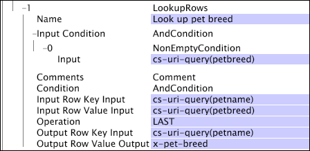

# LookupRows{#lookuprows}

La trasformazione LookupRows esamina altre voci di registro con lo stesso ID di tracciamento e imposta il valore del campo di output sul valore di un campo designato nella riga di input.

Poiché la trasformazione [!DNL LookupRows] esegue la ricerca sulle voci di registro e non sui file di ricerca, è molto simile alla trasformazione [!DNL CrossRows]. Vedere [CrossRows](../../../../../home/c-dataset-const-proc/c-data-trans/c-transf-types/c-standard-transf/c-crossrows.md#concept-fcace08804f54db397ed631cc13ff4f2).

Per funzionare, la trasformazione [!DNL LookupRows] richiede che i dati siano ordinati in tempo e raggruppati in base all’ID di tracciamento nei dati sorgente. Pertanto, [!DNL LookupRows] funziona solo se definito nel file [!DNL Transformation.cfg] o in un file [!DNL Transformation Dataset Include].

Quando rivedi le descrizioni dei parametri nella tabella seguente, ricorda quanto segue:

* La riga di output è la riga di dati su cui la trasformazione sta lavorando in un dato momento nel tempo.
* Le righe di input sono tutte le altre righe di dati (prima, dopo o inclusa la riga di output) i cui valori del campo di input fungono da input per la trasformazione.

<table id="table_AB68A89ECD5C45F39B8433F994BBD7D8"> 
 <thead> 
  <tr> 
   <th colname="col1" class="entry"> Parametro </th> 
   <th colname="col2" class="entry"> Descrizione </th> 
   <th colname="col3" class="entry"> impostazione predefinita </th> 
  </tr> 
 </thead>
 <tbody> 
  <tr> 
   <td colname="col1"> Nome </td> 
   <td colname="col2"> Nome descrittivo della trasformazione. È possibile inserire un nome qualsiasi qui. </td> 
   <td colname="col3"> </td> 
  </tr> 
  <tr> 
   <td colname="col1"> Commenti </td> 
   <td colname="col2"> Facoltativo. Note sulla trasformazione. </td> 
   <td colname="col3"> </td> 
  </tr> 
  <tr> 
   <td colname="col1"> Condizione </td> 
   <td colname="col2"> Limita l'output della trasformazione a determinate voci di registro. Se la condizione non è soddisfatta per una particolare voce di registro, il campo nel parametro Output del valore della riga di output viene lasciato invariato. L'input può ancora essere utilizzato per influenzare altre voci di log. </td> 
   <td colname="col3"> </td> 
  </tr> 
  <tr> 
   <td colname="col1"> Condizione di ingresso </td> 
   <td colname="col2">Accetta l’input per la trasformazione solo da determinate righe di input. Se la condizione  Input non è soddisfatta per una particolare riga di input, il campo di input di tale riga viene ignorato e non influisce sulle altre righe di output. Tuttavia, il campo di output di tale riga viene ancora modificato in base alla condizione specificata. </td> 
   <td colname="col3"> </td> 
  </tr> 
  <tr> 
   <td colname="col1"> Input chiave riga di input </td> 
   <td colname="col2"> Nome del campo da utilizzare come chiave per le righe di input. </td> 
   <td colname="col3"> </td> 
  </tr> 
  <tr> 
   <td colname="col1"> Input valore riga di input </td> 
   <td colname="col2"> Nome del campo nella riga di input il cui valore viene copiato nel campo nel parametro Output del valore della riga di output se tutte le condizioni sono soddisfatte. </td> 
   <td colname="col3"> </td> 
  </tr> 
  <tr> 
   <td colname="col1"> Funzionamento </td> 
   <td colname="col2"> 
Operazione che, per ogni riga di output, viene applicata a tutte le righe di input che soddisfano tutte le condizioni definite dai parametri  Input Condition e Input Key Input per produrre un output: 
     <ul id="ul_16FB152CB558497794DDED72A2F05CDD"> 
      <li id="li_22DA9F814E4E42D0B21E90B63A2A7A0E"> FIRST restituisce il valore del campo nel parametro Input valore riga di input dalla prima riga di input corrispondente nei dati (non la prima riga corrispondente dopo la riga di output). </li> 
      <li id="li_45E00C3DE0494A1CB5C09B942088F161"> LAST restituisce il valore del campo nel parametro Input valore riga di input dall’ultima riga di input nei dati (non l’ultima riga corrispondente prima della riga di output). </li> 
     </ul> 
 </td> 
   <td colname="col3"> </td> 
  </tr> 
  <tr> 
   <td colname="col1"> Input chiave riga di output </td> 
   <td colname="col2"> Nome del campo da utilizzare come chiave per la riga di output. </td> 
   <td colname="col3"> </td> 
  </tr> 
  <tr> 
   <td colname="col1"> Output del valore della riga di output </td> 
   <td colname="col2">Nome del campo nella riga di output il cui valore viene copiato dal campo nel parametro Input value riga di input se tutte le condizioni sono soddisfatte. Tutte le righe di output con gli stessi valori x-trackingid e  Output Row Key Input hanno lo stesso valore  Output Row Value Output. </td> 
   <td colname="col3"> </td> 
  </tr> 
 </tbody> 
</table>

I parametri Input chiave di input, Input valore riga di input e Input condizione definiscono insieme il file di ricerca per ciascun ID di tracciamento, mentre i parametri Input chiave di output, Input valore riga di output e Condizione controllano ciò che viene cercato nel file e il valore memorizzato nel campo specificato da Output valore riga di output.

Per comprendere meglio il funzionamento della trasformazione, prendere in considerazione il seguente profilo:

* Per ogni riga di output che soddisfa le condizioni e presenta un input chiave di riga di output non vuoto:

   * Trova la riga di input FIRST o LAST in modo che

      * la riga di input soddisfa la condizione di input e
      * la x-trackingid della riga di input è uguale alla x-trackingid della riga di output, e
      * l’input della chiave di input della riga di input è uguale all’input della chiave di output della riga di output,

* e impostare l&#39;output del valore della riga di output sull&#39;input del valore della riga di input della riga di input.

Considerazioni per [!DNL LookupRows]

* I valori chiave vuoti non corrispondono mai a nulla. Anche se ci sono righe di input con chiavi vuote e valori non vuoti che corrispondono a [!DNL Input Condition], un [!DNL Output Row Key Input] di &quot;&quot; produrrà sempre un [!DNL Output Row Value Output] di &quot;&quot;.

* Se non è vietato da [!DNL Input Condition], una riga può cercare se stessa se i relativi valori [!DNL Input Row Key Input] e [!DNL Output Row Key Input] sono gli stessi.

Se si dispone di più valori chiave, è possibile combinarli utilizzando una trasformazione [!DNL Format] (vedere [Formato](../../../../../home/c-dataset-const-proc/c-data-trans/c-transf-types/c-standard-transf/c-format.md#concept-3de04869181e4694ab072b092186684b)) prima di applicare una trasformazione [!DNL LookupRows].

Supponiamo di avere un sito web che ha una pagina di registrazione animale, dove il nome e la razza sono inseriti, e una pagina successiva &quot;comprare giocattolo&quot; dove viene utilizzato solo il nome dell&#39;animale domestico. Vorreste poter collegare il nome dell&#39;animale domestico con la razza animale immessa nella pagina di registrazione. A questo scopo, puoi creare la seguente trasformazione [!DNL LookupRows]:

Analizziamo questo esempio utilizzando il profilo precedente:

* Per ogni riga di output che soddisfa un valore non vuoto di cs-uri-query(petname) :

   * Trova la riga di input ULTIMO in modo che

      * la riga di input contiene un valore non vuoto di cs-uri-query(petbreed), e
      * la x-trackingid della riga di input è uguale alla x-trackingid della riga di output, e
      * il valore di cs-uri-query(petname) della riga di input è uguale al valore di cs-uri-query(petname) della riga di output,

* e impostare il valore di x-pet-breed della riga di output sul valore di cs-uri-query(petbreed) della riga di input.

La trasformazione [!DNL LookupRows] utilizza il nome dell&#39;animale domestico (la chiave) per assicurarsi che la razza animale domestico sia collegata sia alla registrazione degli animali domestici e comprare pagine giocattolo in modo da poter analizzare i giocattoli acquistati per ogni razza di animale domestico, anche per i visitatori con più animali domestici.
