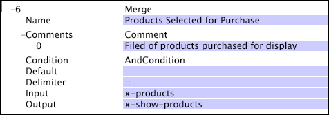

# Unisci{#merge}

La trasformazione Merge prende i valori dal campo di input (in genere un vettore di stringhe), li combina in una singola stringa separata dal delimitatore dato e inserisce la stringa risultante nel campo di output specificato.

<table id="table_2458E008C9A14B31A774E6819D07E9BE"> 
 <thead> 
  <tr> 
   <th colname="col1" class="entry"> Parametro </th> 
   <th colname="col2" class="entry"> Descrizione </th> 
   <th colname="col3" class="entry"> impostazione predefinita </th> 
  </tr> 
 </thead>
 <tbody> 
  <tr> 
   <td colname="col1"> Nome </td> 
   <td colname="col2"> Nome descrittivo della trasformazione. Potete inserire un nome qualsiasi qui. </td> 
   <td colname="col3"></td> 
  </tr> 
  <tr> 
   <td colname="col1"> Commenti </td> 
   <td colname="col2"> Facoltativo. Note sulla trasformazione. </td> 
   <td colname="col3"></td> 
  </tr> 
  <tr> 
   <td colname="col1"> Condizione </td> 
   <td colname="col2"> Condizioni in cui viene applicata la trasformazione. </td> 
   <td colname="col3"></td> 
  </tr> 
  <tr> 
   <td colname="col1"> impostazione predefinita </td> 
   <td colname="col2"> Il valore predefinito da utilizzare se la condizione è soddisfatta e il valore immesso non è disponibile. </td> 
   <td colname="col3"></td> 
  </tr> 
  <tr> 
   <td colname="col1"> Delimitatore </td> 
   <td colname="col2"> 
Stringa utilizzata per separare i singoli elementi del vettore della stringa di input nella singola stringa di output. 
 
 Se si tiene premuto il tasto Ctrl e si fa clic con il pulsante destro del mouse all'interno del parametro Delimiter, viene visualizzato un menu  Inserisci . Questo menu contiene un elenco di caratteri speciali che vengono spesso utilizzati come delimitatori. 
 </td> 
   <td colname="col3"></td> 
  </tr> 
  <tr> 
   <td colname="col1"> Ingresso </td> 
   <td colname="col2"> Un vettore di valori stringa che vengono combinati per formare la stringa di output. </td> 
   <td colname="col3"></td> 
  </tr> 
  <tr> 
   <td colname="col1"> Uscita </td> 
   <td colname="col2"> Nome della stringa di output. </td> 
   <td colname="col3"></td> 
  </tr> 
 </tbody> 
</table>

In questo esempio, si presume che un vettore di input di stringhe contenga un set di prodotti selezionati per l&#39;acquisto. Questi prodotti vengono inseriti in una singola stringa di output e separati da &quot;::&quot; (due punti).

Quindi se il campo x-products di input conteneva i valori stringa B57481, C46355 e Z97123, la stringa di output risultante x-show-products sarebbe B57481::C46355::Z97123.
