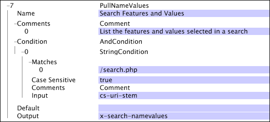

# PullNameValues{#pullnamevalues}

{{eol}}

La trasformazione PullNameValues è un&#39;operazione speciale che prende i valori nel campo cs-uri-query e separa ciascuna delle coppie nome-valore in una stringa separata.

L’intero insieme di stringhe di coppie nome-valore viene restituito nel campo di output specificato come vettore di stringhe.

| Parametro | Descrizione | Impostazione predefinita |
|---|---|---|
| Nome | Nome descrittivo della trasformazione. È possibile inserire un nome qualsiasi qui. |  |
| Commenti | Facoltativo. Note sulla trasformazione. |  |
| Condizione | Le condizioni in cui viene applicata questa trasformazione. |  |
| Impostazione predefinita | Il valore predefinito da utilizzare se la condizione è soddisfatta e il valore specificato non è disponibile nella voce di registro specificata. |  |
| Output | Nome della stringa di output. |  |

La [!DNL PullNameValues] In questo esempio viene utilizzata la trasformazione per acquisire l’utilizzo del modulo di ricerca da parte dei visitatori: quali pulsanti sono stati selezionati, quali valori sono stati digitati nel modulo e così via. Nell&#39;esempio viene utilizzato un [!DNL String Match] condizione (vedi [Condizioni](../../../../../home/c-dataset-const-proc/c-conditions/c-abt-cond.md)) per isolare l’utilizzo di questa trasformazione solo nella pagina [!DNL /search.php]. Il vettore delle coppie nome-valore viene inviato nel campo x-search-namvalue.

Utilizzando la trasformazione come sopra definito, se il campo cs-uri-stem corrisponde alla pagina [!DNL /search.php] e cs-uri-query contenevano quanto segue:

* Ricerca=Bob&amp;State=Virginia&amp;isMale=true

i valori dei nomi di ricerca x contengono un vettore contenente le tre stringhe seguenti:

* Ricerca=Bob
* Stato=Virginia
* isMale=true
