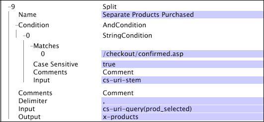

# Dividere{#split}

La trasformazione Split divide una stringa in un vettore di sottostringhe in base a un carattere di delimitazione specificato.

[!DNL Split] è particolarmente utile per estrarre singoli valori da una raccolta di valori associati a un singolo valore di nome query URI.

<table id="table_C97DA4E45DA844FAB8D61AABA22FF809"> 
 <thead> 
  <tr> 
   <th colname="col1" class="entry"> Parametro </th> 
   <th colname="col2" class="entry"> Descrizione </th> 
   <th colname="col3" class="entry"> impostazione predefinita </th> 
  </tr> 
 </thead>
 <tbody> 
  <tr> 
   <td colname="col1"> Nome </td> 
   <td colname="col2"> Nome descrittivo della trasformazione. È possibile inserire un nome qualsiasi qui. </td> 
   <td colname="col3"> </td> 
  </tr> 
  <tr> 
   <td colname="col1"> Commenti </td> 
   <td colname="col2"> Facoltativo. Note sulla trasformazione. </td> 
   <td colname="col3"> </td> 
  </tr> 
  <tr> 
   <td colname="col1"> Condizione </td> 
   <td colname="col2"> Le condizioni in cui viene applicata questa trasformazione. </td> 
   <td colname="col3"> </td> 
  </tr> 
  <tr> 
   <td colname="col1"> Delimitatore </td> 
   <td colname="col2"> 
Stringa utilizzata per separare la stringa di input in sottostringhe. Deve essere un singolo carattere di lunghezza. 
 
 Se si tiene premuto il tasto Ctrl e si fa clic con il pulsante destro del mouse all'interno del parametro Delimitatore, viene visualizzato un menu Inserisci. Questo menu contiene un elenco di caratteri speciali che vengono spesso utilizzati come delimitatori. 
 </td> 
   <td colname="col3"> </td> 
  </tr> 
  <tr> 
   <td colname="col1"> Ingresso </td> 
   <td colname="col2"> Nome del campo il cui valore è diviso per creare il vettore della stringa di output. </td> 
   <td colname="col3"> </td> 
  </tr> 
  <tr> 
   <td colname="col1"> Uscita </td> 
   <td colname="col2"> Nome del campo di output. </td> 
   <td colname="col3"> </td> 
  </tr> 
 </tbody> 
</table>

Considera un sito web in cui i prodotti acquistati da un cliente vengono elencati come parte del valore cs-uri-query quando si accede alla pagina di conferma associata a un acquisto riuscito. Di seguito è riportato un esempio di tale stringa:

* /checkout/confirmed.asp?prod_selected=B57481,C46355,Z97123

Il campo cs-uri-stem viene utilizzato per determinare se la pagina richiesta dalla voce di log è la pagina di conferma. I codici per i prodotti acquistati dal cliente sono elencati come valori separati da virgole del nome prod_selected nella query cs-uri. La trasformazione [!DNL Split] può essere utilizzata per estrarre queste informazioni suddividendo i codici prodotto in base alla virgola se il valore di cs-uri-stem corrisponde al valore specificato nella condizione [!DNL String Match]. Vedere [Corrispondenza stringa](../../../../../home/c-dataset-const-proc/c-conditions/c-test-ops/c-test-op-con.md#section-f8d132085c6b4500bfbe4515b848142f). La seguente trasformazione descrive la soluzione a questo problema.

In questo caso, il campo di output è x-products, che viene utilizzato per creare la dimensione estesa desiderata che mappa i prodotti acquistati alle sessioni durante le quali è stato effettuato l’acquisto.
