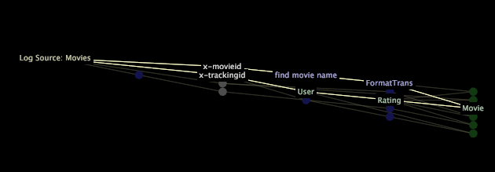

# Mappe dipendenza{#dependency-maps}

Le mappe di dipendenza consentono di visualizzare e gestire la configurazione dei componenti del profilo.

* **Componenti del set di dati:** Origini di registro, filtri, campi, trasformazioni e dimensioni estese definite nel dataset [!DNL Log Processing.cfg], [!DNL Transformation.cfg]e nei [!DNL dataset include] file.

* **Componenti del modello di query:** Metriche, dimensioni e filtri definiti nelle cartelle Dimensioni, Metriche e Filtri.
* **Aree di lavoro e visualizzazioni:** Aree di lavoro, rapporti, opzioni di menu e livelli globali.

Per ulteriori informazioni sull&#39;utilizzo di componenti del modello query, aree di lavoro e visualizzazioni nelle mappe delle dipendenze, vedere la Guida *utente di Workbench* dati.

I componenti profilo sono rappresentati da punti colorati (nodi) nella mappa. Le linee che collegano i nodi rappresentano le dipendenze, ovvero il modo in cui i componenti si relazionano tra loro. Una linea tra due nodi indica che l&#39;output del nodo a sinistra è un input del nodo a destra, vale a dire che il nodo a destra dipende dal nodo a sinistra.

## Visualizzazione dei componenti del set di dati {#section-3e51c09c23cc40aeade2e6ad0fa7c8d2}

1. Fare clic con il pulsante destro del mouse all&#39;interno della mappa di dipendenza e scegliere **[!UICONTROL Display]**.
1. Scegli **[!UICONTROL Dataset]**. A sinistra di [!DNL Dataset].

Per ulteriori informazioni sulle altre opzioni di visualizzazione, vedere la Guida *utente di Workbench* dati.

La figura seguente mostra una mappa delle dipendenze i cui nodi rappresentano le origini di registro, i campi, le trasformazioni e le dimensioni estese di un dataset.

* Un nodo giallo-verde rappresenta una o più origini di registro o un filtro definito nel set di dati. Un nodo per un&#39;origine di registro viene sempre visualizzato più a sinistra nella mappa.
* Un nodo grigio rappresenta un campo elencato nel parametro Campi di un [!DNL Log Processing.cfg] file o di un [!DNL Log Processing Include]file.

* Un nodo blu rappresenta una trasformazione.
* Un nodo verde rappresenta una dimensione estesa.

>[!NOTE]
>
>Se il set di dati ha una singola origine di registro, la mappa visualizza Origine registro: nome *origine* del registro. Se il set di dati contiene più origini di registro, la mappa visualizza *il numero* Origini di registro, dove numero è il numero di origini di registro. Ad esempio, se nel set di dati sono presenti tre origini di registro, nella mappa vengono visualizzate 3 origini di registro.

Se non potete visualizzare tutti i nodi della mappa, potete spostare la mappa, ingrandire o ridurre per visualizzare l&#39;intera mappa o per concentrarvi su una sezione specifica. Per ulteriori informazioni sullo zoom, consulta il capitolo Utilizzo delle visualizzazioni della Guida *utente di Workbench* dati.

Quando si fa clic su un nodo, vengono evidenziati tutti i nodi che dipendono da tale nodo e tutti i nodi da cui dipende tale nodo e visualizzati i relativi nomi.

>[!NOTE]
>
>Un percorso evidenziato in una mappa di dipendenza non costituisce una selezione.

Quando fate clic con il pulsante destro del mouse su un nodo, potete visualizzare le informazioni di identificazione relative a ciascun componente visualizzato sulla mappa e scegliere le opzioni di menu che consentono di visualizzare maggiori dettagli sul componente o di modificarlo. Inoltre, potete eseguire ricerche di testo e visualizzare informazioni sulle prestazioni per trasformazioni e dimensioni estese.

Per informazioni su queste funzioni per le mappe delle dipendenze, vedere il capitolo relativo alle interfacce amministrative della Guida *utente di Workbench* dati.
