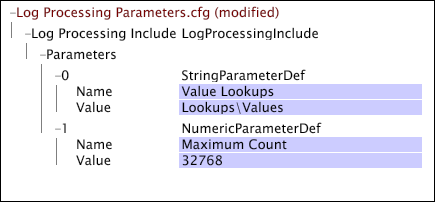

# Parametri stringa e numerici{#string-and-numeric-parameters}

{{eol}}

I parametri stringa e numerici assumono rispettivamente come valori stringa e numeri.

È possibile utilizzarli in modo intercambiabile, ma i parametri numerici devono essere definiti in modo da avere un valore numerico. È possibile fare riferimento a parametri numerici e di stringa durante la definizione di trasformazioni, condizioni e dimensioni estese e fare riferimento a più di un parametro nella stessa riga.

Non è possibile fare riferimento a parametri stringa e numerici in [!DNL Input] o [!DNL Output] ma puoi utilizzare un parametro di stringa per definire un campo di input costante. Inoltre, non è possibile fare riferimento a parametri stringa e numerici nei decoder o nei gruppi decoder.

Questo esempio mostra un [!DNL Log Processing Dataset Include] file che definisce un parametro stringa e un parametro numerico. Il parametro della stringa, denominato &quot;Ricerche di valore&quot;, definisce una posizione del file (Ricerche\Valori) relativa alla directory di installazione del server di Data Workbench.

