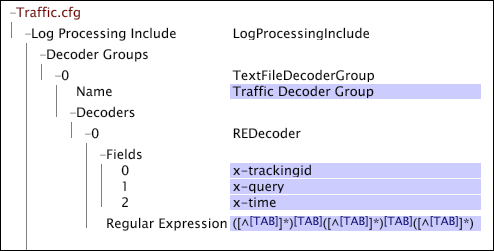

# Gruppi decodificatore file di testo{#text-file-decoder-groups}

L&#39;elaborazione dei file di registro come origini di registro richiede la definizione di un decodificatore nel file Log Processing Dataset Include per estrarre i campi di dati dalle voci di registro.

Per definire i gruppi di decodificatori dei file di testo per le origini di registro dei file di registro è necessario conoscere la struttura e il contenuto del file di registro, i dati da estrarre e i campi in cui tali dati vengono memorizzati. Questa sezione fornisce descrizioni di base dei parametri che è possibile specificare per i decoder, ma il modo in cui si utilizza un decodificatore dipende dal file di registro che contiene i dati di origine.

Per informazioni sui requisiti di formato per le origini di registro dei file di registro, vedere [File](../../../../../home/c-dataset-const-proc/c-log-proc-config-file/c-log-sources.md#concept-3d4fb817c057447d90f166b1183b461e)di registro. Per assistenza nella definizione dei decodificatori dei file di testo, contattate Adobe.

Un gruppo di decodificatori di file di testo può includere:

* [Decodificatori di espressioni regolari](../../../../../home/c-dataset-const-proc/c-dataset-inc-files/c-types-dataset-inc-files/c-log-proc-dataset-inc-files/c-text-file-dec-groups.md#section-67aca2c1f008404da7f845a64abec97c)
* [Decodificatori delimitati](../../../../../home/c-dataset-const-proc/c-dataset-inc-files/c-types-dataset-inc-files/c-log-proc-dataset-inc-files/c-text-file-dec-groups.md#section-7e0a23decdbc4c75ae750a42446997a6)

## Decodificatori di espressioni regolari {#section-67aca2c1f008404da7f845a64abec97c}

Un decodificatore di espressioni regolari identifica pattern di stringhe complessi all&#39;interno delle voci di registro in un file di registro ed estrae questi pattern come campi di dati. Per ciascun decodificatore, il numero di campi deve corrispondere al numero di sottopattern di acquisizione nell&#39;espressione regolare. La parte della linea che corrisponde al n° pattern di cattura secondario viene assegnata all&#39;nth campo per quella linea.

**Per aggiungere un decodificatore di espressioni regolari a un gruppo di decodificatori di file di testo**

1. Aprire il [!DNL Log Processing Dataset Include] file come descritto in [Modifica dei set di dati esistenti Includi file](../../../../../home/c-dataset-const-proc/c-dataset-inc-files/c-work-dataset-inc-files/t-edit-ex-dataset-inc-files.md#task-456c04e38ebc425fb35677a6bb6aa077) e aggiungere un gruppo di decodificatori di file di testo. Vedere la voce di tabella [Decoder Groups](../../../../../home/c-dataset-const-proc/c-dataset-inc-files/c-types-dataset-inc-files/c-log-proc-dataset-inc-files/c-log-proc-dataset-inc-files.md#concept-999475a22519432e98844622ca95b6ab).

1. Fare clic con il pulsante destro del mouse **[!UICONTROL Decoders]** sotto il gruppo di decodificatori appena creato, quindi scegliere **[!UICONTROL Add new]** > **[!UICONTROL Regular Expression]**.

1. Specificate le seguenti informazioni:

   * **Campi:** Elenco dei campi nel file di registro. Se uno dei campi qui definiti deve essere passato alla fase di trasformazione della costruzione del dataset, questi campi devono essere elencati nel parametro Fields di uno dei [!DNL Log Processing Dataset Include] file per il dataset. I nomi dei campi personalizzati devono iniziare con &quot;x-&quot;.

   * **Nome:** Identificatore opzionale per il decodificatore.
   * **Espressione regolare:** Utilizzato per estrarre i campi desiderati da ogni riga del file.

1. Ripetere i passaggi 4 e 5 per tutti gli altri decodificatori che si desidera aggiungere al gruppo.
1. Per salvare il [!DNL Log Processing Dataset Include] file, fare clic con il pulsante destro del mouse **[!UICONTROL (modified)]** nella parte superiore della finestra e fare clic **[!UICONTROL Save]**.

1. Per rendere attive le modifiche apportate localmente, nella [!DNL Profile Manager]colonna fare clic con il pulsante destro del mouse sul segno di spunta del file nella [!DNL User] colonna. Fare clic **[!UICONTROL Save to]** > *&lt;**[!UICONTROL profile name]**>*, dove nome profilo è il nome del profilo del set di dati o il profilo ereditato a cui appartiene il file del set di dati.

Non salvate il file di configurazione modificato in alcun profilo interno fornito da Adobe, in quanto le modifiche vengono sovrascritte quando installate gli aggiornamenti per tali profili.

>[!NOTE]
>
>Un dato file di registro può contenere più decodificatori di espressioni regolari. L’ordine in cui vengono definiti i decodificatori è importante: il primo decodificatore che corrisponde a una riga nel file di registro è quello utilizzato per decodificare tale riga.

Questo esempio illustra l’utilizzo di un decodificatore di espressioni regolari per estrarre campi di dati da un file di testo delimitato da tabulazioni. È possibile ottenere lo stesso risultato definendo un decodificatore delimitato con un delimitatore di tabulazioni.

Per ulteriori informazioni sui decodificatori di espressioni regolari, compresi terminologia e sintassi, vedere Espressioni regolari.

## Decodificatori delimitati {#section-7e0a23decdbc4c75ae750a42446997a6}

Un decodificatore delimitato decodifica un file di registro i cui campi sono delimitati da un singolo carattere. Il numero di campi deve corrispondere al numero di colonne nel file delimitato; tuttavia, non è necessario assegnare un nome a tutti i campi. Se un campo viene lasciato vuoto, la colonna è ancora necessaria nel file di registro, ma il decodificatore la ignora.

**Per aggiungere un decodificatore delimitato a un gruppo di decodificatori di file di testo**

1. Aprire il [!DNL Log Processing Dataset Include] file come descritto in [Modifica dei set di dati esistenti Includi file](../../../../../home/c-dataset-const-proc/c-dataset-inc-files/c-work-dataset-inc-files/t-edit-ex-dataset-inc-files.md#task-456c04e38ebc425fb35677a6bb6aa077) e aggiungere un gruppo di decodificatori di file di testo. Vedere la voce di tabella [Decoder Groups](../../../../../home/c-dataset-const-proc/c-dataset-inc-files/c-types-dataset-inc-files/c-log-proc-dataset-inc-files/c-log-proc-dataset-inc-files.md#concept-999475a22519432e98844622ca95b6ab).

1. Fare clic con il pulsante destro del mouse **[!UICONTROL Decoders]** sotto il gruppo di decodificatori appena creato, quindi scegliere **[!UICONTROL Add new]** > **[!UICONTROL Delimited]**.

1. Specificate le seguenti informazioni:

   * **Campi:** Elenco dei campi nel file di registro. Se uno dei campi qui definiti deve essere passato alla fase di trasformazione della costruzione del dataset, questi campi devono essere elencati nel parametro Fields di uno dei [!DNL Log Processing Dataset Include] file per il dataset. I nomi dei campi personalizzati devono iniziare con &quot;x-&quot;.

   * **Delimitatore:** Carattere utilizzato per separare i campi nel file di output.

1. Ripetere i passaggi 4 e 5 per tutti gli altri decodificatori che si desidera aggiungere al gruppo.
1. Per salvare il [!DNL Log Processing Dataset Include] file, fare clic con il pulsante destro del mouse **[!UICONTROL (modified)]** nella parte superiore della finestra e fare clic **[!UICONTROL Save]**.

1. Per rendere attive le modifiche apportate localmente, nella [!DNL Profile Manager]colonna fare clic con il pulsante destro del mouse sul segno di spunta del file, quindi fare clic su [!DNL User] > **[!UICONTROL Save to]** &lt; *>**[!UICONTROL profile name]***, dove il nome del profilo è il nome del profilo del set di dati o il profilo ereditato a cui appartiene il file del set di dati.

>[!NOTE]
>
>Non salvate il file di configurazione modificato in alcun profilo interno fornito da Adobe, in quanto le modifiche vengono sovrascritte quando installate gli aggiornamenti per tali profili.

Questo esempio illustra l’utilizzo di un decodificatore delimitato per estrarre i campi di dati da un file di testo delimitato da virgole contenente i dati relativi ai filmati.

