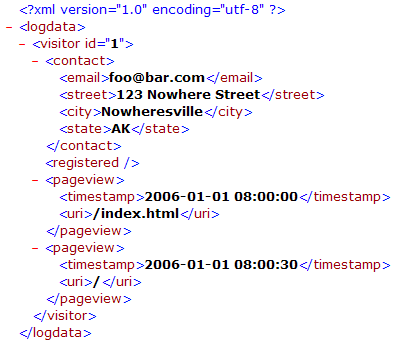

# Gruppi decodificatori XML{#xml-decoder-groups}

{{eol}}

Elaborazione di file XML come origini di registro per definire decoder per l&#39;estrazione di dati dal file XML.

>[!NOTE]
>
>La definizione dei gruppi di decodificatori XML per le origini di log XML richiede la conoscenza della struttura e del contenuto del file XML, dei dati da estrarre e dei campi in cui tali dati vengono memorizzati. Questa sezione fornisce descrizioni di base dei parametri che è possibile specificare per i decoder. Il modo in cui si utilizza un decodificatore dipende dal file XML che contiene i dati di origine.

Per informazioni sui requisiti di formato per le origini di registro XML, consulta [Origini del registro](../../../../../home/c-dataset-const-proc/c-log-proc-config-file/c-log-sources.md#concept-6714c720fac044cbb9af003bf401b2ea). Per assistenza sulla definizione dei decodificatori XML, contatta l’Adobe .

Il livello superiore di un decodificatore XML è un gruppo di decodificatori (XMLDecoderGroup), un set di tabelle di decodificazione che consente di estrarre dati da un file XML di un particolare formato. Se si dispone di file XML di formati diversi, è necessario definire un gruppo di decodificatori per ogni formato. Ogni gruppo di decodificatori è costituito da una o più tabelle di decodificazione.

La tabella seguente descrive il parametro Tables e tutti i sottoparametri che è necessario specificare per definire un gruppo di decodificatori XML.

<table id="table_06C40C5149E94548A1B0C2ED4397624B"> 
 <thead> 
  <tr> 
   <th colname="col1" class="entry"> Parametro </th> 
   <th colname="col2" class="entry"> Descrizione </th> 
  </tr> 
 </thead>
 <tbody> 
  <tr> 
   <td colname="col1"> Tabelle </td> 
   <td colname="col2"> <p>Ogni tabella in un gruppo di decodificatori rappresenta un livello di dati da estrarre dal file XML. Ad esempio, se desideri estrarre dati sui visitatori, crea una tabella di decodifica che consiste delle informazioni che desideri estrarre per ogni visitatore. È inoltre possibile creare tabelle di decodificazione all’interno di tabelle di decoder (vedere Bambini). </p> <p> <b>Aggiunta di una tabella a un gruppo di decodificatori</b> 
     <ul id="ul_C73CAD77440B4465B9FCE08BF4FA0749"> 
      <li id="li_C4B8CC5A85D942898F1EB76778105818"> Fai clic con il pulsante destro del mouse <span class="uicontrol"> Tabelle </span> e fai clic su <span class="uicontrol"> Aggiungi nuovo </span> &gt; <span class="uicontrol"> XMLDecoderTable </span>. </li> 
     </ul> </p> </td> 
  </tr> 
  <tr> 
   <td colname="col1"> Campi </td> 
   <td colname="col2"> <p>Campi estesi (ad esempio, x-trackingid, x-email) in cui vengono archiviati i dati. I dati da memorizzare nel campo sono determinati dai sottocampi Percorso e/o Operazione . </p> <p> Il percorso è il livello del campo all'interno del file XML strutturato. Il percorso di un campo è relativo al percorso della tabella in cui è definito. Esempi <span class="filepath"> tag.tag.tag </span> o <span class="filepath"> tag.tag.tag.@attribute </span>. I percorsi sono sensibili all’uso di maiuscole e minuscole. </p> <p> A ogni linea del percorso specificato viene applicata un'operazione per produrre un output. Sono disponibili le seguenti operazioni: 
     <ul id="ul_B264A411D7E3446288E7E69D62150B8B"> 
      <li id="li_5936E81C0EEF46AFB780E451A04A88E4"><b>ULTIMO:</b> Il campo prende il valore dell'ultima occorrenza del percorso nel file XML. </li> 
      <li id="li_7BC4F24F2CA84C2EB64B06FE09B4CAF6"><b>CASUALE:</b> Assegna un valore casuale al campo. Questa operazione è utile se devi generare un ID univoco, ad esempio per il campo x-trackingid . </li> 
      <li id="li_C1D34EA11BFB4859A25A275A9B63FB56"><b>EREDITARIO:</b> Il campo definito eredita il proprio valore dal campo corrispondente della tabella padre. </li> 
      <li id="li_F62FB8CD962E4E1495D9A2D5B7A78E2A"><b>"<i>costante </i>":</b> La costante deve essere racchiusa tra virgolette. È possibile utilizzare un'operazione costante per verificare l'esistenza di un particolare percorso; se il percorso esiste, al campo viene assegnato il valore della costante. </li> 
     </ul> </p> <p> <b>Aggiunta di un campo a una tabella decoder</b> </p> <p> 
     <ul id="ul_91D104D927424DEA9E788E43B2F6FEA9"> 
      <li id="li_5448B01EE82349569BBFC99C9604D7B8"> Fai clic con il pulsante destro del mouse <span class="uicontrol"> Campi </span>, quindi fai clic su <span class="uicontrol"> Aggiungi nuovo </span> &gt; <span class="uicontrol"> XMLDecoderField </span>. Definire il campo, l’operazione e il percorso appropriati. </li> 
     </ul> </p> </td> 
  </tr> 
  <tr> 
   <td colname="col1"> Path </td> 
   <td colname="col2"> <p>Livello all’interno del file XML strutturato per il quale la tabella del decodificatore contiene informazioni. Per una tabella di decodificazione XML figlio, il percorso è relativo al percorso della tabella padre. I percorsi sono sensibili all’uso di maiuscole e minuscole. </p> <p> Ad esempio, se il file XML contiene la struttura: </p> 

    &amp;lt;visitor&amp;gt;
    
    &amp;nbsp;
    
    ...
    
    &amp;nbsp;
    
    &amp;lt;/visitor&amp;gt;
    
    &amp;lt;/logdata&amp;gt;&amp;nbsp; &lt;/code> &lt;p> allora il percorso sarebbe &lt;span class=&quot;filepath&quot;>logdata.visitor&lt;/span> . &lt;/p> &lt;/td>
</tr> 
  <tr> 
   <td colname="col1"> Tabella </td> 
   <td colname="col2"> <p>Il valore di questo parametro deve sempre essere "Log Entry". </p> <p> <p>Nota: Non modificare questo valore senza consultare un Adobe. </p> </p> </td> 
  </tr> 
  <tr> 
   <td colname="col1"> Bambini </td> 
   <td colname="col2"> <p>Facoltativo. Una o più tabelle decoder incorporate. Ogni elemento secondario include i parametri Fields, Path e Table descritti in precedenza. </p> <p> <b>Aggiunta di un elemento figlio a una tabella decoder</b> </p> <p> 
     <ul id="ul_902AC6CA5D66457D84CBA3194FF49BBE"> 
      <li id="li_07B4D60E7E2E4630B4878691E575936A"> Fai clic con il pulsante destro del mouse <span class="uicontrol"> Bambini </span> e fai clic su <span class="uicontrol"> Aggiungi nuovo </span> &gt; <span class="uicontrol"> XMLDecoderTable </span>. Definire il campo, l’operazione e il percorso appropriati. </li> 
     </ul> </p> </td> 
  </tr> 
 </tbody> 
</table>

Per utilizzare un file XML come origine di registro per un set di dati, è necessario definire gruppi e tabelle di decodifica XML per estrarre le informazioni da elaborare nel set di dati. In questo esempio, puoi vedere come definire gruppi di decodificatori e tabelle per un’origine di log XML di esempio per un set di dati web.

Il seguente file XML contiene informazioni su un visitatore del sito web, tra cui un ID Experience Cloud, un indirizzo e-mail, un indirizzo fisico e informazioni sulle visualizzazioni di pagina del visitatore.



Poiché abbiamo un singolo file XML, abbiamo bisogno di un solo gruppo di decodificatori, che chiamiamo &quot;Sample XML Format&quot;. Questo gruppo di decodificatori si applica a qualsiasi altro file XML dello stesso formato di questo file. Per iniziare a costruire tabelle di decodificatore XML all&#39;interno di questo gruppo di decoder, dobbiamo prima determinare quali informazioni si desidera estrarre e i campi in cui i dati verranno memorizzati.

In questo esempio, estraiamo informazioni sul visitatore e sulle visualizzazioni di pagina associate a tale visitatore. A questo scopo, creiamo una tabella di decodificatore XML di livello principale (padre) con informazioni sul visitatore e una tabella di decodifica XML incorporata (figlio) con informazioni sulle visualizzazioni di pagina del visitatore.

**Le informazioni per la tabella padre (visitatore) sono le seguenti:**

* Identificatore del tipo di dati per ogni riga di dati nel file XML. Usiamo VISITOR come identificatore per identificare rapidamente le righe di dati relative al visitatore e non alle visualizzazioni di pagina. Possiamo memorizzare questo valore nel campo x-rowtype .
* L’ID del visitatore, che memorizziamo nel campo x-trackingid .
* L’indirizzo e-mail del visitatore (contact.email), che memorizziamo nel campo x-email.
* Lo stato di registrazione del visitatore. Se il visitatore è un utente registrato, possiamo memorizzare il valore &quot;1&quot; nel campo x-is-registrato.
* Il valore Path è [!DNL logdata.visitor]e il valore della tabella è [!DNL Log Entry]. Per informazioni su questi parametri, vedere la tabella XMLDecoderGroup riportata sopra.

**Le informazioni per la tabella figlio (visualizzazioni pagina) sono le seguenti:**

* Identificatore del tipo di dati per ogni riga di dati nel file XML. Usiamo &quot;PAGEVIEW&quot; come identificatore per identificare rapidamente le righe di dati relativi alle visualizzazioni di pagina del visitatore e non solo al visitatore. Questo valore viene memorizzato nel campo x-rowtype .
* L&#39;ID del visitatore. Questo valore viene ereditato dalla tabella padre e memorizzato nel campo x-trackingid .
* La marca temporale di ciascuna visualizzazione di pagina, memorizzata nel campo x-event-time.
* URI di ogni visualizzazione di pagina, memorizzato nel campo cs-uri-stem.
* Il valore Path è pageview e il valore Table è &quot;Log Entry&quot;. Per informazioni su questi parametri, vedere la tabella XMLDecoderGroup riportata sopra.

La seguente schermata di acquisizione mostra una parte di [!DNL Log Processing Dataset Include] file con il gruppo di decodificatori XML risultante per il file XML di esempio in base alla struttura discussa delle tabelle di decoder XML padre e figlio.


Una tabella che mostra l&#39;output del decodificatore per il file XML di esempio ha un aspetto simile al seguente:

| x-rowtype | cs—uri-stem | x-mail | x-is-registrato | x-event-time | x-tracking-id |
|---|---|---|---|---|---|
| VISITATORE |  | foo@bar.com | 1 |  | 1 |
| PAGEVIEW | /index.html |  |  | 01/01/2006:00:00 | 1 |
| PAGEVIEW | / |  |  | 01/01/2006:00:30 | 1 |

Puoi creare una tabella come quella riportata sopra in Data Workbench utilizzando un’interfaccia per visualizzatori di campi. Per informazioni sull’interfaccia del visualizzatore di campi, vedi [Strumenti di configurazione del set di dati](../../../../../home/c-dataset-const-proc/c-dataset-config-tools/c-dataset-config-tools.md#concept-6e058b7691834cf79dcfd1573f78d4f5).

## Utilizzo di #value sull&#39;elemento XML per leggere il valore dell&#39;attributo {#section-88758428afb94f0baa5a986604d53bc1}

Ora puoi utilizzare la **[!DNL #value]** in percorsi XML per richiamare il valore di un elemento XML.

Ad esempio, specificando in precedenza un percorso di **`<Hit><Page name="Home Page" index="20">home.html</Page></Hit>`** non è possibile leggere il valore del `<Page>` tag . Per leggere il valore di un `<Page>` tag e relativi attributi, puoi utilizzare [!DNL Hit.Page.@name] e [!DNL Hit.Page.@index] rispettivamente. Puoi anche richiamare il valore del tag utilizzando **`Hit.Page.#value`** espressione.

Ad esempio, puoi leggere il valore del tag `<varValue>` aggiungendo il seguente campo nel decoder:

```
7 = XMLDecoderField: 
Field = string: x-varvalue-name-added 
Operation = string: LAST 
Path = string:  
<b>#value</b> 
Path = string: varValue 
Table = string: Log Entry
```

Allo stesso modo, puoi leggere il valore del tag `<Rep>` aggiungendo il seguente campo nel decoder:

```
7 = XMLDecoderField: 
Field = string: x-rep-name-added 
Operation = string: LAST 
Path = string: Rep.# 
<b>value</b> 
Path = string: Reps 
Table = string: Log Entry
```

Al contrario, per leggere il valore del tag elemento senza alcun attributo, un `<text>` tag sotto a `<line>` tag e il relativo valore possono essere letti direttamente dando &quot; [!DNL text]&quot; in un percorso o utilizzando [!DNL line.text], a seconda di come è stato creato il decodificatore.

```
2 = XMLDecoderField: 
Field = string: x-chat-text 
Operation = string: LAST 
Path = string:  
<b>text</b> 
Path = string:  
<b>line</b> 
Table = string: Log Entry
```
