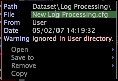

# Creazione di nuovi set di dati con i file{#creating-new-dataset-include-files}

I passaggi per creare un nuovo dataset includono il file.

È necessario creare un nuovo file di set di dati con lo scopo di eseguire una delle seguenti attività di configurazione del set di dati:

* Specifica di nuovi campi di dati da passare dall&#39;elaborazione del registro alla trasformazione.
* Definizione di trasformazioni che eseguono una delle seguenti operazioni:

   * Aggiornare i campi di registro esistenti.
   * Produrre nuovi campi che devono essere passati dall&#39;elaborazione del registro alla trasformazione o utilizzati per definire dimensioni estese.

      Per informazioni sui tipi di trasformazione disponibili, vedere Trasformazioni [dati](../../../../home/c-dataset-const-proc/c-data-trans/c-abt-transf.md).

      >[!NOTE]
      >
      >Se state definendo le trasformazioni in un nuovo set di dati includete file, accertatevi di tenere presente l&#39;ordine degli input e degli output. Per informazioni sull&#39;ordine delle trasformazioni, consultate [Convenzioni per la costruzione delle trasformazioni](../../../../home/c-dataset-const-proc/c-data-trans/c-con-transf.md#concept-01998eebb7e347c58255fb442f2613b6).

* Creazione di dimensioni estese. Per informazioni sui tipi di dimensioni disponibili, vedere [Dimensioni](../../../../home/c-dataset-const-proc/c-ex-dim/c-abt-ex-dim.md)estese.

1. Quando lavori nel profilo del set di dati, apri il set di dati [!DNL Profile Manager] e fai clic **[!UICONTROL Dataset]** per visualizzare il set di dati esistente e includere i file.

   * Per visualizzare i [!DNL Log Processing Dataset Include] file, fare clic su **[!UICONTROL Log Processing]**.

   * Per visualizzare i [!DNL Transformation Dataset Include] file, fare clic su **[!UICONTROL Transformation]**.

1. Create un nuovo [!DNL Log Processing] o [!DNL Transformation Dataset Include] file eseguendo una delle operazioni seguenti:

   * Nella [!DNL User] colonna relativa alla directory Elaborazione log, fare clic su **[!UICONTROL Create]** > **[!UICONTROL New Log Processing]**. Nella directory [!DNL New Log Processing.cfg] viene visualizzato un file denominato.

   * Nella [!DNL User] colonna relativa alla directory Trasformazione, fare clic su **[!UICONTROL Create]** > **[!UICONTROL New Transformation]**. Nella directory [!DNL New Transformation.cfg] viene visualizzato un file denominato.

1. Rinominare il nuovo file facendo clic con il pulsante destro del mouse sul relativo segno di spunta nella [!DNL User] colonna e digitando il nuovo nome nel parametro File.

   

1. Fare clic con il pulsante destro del mouse sul segno di spunta per il file rinominato e scegliere **[!UICONTROL Open]** > **[!UICONTROL from the workbench]**. Viene visualizzata la finestra di configurazione.
1. Modificate i parametri nel file di configurazione come appropriato. Per le descrizioni dei parametri disponibili, vedere [Log Processing Dataset Include Files (I dataset di elaborazione dei registri includono i file](../../../../home/c-dataset-const-proc/c-dataset-inc-files/c-types-dataset-inc-files/c-log-proc-dataset-inc-files/c-log-proc-dataset-inc-files.md#concept-999475a22519432e98844622ca95b6ab) ) o [Transformation Dataset Include i file](../../../../home/c-dataset-const-proc/c-dataset-inc-files/c-types-dataset-inc-files/c-trans-dataset-inc-files.md#concept-c64aa78ed9ce40b8a0f4932c82ff5ace) .
1. Per salvare le modifiche, fate clic con il pulsante destro del mouse **[!UICONTROL (modified)]** nella parte superiore della finestra e fate clic su **[!UICONTROL Save]**.
1. Per rendere attive le modifiche apportate localmente, nella [!DNL Profile Manager]colonna fare clic con il pulsante destro del mouse sul segno di spunta del file, quindi fare clic su [!DNL User] > **[!UICONTROL Save to]** &lt; *>**[!UICONTROL profile name]***, dove il nome del profilo è il nome del profilo del set di dati o il profilo ereditato a cui appartiene il file del set di dati. La rielaborazione o la riconversione dei dati inizia dopo la sincronizzazione del profilo del dataset.

   >[!NOTE]
   >
   >Non salvate il file di configurazione modificato in alcun profilo interno fornito da Adobe, in quanto le modifiche vengono sovrascritte quando installate gli aggiornamenti per tali profili.

Per modificare un set di dati includere il file creato, vedere [Modifica dei set di dati esistenti Includi file](../../../../home/c-dataset-const-proc/c-dataset-inc-files/c-work-dataset-inc-files/t-edit-ex-dataset-inc-files.md#task-456c04e38ebc425fb35677a6bb6aa077).
