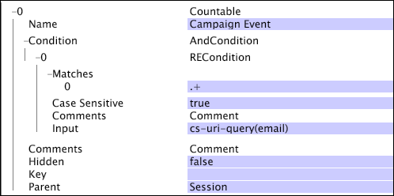

# Dimensioni numerabili{#countable-dimensions}

Gli elementi di una dimensione numerabile possono essere conteggiati dal sistema.

Le dimensioni contabili vengono in genere utilizzate per creare metriche di somma, che restituiscono il conteggio, o la somma, di tutti gli elementi della dimensione. È possibile definire dimensioni numerabili per contare le istanze, ad esempio prenotazioni o ordini di prodotti. Ad esempio, è possibile definire la dimensione numerabile Ordini i cui elementi (voci di registro corrispondenti agli ordini del negozio online) possono essere conteggiati. Se si desidera visualizzare un conteggio di ordini all&#39;interno di una visualizzazione, è possibile definire la metrica della somma Ordini, che può essere valutata su una dimensione o a cui sono applicati filtri.

Le dimensioni contabili possono essere elementi padre di altre dimensioni o elementi secondari di altre dimensioni computabili.

>[!NOTE]
>
>Se hai bisogno di una dimensione che fornisca solo un conteggio di qualcosa, devi usare una dimensione numerica con un&#39;operazione di COUNT. Consultate Dimensioni numeriche.

Le dimensioni contabili sono definite dai seguenti parametri:

<table id="table_9F3F093F5B074EA68CA4DCE731161F6C"> 
 <thead> 
  <tr> 
   <th colname="col1" class="entry"> Parametro </th> 
   <th colname="col2" class="entry"> Descrizione </th> 
   <th colname="col3" class="entry"> impostazione predefinita </th> 
  </tr> 
 </thead>
 <tbody> 
  <tr> 
   <td colname="col1"> Nome </td> 
   <td colname="col2"> Nome descrittivo della dimensione che verrà visualizzato all'utente nel workbench dati. Il nome della dimensione non può includere un trattino (-). </td> 
   <td colname="col3"> </td> 
  </tr> 
  <tr> 
   <td colname="col1"> Commenti </td> 
   <td colname="col2"> Facoltativo. Note sulla dimensione estesa. </td> 
   <td colname="col3"> </td> 
  </tr> 
  <tr> 
   <td colname="col1"> Condizione </td> 
   <td colname="col2"> Le condizioni in cui il campo di immissione contribuisce alla creazione della dimensione numerabile. Se specificata, una condizione limita l'insieme di voci di registro visibili alla dimensione e a tutti i relativi elementi secondari nello schema del set di dati. </td> 
   <td colname="col3"> </td> 
  </tr> 
  <tr> 
   <td colname="col1"> Nascosto </td> 
   <td colname="col2"> Determina se la dimensione viene visualizzata nell'interfaccia workbench dati. Per impostazione predefinita, questo parametro è impostato su false. Se, ad esempio, la dimensione deve essere utilizzata solo come base di una metrica, è possibile impostare questo parametro su true per nascondere la dimensione dalla visualizzazione del workbench dati. </td> 
   <td colname="col3"> false </td> 
  </tr> 
  <tr> 
   <td colname="col1"> Chiave </td> 
   <td colname="col2"> 
Facoltativo. Nome del campo da utilizzare come chiave. Se si definisce questo parametro, esiste un elemento della dimensione calcolabile per ogni combinazione di un elemento dell'elemento padre della dimensione calcolabile e un valore distinto del campo specificato come chiave. 
 
 Ogni elemento della dimensione numerabile è necessario per fare riferimento a un insieme contiguo di voci di registro. Pertanto, se le voci di registro non sono ordinate dalla chiave, viene creato un elemento della dimensione numerabile ogni volta che il campo chiave cambia. Per evitare questa situazione, Adobe consiglia di utilizzare una chiave univoca contigua in ordine temporale. 
 </td> 
   <td colname="col3"> </td> 
  </tr> 
  <tr> 
   <td colname="col1"> Elemento padre </td> 
   <td colname="col2"> 
Nome della dimensione padre. Qualsiasi dimensione numerabile può essere una dimensione padre. Per fare di una dimensione la dimensione di primo livello nello schema del dataset, impostare il parametro su "root". La dimensione definita diventa la dimensione contabile principale per il dataset. Ad esempio, se lavori con il sito, la dimensione Visitatore è la dimensione contabile principale del set di dati. 
 
 
Nota:  Anche se la dimensione contabile principale non deve essere associata agli ID di tracciamento nei dati, Adobe consiglia di configurare la dimensione contabile principale del dataset per utilizzare il campo ID tracciamento (x-trackingid) come chiave. Come risultato, ogni elemento della tabella contabile principale è associato a un valore univoco di x-trackingid, e tutti i dati relativi a ciascun elemento sono raggruppati insieme. Se desiderate configurare il set di dati in modo diverso, contattate Adobe. 
 
 </td> 
   <td colname="col3"> </td> 
  </tr> 
 </tbody> 
</table>

Questo esempio illustra la definizione di una dimensione numerabile utilizzando i dati evento raccolti dal traffico del sito Web. La dimensione numerabile conta gli eventi della campagna Web all’interno di una determinata sessione. Si presume che tutte le risorse della campagna e-mail siano richieste dal server Web con &quot;email=&quot; come parte di cs-uri-query. Nell’esempio, il numero di volte in cui il visitatore risponde a una campagna e-mail durante una determinata sessione è di interesse, non il valore effettivo del campo cs-uri-query(email).

Questo esempio illustra anche la definizione di una dimensione numerabile utilizzando i dati evento raccolti dal traffico del sito Web, ma ha un parametro Key definito. La dimensione numerabile della sessione utilizza il campo x-session-key come chiave. (Il campo x-session-key è l’output della [!DNL Sessionize] trasformazione e ha un valore univoco per ciascuna sessione.) Ogni combinazione univoca di un elemento della dimensione Visitatore (l’elemento padre) e del campo x-session-key è un elemento della dimensione Sessione.

