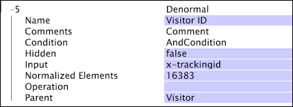

# Dimensioni standard{#denormal-dimensions}

Una dimensione standard ha una relazione uno-a-uno con la dimensione numerabile padre.

Definireste una dimensione standard ogni volta che la dimensione desiderata contiene un elemento univoco per ciascun elemento del relativo elemento padre. Ad esempio, [!DNL EMail Address] è una dimensione standard con un elemento padre di Visitatore. Ogni visitatore ha un indirizzo e-mail e ogni elemento nella dimensione Indirizzo e-mail è l’indirizzo e-mail di un singolo visitatore. Anche se due visitatori hanno lo stesso indirizzo e-mail, gli indirizzi sono elementi distinti della dimensione Indirizzo e-mail.

Potete usare dimensioni standard in qualsiasi visualizzazione di tabella, nelle tabelle di dettaglio o per creare filtri. È inoltre possibile utilizzare dimensioni standard con la funzionalità di esportazione dei segmenti del server workbench dati per esportare valori di campi (ad esempio [!DNL Tracking ID] o [!DNL EMail Address]) con molti valori. Poiché i dati del segmento che si desidera esportare devono essere definiti come una dimensione all&#39;interno del profilo, è necessario creare una dimensione standard in cui siano memorizzate le stringhe raw dei dati del campo.

>[!NOTE]
>
>Quando si utilizza una dimensione standard in una tabella o in un’altra visualizzazione che prevede una dimensione normale, viene automaticamente creata una dimensione standard derivata. La dimensione standard derivata ha una relazione uno-a-molti con la dimensione padre.

Per informazioni sulla visualizzazione della tabella di dettaglio e sui filtri, consulta il capitolo Analisi visualizzazioni nella Guida *utente di Workbench* dati. Per informazioni sull’esportazione dei segmenti, consultare il capitolo Configurazione delle funzioni di interfaccia e analisi nella Guida *utente di Workbench* dati.

>[!NOTE]
>
>Le dimensioni standard possono essere molto costose in termini di tempo di query e spazio su disco. Una dimensione standard con un elemento padre [!DNL Page View]e una stringa di input media di 50 byte potrebbe aggiungere 25 GB di dati ai buffer in un set di dati tipico e di grandi dimensioni, equivalente a circa 13 dimensioni di visualizzazione di pagina semplici o numeriche, o a circa 125 dimensioni a livello di sessione. Non aggiungere mai una dimensione standard a un dataset senza un&#39;attenta valutazione dell&#39;impatto sulle prestazioni.

Le dimensioni standard sono definite dai seguenti parametri:

<table id="table_532AD791E39B4CF296FFA1C33FB8302E"> 
 <thead> 
  <tr> 
   <th colname="col1" class="entry"> Parametro </th> 
   <th colname="col2" class="entry"> Descrizione </th> 
   <th colname="col3" class="entry"> impostazione predefinita </th> 
  </tr> 
 </thead>
 <tbody> 
  <tr> 
   <td colname="col1"> Nome </td> 
   <td colname="col2"> Nome descrittivo della dimensione così come viene visualizzata nel workbench dati. Il nome della dimensione non può includere un trattino (-). </td> 
   <td colname="col3"> </td> 
  </tr> 
  <tr> 
   <td colname="col1"> Commenti </td> 
   <td colname="col2"> Facoltativo. Note sulla dimensione estesa. </td> 
   <td colname="col3"> </td> 
  </tr> 
  <tr> 
   <td colname="col1"> Condizione </td> 
   <td colname="col2"> Condizioni in cui creare la relazione tra il padre e il valore del campo di input. </td> 
   <td colname="col3"> </td> 
  </tr> 
  <tr> 
   <td colname="col1"> Nascosto </td> 
   <td colname="col2"> Determina se la dimensione viene visualizzata nell'interfaccia workbench dati. Per impostazione predefinita, questo parametro è impostato su false. Se, ad esempio, la dimensione deve essere utilizzata solo come base di una metrica, è possibile impostare questo parametro su true per nascondere la dimensione dalla visualizzazione del workbench dati. </td> 
   <td colname="col3"> true </td> 
  </tr> 
  <tr> 
   <td colname="col1"> Ingresso </td> 
   <td colname="col2"> Valore correlato alla dimensione padre (Parent). </td> 
   <td colname="col3"> </td> 
  </tr> 
  <tr> 
   <td colname="col1"> Elementi normalizzati </td> 
   <td colname="col2"> Un parametro di ottimizzazione delle prestazioni che specifica il numero di elementi dimensionali i cui nomi devono essere memorizzati nella memoria del sistema. Impostando questo parametro su un valore più alto, una dimensione standard utilizza più RAM, ma produce query più veloci. Il valore predefinito è 16383. </td> 
   <td colname="col3"> </td> 
  </tr> 
  <tr> 
   <td colname="col1"> Funzionamento </td> 
   <td colname="col2"> 
Le operazioni disponibili sono le seguenti: 
 
 
     <ul id="ul_CCDC45838A3941BD949B6D21EA0492B3"> 
      <li id="li_F33898192A82437692B5C15684EFCF64"> PRIMO NONBLANK: Viene utilizzato il primo valore di input non vuoto, indipendentemente dal fatto che provenga dalla prima voce di registro. Se  Input è un campo vettoriale, viene utilizzata la prima riga del vettore per la voce di registro interessata. </li> 
      <li id="li_4ADD0A368BB74B64AD29126C8E7B333F"> PRIMA RIGA: Viene utilizzato il valore per la prima voce di registro relativa all’elemento dimensione padre, anche se l’input è vuoto. Se  Input è un campo vettoriale, viene utilizzata la prima riga del vettore per la voce di registro interessata. Se questo valore è vuoto o non è un numero, o se la voce di registro pertinente non soddisfa la condizione della dimensione, non viene utilizzato alcun valore. </li> 
      <li id="li_C93CA22ADA634F21A6488BB3BEE7CB23"> ULTIMO NONBLANK: Viene utilizzato l’ultimo valore di input non vuoto, indipendentemente dal fatto che provenga dall’ultima voce di registro. Se  Input è un campo vettoriale, viene utilizzata la prima riga del vettore per la voce di registro interessata. </li> 
      <li id="li_2FFE585521B14FE5ABBF66AAC47F22C4"> ULTIMA RIGA: Viene utilizzato il valore per l’ultima voce di registro relativa all’elemento dimensione padre, anche se l’input è vuoto. Se  Input è un campo vettoriale, viene utilizzata la prima riga del vettore per la voce di registro interessata. Se questo valore è vuoto o non è un numero, o se la voce di registro pertinente non soddisfa la condizione della dimensione, non viene utilizzato alcun valore. </li> 
     </ul> 
 
 
Nota:  Se Operation non restituisce alcun valore, viene utilizzato un valore vuoto (""). 
 
 
 È necessario specificare un'operazione per garantire che la dimensione sia definita come previsto. 
 </td> 
   <td colname="col3"> </td> 
  </tr> 
  <tr> 
   <td colname="col1"> Elemento padre </td> 
   <td colname="col2"> Nome della dimensione padre. Qualsiasi dimensione numerabile può essere una dimensione padre. </td> 
   <td colname="col3"> </td> 
  </tr> 
 </tbody> 
</table>

La dimensione standard mostrata in questo esempio considera tutti i dati del campo x-trackingid come input e li include in una dimensione denominata ID visitatore. Per un segmento di visitatori creato, puoi esportare i dati nella dimensione ID visitatore (così come qualsiasi altra dimensione definita).

