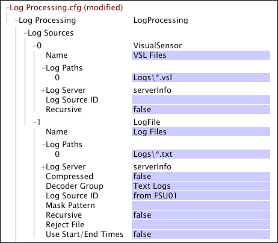

# Origini del registro{#log-sources}

Le origini di registro sono file che contengono i dati da utilizzare per creare un dataset.

I dati disponibili nelle origini del registro sono denominati dati evento perché ogni record di dati rappresenta un record di transazione o una singola istanza di un evento. Il server workbench dati può elaborare origini di registro derivate da dati raccolti da [!DNL Sensors] o estratti da altre origini dati.

* **Dati raccolti da [!DNL Sensors]: ** I dati raccolti dai server [!DNL Sensors] HTTP e applicativi vengono trasmessi ai server workbench dati, che convertono i dati in file di registro ( [!DNL .vsl]) altamente compressi. Consultate File [Sensor](../../../home/c-dataset-const-proc/c-log-proc-config-file/c-log-sources.md#concept-b25f11c477b54032a15b6117b3bf9009).

* **Dati estratti da Insight Server:** Il server workbench dati legge i dati degli eventi contenuti in file semplici, file XML o database conformi a ODBC e utilizza i relativi decoder per estrarre gli elementi desiderati dei dati. Tali dati evento non devono necessariamente risiedere nella memoria, ma i record che contengono i dati devono includere un ID di tracciamento. Vedere [File](../../../home/c-dataset-const-proc/c-log-proc-config-file/c-log-sources.md#concept-3d4fb817c057447d90f166b1183b461e)di registro, origini [di registro](../../../home/c-dataset-const-proc/c-log-proc-config-file/c-log-sources.md#concept-c7b154e93748447b986e97f6ef688887)XML e origini [dati](../../../home/c-dataset-const-proc/c-log-proc-config-file/c-odbc-data-sources.md#concept-5f2cf635081d44beab826ef5ec8cf4e3)ODBC.

**Per aggiungere un&#39;origine di registro**

1. Aprire [!DNL Log Processing.cfg] in workbench dati.
1. Fare clic con il pulsante destro del mouse **[!UICONTROL Log Sources]** e quindi scegliere **[!UICONTROL Add New]**.

1. Seleziona una delle seguenti opzioni:

   * **[!UICONTROL Sensor]**
   * **[!UICONTROL Log File]**
   * **[!UICONTROL XML Log Source]**
   * **[!UICONTROL ODBC Data Source]**

1. I parametri specifici utilizzati per definire un dataset variano in base al tipo di origine del log da utilizzare nel processo di configurazione del dataset. Specificate i parametri come indicato nella sezione corrispondente all&#39;origine di registro appropriata:

   * [File sensore](../../../home/c-dataset-const-proc/c-log-proc-config-file/c-log-sources.md#concept-b25f11c477b54032a15b6117b3bf9009)
   * [File di registro](../../../home/c-dataset-const-proc/c-log-proc-config-file/c-log-sources.md#concept-3d4fb817c057447d90f166b1183b461e)
   * [Origini log XML](../../../home/c-dataset-const-proc/c-log-proc-config-file/c-log-sources.md#concept-c7b154e93748447b986e97f6ef688887)
   * [Origini dati ODBC](../../../home/c-dataset-const-proc/c-log-proc-config-file/c-odbc-data-sources.md#concept-5f2cf635081d44beab826ef5ec8cf4e3)

1. Dopo aver definito l&#39;origine del registro (e aver apportato modifiche ad altri parametri) nel [!DNL Log Processing.cfg] file, salvarlo localmente e salvarlo nel profilo del dataset sul server workbench dati.

   >[!NOTE]
   >
   >Un server workbench dati [!DNL File Server Unit] può ricevere e archiviare [!DNL Sensor] file, file di registro e file XML e inviarli al server Workbench dati [!DNL Data Processing Units] che crea il dataset. Consultate [Configurazione di un&#39;unità](../../../home/c-dataset-const-proc/c-log-proc-config-file/c-ins-svr-file-svr-unit.md#concept-995abff3fce34e439fb3f7f47191c80d)del file server di Insight Server.

   È possibile aprire la configurazione di qualsiasi origine di registro da un [!DNL Transformation Dependency Map]. Per informazioni su [!DNL Transformation Dependency Map], vedere Strumenti [di configurazione](../../../home/c-dataset-const-proc/c-dataset-config-tools/c-dataset-config-tools.md#concept-6e058b7691834cf79dcfd1573f78d4f5)DataSet.

<!--
c_sensor_files.xml
-->

## Requisiti {#section-d5901a4872774ad5bd01a18db114f1f2}

I dati degli eventi raccolti dai server [!DNL Sensors] HTTP e applicativi vengono trasmessi ai server workbench dati, che convertono i dati in file di registro ( [!DNL .vsl]) altamente compressi. Il formato di [!DNL .vsl] file è gestito dal server workbench dati e ogni file ha un nome nel formato:

YYYYMMDD-*SENSORID*.VSL

dove YYYMMDD è la data del file, e *SENSORID* è il nome (assegnato dalla tua organizzazione) che indica quali dati [!DNL Sensor] hanno raccolto e trasmesso al server workbench dati.

## Parametri {#section-5c3f1e341c284486aeba3452057da7f3}

Per [!DNL Sensor] i file sono disponibili i seguenti parametri:

<table id="table_F583B475600041AFA3B9399AE0592146"> 
 <thead> 
  <tr> 
   <th colname="col1" class="entry"> Parametro </th> 
   <th colname="col2" class="entry"> Descrizione </th> 
  </tr> 
 </thead>
 <tbody> 
  <tr> 
   <td colname="col1"> Percorsi registro </td> 
   <td colname="col2"> 
Le directory in cui sono memorizzati i file  .vsl . Il percorso predefinito è la directory Logs. Un percorso relativo fa riferimento alla directory di installazione del server workbench dati. 
 
Potete utilizzare i caratteri jolly per specificare quali file  .vsl elaborare: 
     <ul id="ul_AE144ED0FAB94FE8B32599A058659DE1"> 
      <li id="li_1E4E4CFD72C34B5EB71A3C59877950A9"> * restituisce un numero qualsiasi di caratteri </li> 
      <li id="li_4664400FC12E44B39B28438B85D20ED8"> ? corrisponde a un singolo carattere </li> 
     </ul> 
 
 Ad esempio, il percorso di registro  Logs\*.vsl corrisponde a qualsiasi file presente nella directory Logs che termina con  .vsl. Il percorso di registro  Logs\*-SENSOR?.vsl corrisponde ai file nella directory Logs con qualsiasi data (YYYYMMDD) e un singolo carattere dopo SENSOR, come in SENSOR1. 
 
 Se si desidera eseguire la ricerca in tutte le sottodirectory del percorso specificato, è necessario impostare il parametro ricorsivo su true. 
 
 
Nota: Se i file devono essere letti da un'unità file server del workbench di dati, è necessario immettere gli URI appropriati nel parametro Percorsi di registro. Ad esempio, l'  URI /Logs/*-*.vsl corrisponde a qualsiasi file  .vsl presente nella directory Logs. Consultate <a href="../../../home/c-dataset-const-proc/c-log-proc-config-file/c-ins-svr-file-svr-unit.md#concept-995abff3fce34e439fb3f7f47191c80d"> Configurazione di un'unità</a>server di file Insight Server. 
 
 </td> 
  </tr> 
  <tr> 
   <td colname="col1"> Registro server </td> 
   <td colname="col2">Informazioni (Indirizzo, Nome, Porta e così via) necessarie per connettersi a un file server. Se nel parametro del server di registro è presente una voce, i percorsi  di registro vengono interpretati come URI. In caso contrario, vengono interpretati come percorsi locali. Consultate <a href="../../../home/c-dataset-const-proc/c-log-proc-config-file/c-ins-svr-file-svr-unit.md#concept-995abff3fce34e439fb3f7f47191c80d"> Configurazione di un'unità</a>server di file Insight Server. </td> 
  </tr> 
  <tr> 
   <td colname="col1"> ID origine registro </td> 
   <td colname="col2"> 
Il valore di questo parametro può essere una qualsiasi stringa. Se viene specificato un valore, questo parametro consente di distinguere le voci di registro da diverse origini di registro per l'identificazione dell'origine o l'elaborazione mirata. Il campo x-log-source-id è popolato con un valore che identifica l’origine del registro per ciascuna voce di registro. Ad esempio, se si desidera identificare le voci di registro da un  sensore denominato VSensor01, è possibile digitare  da VSensor01e tale stringa viene passata al campo x-log-source-id per ogni voce di registro proveniente da tale origine. 
 
 Per informazioni sul campo x-log-source-id, consultate Campi <a href="../../../home/c-dataset-const-proc/c-ev-data-rec-fields.md#concept-06bda4be1a4649a2905a4422e9e6c42f"> record dati evento</a>. 
 </td> 
  </tr> 
  <tr> 
   <td colname="col1"> Ricorsivo </td> 
   <td colname="col2"> True o false. Se è impostato su true, tutte le sottodirectory di ciascun percorso specificato nei percorsi  di registro sono alla ricerca di file che corrispondono al nome di file o al pattern di caratteri jolly specificato. Il valore predefinito è false. </td> 
  </tr> 
  <tr> 
   <td colname="col1"> Usa ora di inizio/fine </td> 
   <td colname="col2"> 
True o false. Se si specifica true e Ora di inizio o Ora di fine, tutti i file per questa origine di registro devono avere nomi di file che iniziano con le date in formato ISO (AAAAMMGG). Si presume che ciascun file contenga dati per un giorno GMT (ad esempio, l'intervallo di tempo che inizia alle 0000 GMT di un giorno e termina alle 0000 GMT del giorno successivo). Se i file delle origini del registro contengono dati che non corrispondono a un giorno GMT, questo parametro deve essere impostato su false per evitare risultati errati. 
 
 
Nota: Per impostazione predefinita,  .vsl i file contenenti i dati raccolti dal  sensore soddisfano automaticamente i requisiti di denominazione e intervallo di tempo descritti in precedenza. Se si imposta questo parametro su true, il server workbench dati elabora sempre i dati dai file i cui nomi includono date ISO che rientrano tra l'ora di inizio e l'ora di fine specificate. Se si imposta questo parametro su false, il server workbench dati legge tutti i file  .vsl durante l'elaborazione del registro per determinare quali file contengono dati nell'intervallo Ora di inizio e Ora di fine. 
 
 
 Per informazioni sui parametri Ora di inizio e Ora di fine, vedere <a href="../../../home/c-dataset-const-proc/c-log-proc-config-file/c-info-log-proc-param.md#concept-41bd49bf6b64442d91c232ec67529a3d"> Filtri</a>dati. 
 </td> 
  </tr> 
 </tbody> 
</table>

>[!NOTE]
>
>Non utilizzare i parametri di configurazione per le origini [!DNL Sensor] dati per determinare quali voci di registro includere in un file di registro. Impostare invece l&#39;origine dati in modo che punti a tutti i file di registro all&#39;interno di una directory. Quindi utilizzate i parametri Ora di inizio e Ora di fine di [!DNL Log Processing.cfg] per determinare le voci di registro da utilizzare nella costruzione del dataset. Consulta Filtri [dati](../../../home/c-dataset-const-proc/c-log-proc-config-file/c-info-log-proc-param.md#concept-41bd49bf6b64442d91c232ec67529a3d).

<!--
c_log_files.xml
-->

Il file contenente i dati dell&#39;evento deve soddisfare i seguenti requisiti:

* Ogni record di dati evento nel file deve essere rappresentato da una riga.
* I campi all&#39;interno di un record devono essere separati, vuoti o meno, da un delimitatore ASCII. Il server workbench dati non richiede l&#39;utilizzo di un delimitatore specifico. È possibile utilizzare qualsiasi carattere che non sia un carattere di fine riga e che non venga visualizzato in alcun punto all&#39;interno dei dati dell&#39;evento stesso.
* Ogni record del file deve contenere:

   * Un ID di tracciamento
   * Timestamp

* Per specificare l&#39;ora di inizio e di fine dell&#39;elaborazione dati, ogni nome file deve essere del modulo:

   * [!DNL YYYYMMDD-SOURCE.log]

   dove *YYYMMDD* è il giorno di Greenwich Mean Time (GMT) di tutti i dati nel file, e *SOURCE* è una variabile che identifica l&#39;origine dei dati contenuti nel file.

   >[!NOTE]
   >
   >Contattare  Adobe Consulting Services per una revisione dei file di registro che si intende incorporare nel dataset.

## Parametri {#section-83a861ac24954d54bbb9530e4d8bf23c}

Per le origini di registro dei file di registro, sono disponibili i parametri nella tabella seguente.

>[!NOTE]
>
>L&#39;elaborazione delle origini di registro dei file di registro richiede parametri aggiuntivi definiti in un [!DNL Log Processing Dataset Include] file, che contiene un sottoinsieme dei parametri inclusi in un [!DNL Log Processing.cfg] file, nonché parametri speciali per la definizione dei decodificatori per l&#39;estrazione dei dati dal file di registro. Per informazioni sulla definizione dei decodificatori per le origini di registro dei file di registro, vedere Gruppi [decodificatori di file di](../../../home/c-dataset-const-proc/c-dataset-inc-files/c-types-dataset-inc-files/c-log-proc-dataset-inc-files/c-text-file-dec-groups.md#concept-0db34988e17c41bfb1797f1d8e78aabd)testo.

<table id="table_F33735B5B90A48B0B21FA02D9198CCA9"> 
 <thead> 
  <tr> 
   <th colname="col1" class="entry"> Parametro </th> 
   <th colname="col2" class="entry"> Descrizione </th> 
  </tr> 
 </thead>
 <tbody> 
  <tr> 
   <td colname="col1"> Nome </td> 
   <td colname="col2"> Identificatore per l'origine del file di registro. </td> 
  </tr> 
  <tr> 
   <td colname="col1"> Percorsi registro </td> 
   <td colname="col2"> 
Le directory in cui sono memorizzati i file di registro. Il percorso predefinito è la directory Logs. Un percorso relativo fa riferimento alla directory di installazione del server workbench dati. 
 
 È possibile utilizzare caratteri jolly per specificare quali file di registro elaborare: 
     <ul id="ul_1F02D26A08D846E2A3114E5C33F60ECF"> 
      <li id="li_ECAE1C03A1C448A1B86AE00B3A955708"> * restituisce un numero qualsiasi di caratteri. </li> 
      <li id="li_24FDB500C5934CAAA4124C435DF4B290"> ? rileva un singolo carattere. </li> 
     </ul> 
 
 Ad esempio, il percorso di registro  Logs\*.log corrisponde a qualsiasi file presente nella directory Logs che termina con  .log. 
 
 Se si desidera eseguire la ricerca in tutte le sottodirectory del percorso specificato, è necessario impostare il parametro ricorsivo su true. 
 
 Se i file devono essere letti da un'unità file server del workbench di dati, è necessario immettere gli URI appropriati nel parametro Percorsi di registro. Ad esempio, l’  URI/Logs/*.log corrisponde a qualsiasi file  .log presente nella directory Logs. Consultate <a href="../../../home/c-dataset-const-proc/c-log-proc-config-file/c-ins-svr-file-svr-unit.md#concept-995abff3fce34e439fb3f7f47191c80d"> Configurazione di un'unità</a>server di file Insight Server. 
 </td> 
  </tr> 
  <tr> 
   <td colname="col1"> Registro server </td> 
   <td colname="col2"> Informazioni (Indirizzo, Nome, Porta e così via) necessarie per connettersi a un file server. Se nel parametro del server di registro è presente una voce, i percorsi  di registro vengono interpretati come URI. In caso contrario, vengono interpretati come percorsi locali. Consultate <a href="../../../home/c-dataset-const-proc/c-log-proc-config-file/c-ins-svr-file-svr-unit.md#concept-995abff3fce34e439fb3f7f47191c80d"> Configurazione di un'unità</a>server di file Insight Server. </td> 
  </tr> 
  <tr> 
   <td colname="col1"> Compresso </td> 
   <td colname="col2"> True o false. Questo valore deve essere impostato su true se i file di registro da leggere dal server workbench dati sono file gzip compressi. </td> 
  </tr> 
  <tr> 
   <td colname="col1"> Gruppo decodificatore </td> 
   <td colname="col2"> Nome del gruppo di decodificatori del file di testo da applicare all'origine del registro del file di registro. Questo nome deve corrispondere esattamente al nome del gruppo di decodificatori del file di testo corrispondente specificato nel file  Log Processing Dataset Include . See <a href="../../../home/c-dataset-const-proc/c-dataset-inc-files/c-types-dataset-inc-files/c-log-proc-dataset-inc-files/c-text-file-dec-groups.md#concept-0db34988e17c41bfb1797f1d8e78aabd"> Text File Decoder Groups</a>. </td> 
  </tr> 
  <tr> 
   <td colname="col1"> ID origine registro </td> 
   <td colname="col2"> 
Il valore di questo parametro può essere una qualsiasi stringa. Se viene specificato un valore, questo parametro consente di distinguere le voci di registro da diverse origini di registro per l'identificazione dell'origine o l'elaborazione mirata. Il campo x-log-source-id è popolato con un valore che identifica l’origine del registro per ciascuna voce di registro. Ad esempio, se si desidera identificare le voci di registro da un'origine di file di registro denominata LogFile01, è possibile digitare  da LogFile01e tale stringa viene passata al campo x-log-source-id per ogni voce di registro proveniente da tale origine. 
 
 Per informazioni sul campo x-log-source-id, consultate Campi <a href="../../../home/c-dataset-const-proc/c-ev-data-rec-fields.md#concept-06bda4be1a4649a2905a4422e9e6c42f"> record dati evento</a>. 
 </td> 
  </tr> 
  <tr> 
   <td colname="col1"> Pattern maschera </td> 
   <td colname="col2"> 
Un'espressione regolare con un singolo pattern di cattura che estrae un nome coerente utilizzato per identificare l'origine di una serie di file di registro. Viene considerato solo il nome del file. Il percorso e l'estensione non vengono considerati per la corrispondenza dell'espressione regolare. Se non si specifica un pattern  dimaschera, viene generata automaticamente una maschera. 
 
 Per i file  Logs\010105server1.log e  Logs\010105server2.log, il  pattern della maschera sarà <code>[0-9]{6}(.*)</code>. Questo pattern estrae la stringa "server1" o "server2" dai nomi di file riportati sopra. 
 
 Consultate <a href="../../../home/c-dataset-const-proc/c-reg-exp.md#concept-070077baa419475094ef0469e92c5b9c"> Espressioni</a>regolari. 
 </td> 
  </tr> 
  <tr> 
   <td colname="col1"> Ricorsivo </td> 
   <td colname="col2"> True o false. Se questo parametro è impostato su true, tutte le sottodirectory di ciascun percorso specificato nei percorsi  di registro vengono cercate nei file che corrispondono al nome di file o al pattern di caratteri jolly specificato. Il valore predefinito è false. </td> 
  </tr> 
  <tr> 
   <td colname="col1"> Rifiuta file </td> 
   <td colname="col2"> Percorso e nome del file contenente le voci di registro che non soddisfano le condizioni del decodificatore. </td> 
  </tr> 
  <tr> 
   <td colname="col1"> Usa ora di inizio/fine </td> 
   <td colname="col2"> 
True o false. Se questo parametro è impostato su true e si specifica Ora di inizio o Ora di fine, tutti i file per questa origine di registro devono avere nomi di file che iniziano con le date in formato ISO (AAAAMMGG). Si presume che ciascun file contenga dati per un giorno GMT (ad esempio, l'intervallo di tempo che inizia alle 0000 GMT di un giorno e termina alle 0000 GMT del giorno successivo). Se i nomi dei file delle origini di registro non iniziano con le date ISO, o se i file contengono dati che non corrispondono a un giorno GMT, allora questo parametro deve essere impostato su false per evitare risultati errati. 
 
 
Nota:  Se i requisiti di denominazione e intervallo di tempo descritti in precedenza sono soddisfatti per i file di registro e impostate questo parametro su true, il gruppo di decodificatori del file di testo specificato limita i file letti a quelli i cui nomi hanno date ISO comprese tra l’ora di inizio e l’ora di fine specificate. Se si imposta questo parametro su false, il server workbench dati legge tutti i file di registro durante l'elaborazione del registro per determinare quali file contengono dati nell'intervallo Ora di inizio e Ora di fine. 
 
 
 Per informazioni sui parametri Ora di inizio e Ora di fine, vedere <a href="../../../home/c-dataset-const-proc/c-log-proc-config-file/c-info-log-proc-param.md#concept-41bd49bf6b64442d91c232ec67529a3d"> Filtri</a>dati. 
 </td> 
  </tr> 
 </tbody> 
</table>

In questo esempio, il dataset è costruito da due tipi di origini di registro.

Origine registro 0 specifica i file di registro generati dai dati dell&#39;evento acquisiti da [!DNL Sensor]. Questa origine dati punta a una directory denominata Logs e a tutti i file in quella directory con un&#39;estensione del nome [!DNL .vsl] file.

Log Source 1 punta a tutti i file della directory Logs con estensione [!DNL .txt] del nome file. Il gruppo di decodificatori per questa origine di registro è denominato &quot;Registri di testo&quot;.

Non eliminare o spostare i file di registro dopo che sono state definite le origini dati per un dataset. Solo i file di registro appena creati devono essere aggiunti alla directory per le origini dati.

<!--
c_xml_log_sources.xml
-->

Il file contenente i dati dell&#39;evento deve soddisfare i seguenti requisiti:

* I dati evento devono essere inclusi in un file XML formattato correttamente con le relazioni padre-figlio appropriate.
* Per ogni formato di file XML deve esistere un gruppo di decodificatori univoco. Per informazioni sulla creazione di un gruppo di decodificatori, consultate Gruppi [decodificatori](../../../home/c-dataset-const-proc/c-dataset-inc-files/c-types-dataset-inc-files/c-log-proc-dataset-inc-files/c-xml-dec-grps.md#concept-5eda5ab253724674832f6951e2a0d1c3)XML.
* Ogni record visitatore nel file deve contenere:

   * Un ID di tracciamento
   * Timestamp

* Per specificare l&#39;ora di inizio e di fine dell&#39;elaborazione dati, ogni nome file deve essere del modulo

[!DNL YYYYMMDD-SOURCE.log]

dove *YYYMMDD* è il giorno di Greenwich Mean Time (GMT) di tutti i dati nel file, e *SOURCE* è una variabile che identifica l&#39;origine dei dati contenuti nel file.

Per un esempio di file XML che soddisfa tali requisiti, vedere Gruppi [decodificatori](../../../home/c-dataset-const-proc/c-dataset-inc-files/c-types-dataset-inc-files/c-log-proc-dataset-inc-files/c-xml-dec-grps.md#concept-5eda5ab253724674832f6951e2a0d1c3)XML.

>[!NOTE]
>
>Contattare  Adobe Consulting Services per una revisione dei file di registro XML che si intende incorporare nel dataset.

## Parametri {#section-d07b96d7f6ad4affb9cc0a0bc1b88c4d}

Per le origini di registro XML, sono disponibili i parametri della tabella seguente.

>[!NOTE]
>
>L&#39;elaborazione delle origini di registro XML richiede parametri aggiuntivi definiti in un [!DNL Log Processing Dataset Include] file, che contiene un sottoinsieme dei parametri inclusi in un [!DNL Log Processing.cfg] file, nonché parametri speciali per la definizione dei decodificatori per l&#39;estrazione dei dati dal file XML. Per informazioni sulla definizione dei decodificatori per le origini di registro XML, vedere Gruppi [decodificatori](../../../home/c-dataset-const-proc/c-dataset-inc-files/c-types-dataset-inc-files/c-log-proc-dataset-inc-files/c-xml-dec-grps.md#concept-5eda5ab253724674832f6951e2a0d1c3)XML.

<table id="table_86B849F379CF4FEBA9294ACEF8F55184"> 
 <thead> 
  <tr> 
   <th colname="col1" class="entry"> Campo </th> 
   <th colname="col2" class="entry"> Descrizione </th> 
  </tr> 
 </thead>
 <tbody> 
  <tr> 
   <td colname="col1"> Nome </td> 
   <td colname="col2"> Identificatore per l'origine del registro XML. </td> 
  </tr> 
  <tr> 
   <td colname="col1"> Percorsi registro </td> 
   <td colname="col2"> 
Le directory in cui sono memorizzate le origini di registro XML. Il percorso predefinito è la directory Logs. Un percorso relativo fa riferimento alla directory di installazione del server workbench dati. 
 
 È possibile utilizzare caratteri jolly per specificare quali origini di registro XML elaborare: 
     <ul id="ul_0AE5D0ADE0F64CFAA856492A49239F58"> 
      <li id="li_4CBC0D1733F04258B3A55CC6FA714538 "> * restituisce un numero qualsiasi di caratteri </li> 
      <li id="li_81B597436A1241FF94E73C18A0ABBFA1"> ? corrisponde a un singolo carattere </li> 
     </ul> 
 
Ad esempio, il percorso di registro  Logs\*.xml corrisponde a qualsiasi file presente nella directory Logs che termina con  .xml. 
 
 Se si desidera eseguire la ricerca in tutte le sottodirectory del percorso specificato, è necessario impostare il campo  Ricorsivo su true. 
 
 
Nota: Se i file devono essere letti da un'unità  file server del workbench di dati, è necessario immettere gli URI appropriati nel campo dei percorsidi  log. Ad esempio, l’  URI/Logs/*.xml corrisponde a qualsiasi file  .xml presente nella directory Logs. Consultate <a href="../../../home/c-dataset-const-proc/c-log-proc-config-file/c-ins-svr-file-svr-unit.md#concept-995abff3fce34e439fb3f7f47191c80d"> Configurazione di un'unità</a>server di file Insight Server. 
 
 </td> 
  </tr> 
  <tr> 
   <td colname="col1"> Registro server </td> 
   <td colname="col2"> Informazioni (Indirizzo, Nome, Porta e così via) necessarie per connettersi a un file server. Se è presente una voce nel campo Server  di registro, i percorsi  di registro vengono interpretati come URI. In caso contrario, vengono interpretati come percorsi locali. Consultate <a href="../../../home/c-dataset-const-proc/c-log-proc-config-file/c-ins-svr-file-svr-unit.md#concept-995abff3fce34e439fb3f7f47191c80d"> Configurazione di un'unità</a>server di file Insight Server. </td> 
  </tr> 
  <tr> 
   <td colname="col1"> Compresso </td> 
   <td colname="col2"> True o false. Questo valore deve essere impostato su true se le origini di registro XML da leggere dal server workbench dati sono file gzip compressi. </td> 
  </tr> 
  <tr> 
   <td colname="col1"> Gruppo decodificatore </td> 
   <td colname="col2"> Nome del gruppo di decodificatori XML da applicare all'origine di registro XML. Questo nome deve corrispondere esattamente al nome del gruppo di decodificatori XML corrispondente specificato nel file  Log Processing Dataset Include . See <a href="../../../home/c-dataset-const-proc/c-dataset-inc-files/c-types-dataset-inc-files/c-log-proc-dataset-inc-files/c-xml-dec-grps.md#concept-5eda5ab253724674832f6951e2a0d1c3"> XML Decoder Groups</a>. </td> 
  </tr> 
  <tr> 
   <td colname="col1"> ID origine registro </td> 
   <td colname="col2"> 
Il valore di questo campo può essere una qualsiasi stringa. Se viene specificato un valore, questo campo consente di distinguere le voci di registro da origini di registro diverse per l'identificazione dell'origine o l'elaborazione mirata. Il campo x-log-source-id è popolato con un valore che identifica l’origine del registro per ciascuna voce di registro. Ad esempio, se si desidera identificare le voci di registro da un'origine di file di registro denominata XMLFile01, è possibile digitare  da XMLFile01e passare tale stringa al campo x-log-source-id per ogni voce di registro proveniente da tale origine. 
 
 Per informazioni sul campo x-log-source-id, consultate Campi <a href="../../../home/c-dataset-const-proc/c-ev-data-rec-fields.md#concept-06bda4be1a4649a2905a4422e9e6c42f"> record dati evento</a>. 
 </td> 
  </tr> 
  <tr> 
   <td colname="col1"> Pattern maschera </td> 
   <td colname="col2"> 
Un'espressione regolare con un singolo pattern di cattura che estrae un nome coerente utilizzato per identificare l'origine di una serie di file di registro. Viene considerato solo il nome del file. Il percorso e l'estensione non vengono considerati per la corrispondenza dell'espressione regolare. Se non si specifica un pattern  dimaschera, viene generata automaticamente una maschera. 
 
 Per i file  Logs\010105server1.xml e  Logs\010105server2.xml, il pattern della maschera sarebbe <code>[0-9]{6}(.*)</code>. Questo pattern estrae la stringa "server1" o "server2" dai nomi di file riportati sopra. 
 
 Consultate <a href="../../../home/c-dataset-const-proc/c-reg-exp.md#concept-070077baa419475094ef0469e92c5b9c"> Espressioni</a>regolari. 
 </td> 
  </tr> 
  <tr> 
   <td colname="col1"> Ricorsivo </td> 
   <td colname="col2"> True o false. Se questo parametro è impostato su true, tutte le sottodirectory di ciascun percorso specificato nei percorsi  di registro vengono cercate nei file che corrispondono al nome di file o al pattern di caratteri jolly specificato. Il valore predefinito è false. </td> 
  </tr> 
  <tr> 
   <td colname="col1"> Rifiuta file </td> 
   <td colname="col2"> Percorso e nome del file contenente le voci di registro che non soddisfano le condizioni del decodificatore. </td> 
  </tr> 
  <tr> 
   <td colname="col1"> Usa ora di inizio/fine </td> 
   <td colname="col2"> 
True o false. Se questo parametro è impostato su true e si specifica Ora di inizio o Ora di fine, tutti i file per questa origine di registro devono avere nomi di file che iniziano con le date in formato ISO (AAAAMMGG). Si presume che ciascun file contenga dati per un giorno GMT (ad esempio, l'intervallo di tempo che inizia alle 0000 GMT di un giorno e termina alle 0000 GMT del giorno successivo). Se i nomi dei file delle origini di registro non iniziano con le date ISO, o se i file contengono dati che non corrispondono a un giorno GMT, allora questo parametro deve essere impostato su false per evitare risultati errati. 
 
 
Nota:  Se i requisiti di denominazione e intervallo di tempo descritti in precedenza sono soddisfatti per i file XML e impostate questo parametro su true, il gruppo di decodificatori XML specificato limita i file letti a quelli i cui nomi hanno date ISO comprese tra l'ora di inizio e l'ora di fine specificate. Se si imposta questo parametro su false, il server workbench dati legge tutti i file XML durante l'elaborazione del registro per determinare quali file contengono dati nell'intervallo Ora di inizio e Ora di fine. 
 
 
 Per informazioni sui parametri Ora di inizio e Ora di fine, vedere <a href="../../../home/c-dataset-const-proc/c-log-proc-config-file/c-info-log-proc-param.md#concept-41bd49bf6b64442d91c232ec67529a3d"> Filtri</a>dati. 
 </td> 
  </tr> 
 </tbody> 
</table>

>[!NOTE]
>
>Non eliminare o spostare le origini di registro XML dopo la definizione delle origini dati per un dataset. Solo i file XML appena creati devono essere aggiunti alla directory delle origini dati.

<!--
AVRO-log-file.xml
-->

Il feed di dati Avro fornisce un modo più efficiente per integrare i dati nella Data Workbench:

<!--  -->

* Avro fornisce un formato di origine singola per i dati relativi al traffico e al commercio.
* Il feed Avro è compresso con dati di più blocchi sorgente forniti al giorno. Fornisce solo campi popolati e fornisce funzioni di monitoraggio e notifica, accesso ai dati storici e auto-ripristino.
* Lo schema, un layout autodefinito dei file di registro Avro, è incluso all&#39;inizio di ciascun file.
* I nuovi campi vengono aggiunti con le informazioni di supporto per l’acquisizione dei dati di Data Workbench, senza che siano necessarie modifiche al decodificatore. Questi includono:

   * Evar: 1-250 (precedentemente 1-75)
   * Eventi personalizzati: 1-1000 (contro 1-100)
   * Accesso a variabili di soluzione per dati mobili, social e video

>[!NOTE]
>
>Inoltre, l&#39;utilizzo del feed Avro consente l&#39;accesso immediato a tutti i nuovi campi del feed senza spegnimento, consentendo l&#39;aggiornamento dei campi senza necessità di orari di servizio.

Il feed di dati Avro è impostato in file separati:

* Un file **di registro** Avro: Questo è il formato di registro Avro generato dal decodificatore per formattare i dati di traffico e commercio.
* Un file **Decoder** Avro: Questo file consente di mappare i valori nel nuovo formato Avro. È possibile impostare il decodificatore utilizzando Avro Decoder Wizard.

## Procedura guidata Decoder Avro {#section-9a824b4c3d5549e7952a7111232035b2}

Questa procedura guidata consente di impostare il file di registro del decodificatore Avro.

Per aprire, fare clic con il pulsante destro del mouse in un&#39;area di lavoro e selezionare **Admin** > **Procedure guidate** > Decoder **automatico**.

**Passaggio 1:** **Selezionate un file** di registro virtuale.

In questo passaggio, potete selezionare un file di origine per lo schema Avro. Gli schemi sono accessibili da un file di registro (.log) o da un file di decodificatore esistente (.avrò). Gli schemi possono essere estratti da entrambi i file.

| **File di registro Avro ** | Fare clic per aprire un file di registro (.log) per visualizzare lo schema nella parte superiore del file di registro e generare il file di decodificatore. |
|---|---|
| **File decodificatore Avro** | Fare clic per aprire e modificare lo schema di un file decoder (.avrò) esistente. |

**Passaggio 2: Selezionare Campi** di input.

Selezionare i campi di input da utilizzare nel set di dati per passare attraverso l&#39;elaborazione del registro. Vengono visualizzati tutti i campi del file, consentendo di selezionare i campi per il feed.

>[!NOTE]
>
>Viene fornito un [!DNL x-product(Generates row)] campo se nei dati viene rilevata una matrice. Questo campo genera nuove righe per i dati nidificati di un array come campi di input. Ad esempio, se si dispone di una riga Hit con molti valori Product in un array, le righe verranno generate nel file di input per ogni prodotto.

| **Seleziona valori predefiniti** | Selezionare i campi da identificare come set standard di campi predefiniti. |
|---|---|
| **Seleziona tutto** | Selezionate tutti i campi nel file. |
| **Deseleziona tutto** | Cancella tutti i campi nel file. |

**Passaggio 3: Selezionare i campi che vengono copiati per generare le righe.**

Poiché è possibile creare nuove righe dai valori nidificati di un array, ogni nuova riga creata deve avere un ID di tracciamento e una marca temporale. Questo passaggio consente di selezionare i campi da copiare nelle righe del record padre, ad esempio un ID tracciamento e una marca temporale. È inoltre possibile selezionare altri valori da aggiungere a ogni riga.

| **Seleziona valori predefiniti** | Selezionare un set standard di campi predefiniti che richiedono l&#39;aggiunta di nuovi valori di colonna a ciascuna riga, ad esempio un ID di tracciamento e una marca temporale. Ad esempio, un [!DNL hit_source] campo è un valore predefinito che deve essere aggiunto a ogni nuova riga (è definito come valore predefinito nell&#39;elenco). È possibile aggiungere altri valori di colonna a ogni riga, in base alle esigenze. |
|---|---|
| **Seleziona tutto** | Selezionate tutti i campi nel file. |
| **Deseleziona tutto** | Cancella tutti i campi nel file. |

Utilizzare la casella **Cerca** per trovare i valori nell&#39;elenco.

**Passaggio 4: specifica il nome del decodificatore**

Assegnate un nome per il gruppo di campi e salvate come file di decodifica. Il nome deve corrispondere al nome del gruppo Decoder specificato nell’origine del registro.

**Passaggio 5: Salvate il file del decodificatore.**

Il menu del file si apre per denominare il file decoder e salvarlo come [!DNL .cfg] file nella cartella **Logs** .
