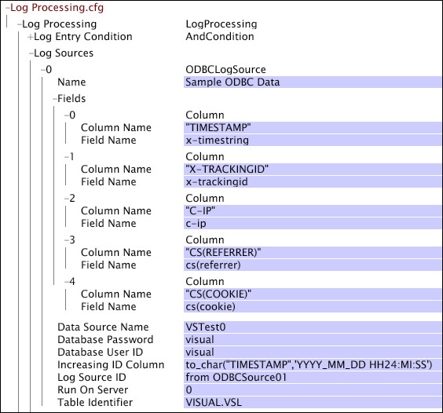

# Origini dati ODBC{#odbc-data-sources}

Il server workbench dati (InsightServer64.exe) è in grado di leggere i dati evento da qualsiasi database SQL (ad esempio, Oracle o Microsoft SQL Server) con driver conforme a ODBC 3.0.

Il supporto ODBC del server workbench dati è simile al supporto esistente per il caricamento dei dati dai sensori o dai file di registro generati da processi esterni. Esistono tuttavia alcune considerazioni e limitazioni aggiuntive:

* Il supporto ODBC del server workbench dati è compatibile con le funzionalità di clustering. I dati vengono distribuiti tra tutti i server di elaborazione e tutte le elaborazioni successive (compresa l&#39;elaborazione delle query) beneficiano appieno del clustering.
* Il supporto ODBC dipende da driver ODBC di terze parti. Affinché il supporto ODBC funzioni, questi driver devono essere configurati sul computer in cui viene eseguito il server workbench dati, utilizzando strumenti esterni alla piattaforma Adobe. Le macchine per workbench dati non richiedono alcuna configurazione aggiuntiva.
* La tabella o la vista da cui vengono caricati i dati deve avere una colonna ID crescente. Per ogni riga, il valore in questa colonna (che può essere una colonna effettiva nella tabella o qualsiasi espressione di colonna SQL) non deve diminuire quando vengono inserite nuove righe nel database. Se questo vincolo viene violato, i dati vengono persi. Per ottenere prestazioni adeguate, è necessario un indice in questa espressione di colonna o colonna.

   >[!NOTE]
   >
   >È possibile che più righe abbiano lo stesso valore nella [!DNL Increasing ID] colonna. Una possibilità è una colonna timestamp con una precisione inferiore a quella perfetta.

* Il server workbench dati non è in grado di caricare colonne con dati lunghi (dati di lunghezza superiore a quella determinata dall&#39;applicazione di database specifica in uso).
* Il recupero dei dati da un database è più lento rispetto alla lettura da un file su disco. I set di dati che caricano i dati da un&#39;origine ODBC richiedono molto più tempo per l&#39;elaborazione (in particolare durante la rielaborazione) rispetto ai set di dati di dimensioni equivalenti i cui dati provengono da Sensori o altri file di disco.

Per informazioni sulla rielaborazione dei dati, vedere [Rielaborazione e trasformazione](../../../home/c-dataset-const-proc/c-reproc-retrans/c-unst-reproc-retrans.md).

**Per configurare Insight Server per ODBC[!DNL event data]**

La configurazione del server workbench dati per caricare i dati da un database SQL richiede che vengano eseguiti i seguenti passaggi in ordine:

1. Installare il software client di database appropriato, incluso un driver ODBC, nel computer server workbench dati su cui viene elaborato il dataset.

   >[!NOTE]
   >
   >Se si caricano dati evento ODBC per l&#39;elaborazione in un cluster di server workbench dati, è necessario installare il software client del database su tutti i server di elaborazione del cluster. Per informazioni sulla specifica dei server di elaborazione in un cluster, consultate la Guida all&#39;installazione e all&#39;amministrazione dei prodotti *server*.

1. Configurare un&#39;origine dati utilizzando l&#39;amministratore dell&#39;origine dati ODBC per Windows.

   È importante notare che il server workbench dati (InsightServer64.exe) viene eseguito come servizio Windows. Pertanto, l&#39;Origine dati deve essere configurata normalmente come DSN di sistema anziché come DSN utente per consentire al server workbench dati di utilizzarla. Per ulteriori informazioni su questo passaggio di configurazione, consulta la documentazione relativa al software del database.

Dopo aver installato il software client del database sul computer server workbench dati appropriato, è possibile configurare il dataset per utilizzare l&#39;origine dati ODBC modificando i parametri appropriati nel file di [!DNL Log Processing] configurazione per il profilo desiderato.

## Parametri {#section-15c0218d93364693a565f2609a12f73e}

Per i dati provenienti da database che utilizzano lo standard ODBC (Open Database Connectivity), sono disponibili i seguenti parametri:

<table id="table_606D8A90DA4A43C29F2C6130F8C753F8"> 
 <thead> 
  <tr> 
   <th colname="col1" class="entry"> Parametro </th> 
   <th colname="col2" class="entry"> Descrizione </th> 
  </tr> 
 </thead>
 <tbody> 
  <tr> 
   <td colname="col1"> Nome </td> 
   <td colname="col2"> Identificatore per l'origine ODBC. </td> 
  </tr> 
  <tr> 
   <td colname="col1"> Nome origine dati </td> 
   <td colname="col2"> Un DSN, fornito da un amministratore del computer server workbench dati su cui viene elaborato il dataset, che fa riferimento al database da cui vengono caricati i dati. </td> 
  </tr> 
  <tr> 
   <td colname="col1"> Password database </td> 
   <td colname="col2"> La password da utilizzare per la connessione al database. Se una password è stata configurata per il DSN nell'amministratore dell'origine dati, potrebbe essere lasciata vuota. Qualsiasi password qui fornita sostituisce la password configurata per il DSN nell'amministratore dell'origine dati. </td> 
  </tr> 
  <tr> 
   <td colname="col1"> ID utente database </td> 
   <td colname="col2"> ID utente da utilizzare per la connessione al database. Se l'ID utente è stato configurato per il DSN nell'amministratore dell'origine dati, può essere lasciato vuoto. Qualsiasi ID utente fornito qui ha la precedenza sull'ID utente configurato per il DSN nell'amministratore dell'origine dati. </td> 
  </tr> 
  <tr> 
   <td colname="col1"> Campi </td> 
   <td colname="col2"> Un vettore di oggetti colonna che specifica una mappatura dalle colonne di dati nel database ai campi di dati nel motore di esecuzione del server workbench dati. Ogni colonna contiene voci  Nome colonna e Nome  campo.  Nome colonna è un'espressione di colonna SQL che deve essere valida nel contesto della tabella identificata dall'identificatore  di tabella sopra descritto. Può trattarsi di un nome di colonna o di un'espressione SQL basata su un numero qualsiasi di colonne nella tabella. Potrebbe essere necessaria una funzione di formattazione per convertire i valori di alcuni tipi di dati in stringhe in modo da non perdere precisione. Tutti i dati vengono implicitamente convertiti in stringhe utilizzando il metodo di formattazione predefinito del database, che potrebbe causare la perdita di dati per alcuni tipi di dati di colonna (come i tipi di dati data/ora) se non vengono utilizzate espressioni di formattazione esplicite. </td> 
  </tr> 
  <tr> 
   <td colname="col1"> Aumento della colonna ID </td> 
   <td colname="col2"> 
Un nome di colonna o un'espressione di colonna SQL che soddisfa il criterio per cui aumenta (o almeno non diminuisce) quando vengono aggiunte nuove righe. Se la riga B viene aggiunta alla tabella in un momento successivo rispetto alla riga A, il valore di questa colonna (o espressione di colonna) nella riga B deve essere maggiore (in base all'ordine di ordinamento nativo del database) del valore corrispondente nella riga A. 
 
 
     <ul id="ul_EBF6AEE4746B41B3B5BB6CC74194DAED"> 
      <li id="li_A5C9BE52B01649DE9726ECEC68B99828"> Il  nome della colonna ID crescente può essere uguale al nome di una colonna esistente, ma non obbligatorio. </li> 
      <li id="li_CF69EAB4AFB14F4894F7A5CDCAF06947"> Si presume che l'espressione abbia un tipo di dati carattere SQL. Se la colonna ID incrementale effettiva è di un altro tipo di dati, questo valore deve essere un'espressione di colonna per convertirla in una stringa. Poiché in genere i confronti sono lessicografici (carattere per carattere), è importante formattare attentamente il valore. </li> 
      <li id="li_58977431962E48039C898CFC47C53323"> L'espressione viene utilizzata nelle clausole SQL ORDER BY e confrontata con le clausole SQL WHERE. È importante disporre di un indice basato sull'espressione di colonna esatta utilizzata. </li> 
     </ul> 
 </td> 
  </tr> 
  <tr> 
   <td colname="col1"> ID origine registro </td> 
   <td colname="col2"> 
Il valore di questo parametro può essere una qualsiasi stringa. Se viene specificato un valore, questo parametro consente di distinguere le voci di registro da diverse origini di registro per l'identificazione dell'origine o l'elaborazione mirata. Il campo x-log-source-id è popolato con un valore che identifica l’origine del registro per ciascuna voce di registro. Ad esempio, se si desidera identificare le voci di registro da un'origine ODBC denominata ODBCSource01, è possibile digitare  da ODBCSource01. e quella stringa viene passata al campo x-log-source-id per ogni voce di registro proveniente da tale origine. 
 
 Per informazioni sul campo x-log-source-id, consultate Campi <a href="../../../home/c-dataset-const-proc/c-ev-data-rec-fields.md#concept-06bda4be1a4649a2905a4422e9e6c42f"> record dati evento</a>. 
 </td> 
  </tr> 
  <tr> 
   <td colname="col1"> Esegui sul server </td> 
   <td colname="col2"> Valore di indice nel file  profile.cfg del server di elaborazione che esegue le query ODBC per ottenere i dati dal database. (Il parametro Server di elaborazione nel file  profile.cfg elenca tutti i server di elaborazione per il set di dati, e ogni server ha un valore di indice, il primo è 0.) Il valore predefinito è 0. </td> 
  </tr> 
  <tr> 
   <td colname="col1"> Identificatore tabella </td> 
   <td colname="col2"> Un'espressione SQL che assegna un nome alla tabella o alla vista da cui devono essere caricati i dati. Un identificatore di tabella tipico è costituito dal modulo SCHEMA.TABLE. </td> 
  </tr> 
 </tbody> 
</table>

Questo esempio mostra la finestra di [!DNL Log Processing] configurazione nel workbench dati con un&#39;origine dati ODBC. Questa Origine dati prende i dati da una tabella chiamata [!DNL VISUAL.VSL] in un database con [!DNL Data Source Name] &quot;VSTestO&quot;. Cinque (5) oggetti colonna ( [!DNL Fields]) mappano i dati dalle colonne di dati del database al server Workbench dati.

