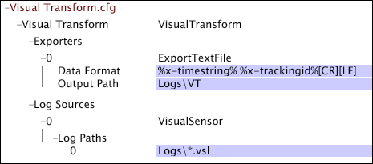

# Esempio di file Transform.cfg di Workbench dati{#sample-data-workbench-transform-cfg-files}

Informazioni su come specificare i parametri nel file Transform.cfg in base ai diversi scenari.

* [Un semplice file Transform.cfg Insight](../../../../../home/c-dataset-const-proc/c-transf-func/c-config-files-transf/t-ins-transf-file/c-sample-transf-files.md#section-b7e83cafa3a947c597bd09d316930190)
* [Output con valori separati da virgole](../../../../../home/c-dataset-const-proc/c-transf-func/c-config-files-transf/t-ins-transf-file/c-sample-transf-files.md#section-03916934ad574efc8695abbae54a1816)
* [File di registro di esempio](../../../../../home/c-dataset-const-proc/c-transf-func/c-config-files-transf/t-ins-transf-file/c-sample-transf-files.md#section-113b3b0c0c7547ea9536bb2f465c0875)
* [Suddivisione dei file di registro per sezione del sito Web](../../../../../home/c-dataset-const-proc/c-transf-func/c-config-files-transf/t-ins-transf-file/c-sample-transf-files.md#section-2cac205cd3934d31abb6c6ed8780196d)

In ciascun esempio, il file viene visualizzato come una [!DNL Transform.cfg] finestra nel workbench dati.

## Un semplice file Transform.cfg di Workbench dati {#section-b7e83cafa3a947c597bd09d316930190}

La [!DNL Transform.cfg] finestra seguente fornisce istruzioni per leggere [!DNL .vsl] i file dalla [!DNL Logs] directory ed esportare i campi x-timestring e x-trackingid in un file di testo memorizzato nella directory Logs\VT. Poiché non è stato specificato alcun periodo di rotazione del file o formato del nome del file di output, ogni file contiene dati per un giorno di calendario e ha un nome nel formato predefinito [!DNL %yyyy%%mm%%dd%-%x-mask%.txt].

## Output con valori separati da virgole {#section-03916934ad574efc8695abbae54a1816}

La [!DNL Transform.cfg] finestra seguente fornisce istruzioni per leggere [!DNL .vsl] i file dalla directory Logs ed esportare i campi da 0 a 13 in un file delimitato da virgole ( [!DNL .csv]) memorizzato nella directory Logs\VT\CSV directory. Poiché non è stato specificato alcun periodo di rotazione del file, ogni file contiene dati per un giorno di calendario. I file di output sono [!DNL .csv] file denominati in formato [!DNL %yyyy%%mm%%dd%-%x-mask%.csv].

## File di registro di esempio {#section-113b3b0c0c7547ea9536bb2f465c0875}

È possibile configurare la funzionalità di trasformazione per creare e mantenere una versione aggiornata e compatta dei file di registro completi. In questo modo è possibile testare rapidamente le configurazioni dei dataset, con tempi di rielaborazione di secondi o minuti invece delle ore necessarie per rielaborare l&#39;intero dataset. L&#39;esempio seguente illustra come configurare la funzionalità di trasformazione per eseguire questa operazione.

La [!DNL Transform.cfg] finestra seguente fornisce istruzioni per leggere [!DNL .vsl] i file dalla directory Logs ed esportare i campi x-timestring e x-trackingid in un file di testo memorizzato nella directory Logs\VT. La soglia hash specificata filtra alcuni ID di tracciamento dal set di dati, creando in tal modo un set di dati campionato da un fattore di 100. Poiché non è stato specificato alcun periodo di rotazione del file, ogni file contiene dati per un giorno di calendario. I nomi dei file di output sono nel formato predefinito [!DNL %yyyy%%mm%%dd%-%x-mask%.txt].

## Suddivisione dei file di registro per sezione del sito Web {#section-2cac205cd3934d31abb6c6ed8780196d}

La [!DNL Transform.cfg] finestra seguente fornisce istruzioni per leggere [!DNL .vsl]i file dalla directory Logs ed esportare i campi x-timestring e x-trackingid in un file di testo memorizzato nella directory Logs\VT. La trasformazione delle espressioni regolari ( [!DNL RETransform]) prende come input il campo cs-uri-stem e crea un nuovo campo (x-site) che definisce una sezione del sito. Il campo x-site è incluso nel nome dei file di testo di output, ciascuno dei quali contiene dati per un giorno di calendario.

