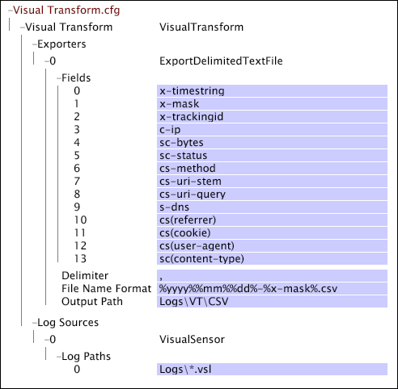

# Esempio di file Transform.cfg di Data Workbench{#sample-data-workbench-transform-cfg-files}

{{eol}}

Informazioni su come specificare i parametri nel file Transform.cfg in base ai diversi scenari.

* [Un file Transform.cfg semplice](../../../../../home/c-dataset-const-proc/c-transf-func/c-config-files-transf/t-ins-transf-file/c-sample-transf-files.md#section-b7e83cafa3a947c597bd09d316930190)
* [Uscita con valori separati da virgole](../../../../../home/c-dataset-const-proc/c-transf-func/c-config-files-transf/t-ins-transf-file/c-sample-transf-files.md#section-03916934ad574efc8695abbae54a1816)
* [File di registro di esempio](../../../../../home/c-dataset-const-proc/c-transf-func/c-config-files-transf/t-ins-transf-file/c-sample-transf-files.md#section-113b3b0c0c7547ea9536bb2f465c0875)
* [Divisione dei file di registro per sezione del sito Web](../../../../../home/c-dataset-const-proc/c-transf-func/c-config-files-transf/t-ins-transf-file/c-sample-transf-files.md#section-2cac205cd3934d31abb6c6ed8780196d)

In ciascun esempio, il file viene visualizzato come [!DNL Transform.cfg] all’interno di Data Workbench.

## Un file Transform.cfg di Data Workbench semplice {#section-b7e83cafa3a947c597bd09d316930190}

I seguenti [!DNL Transform.cfg] windows fornisce istruzioni per leggere [!DNL .vsl] file dal [!DNL Logs] e esporta i campi x-timestring e x-trackingid in un file di testo memorizzato nella directory Logs\VT. Poiché non è specificato alcun periodo di rotazione dei file o il formato del nome del file di output, ogni file contiene dati per un giorno di calendario e ha un nome nel formato predefinito [!DNL %yyyy%%mm%%dd%-%x-mask%.txt].

## Uscita con valori separati da virgole {#section-03916934ad574efc8695abbae54a1816}

I seguenti [!DNL Transform.cfg] windows fornisce istruzioni per leggere [!DNL .vsl] file dalla directory Logs ed esporta i campi da 0 a 13 in un delimitato da virgole ( [!DNL .csv]) nella directory Logs\VT\CSV. Poiché non viene specificato alcun periodo di rotazione dei file, ogni file contiene dati per un giorno di calendario. I file di output sono [!DNL .csv] file denominati nel formato [!DNL %yyyy%%mm%%dd%-%x-mask%.csv].

## File di registro di esempio {#section-113b3b0c0c7547ea9536bb2f465c0875}

Puoi configurare la funzionalità di trasformazione per creare e mantenere una versione aggiornata e compatta dei file di registro completi. In questo modo puoi testare rapidamente le configurazioni del set di dati, con tempi di rielaborazione di secondi o minuti invece delle ore necessarie per rielaborare l’intero set di dati. L&#39;esempio seguente fornisce un esempio di come configurare la funzionalità di trasformazione per eseguire questa operazione.

I seguenti [!DNL Transform.cfg] windows fornisce istruzioni per leggere [!DNL .vsl] file dalla directory Logs ed esporta i campi x-timestring e x-trackingid in un file di testo memorizzato nella directory Logs\VT. La soglia hash specificata filtra alcuni ID di tracciamento dal set di dati, creando in tal modo un set di dati campionato da un fattore di 100. Poiché non viene specificato alcun periodo di rotazione dei file, ogni file contiene dati per un giorno di calendario. I nomi dei file di output sono nel formato predefinito [!DNL %yyyy%%mm%%dd%-%x-mask%.txt].

## Divisione dei file di registro per sezione del sito Web {#section-2cac205cd3934d31abb6c6ed8780196d}

I seguenti [!DNL Transform.cfg] windows fornisce istruzioni per leggere [!DNL .vsl]file dalla directory Logs ed esporta i campi x-timestring e x-trackingid in un file di testo memorizzato nella directory Logs\VT. La trasformazione delle espressioni regolari ( [!DNL RETransform]) prende come input il campo cs-uri-stem e crea un nuovo campo (x-site) che definisce una sezione del sito. Il campo x-site è incluso nel nome dei file di testo di output, ciascuno dei quali contiene dati per un giorno di calendario.

