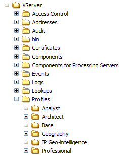

# Installazione del profilo del servizio dati{#installing-the-data-service-profile}

I profili del servizio dati (Geo-intelligence IP e Geo-location IP) sono profili interni che forniscono funzionalità aggiuntive all’applicazione Adobe.

Come per tutti gli altri profili interni forniti dall’Adobe, tali profili non devono essere modificati. Tutte le personalizzazioni devono verificarsi nel set di dati o nei profili specifici per il ruolo o in altri profili creati.

I profili del servizio dati includono i seguenti set di dati che includono i file da installare su un server di Data Workbench:

* **Profiles\*profile name *\Dataset\Log Processing\Traffic\IP.cfg:** Elenca il campo c-ip da passare dall&#39;elaborazione del registro alla trasformazione.
* **Profiles\*profile name *\Dataset\Transformation\Geography\IPLookup.cfg:** Definisce una trasformazione IPLookup che produce diversi campi di dati geografici utilizzando il file di ricerca Geo-intelligence IP o Geo-location IP fornito.

Per informazioni sui file di inclusione dei set di dati di trasformazione, consulta la *Guida alla configurazione del set di dati*.

Inoltre, ogni profilo del servizio dati fornisce un file di livello del punto elemento denominato [!DNL IP Coordinates.layer]. Questo file di livello consente di mappare dinamicamente le posizioni nel set di dati sul globo utilizzando indirizzi IP. Dopo l’installazione, il livello viene memorizzato nella cartella Profiles\*data service name*\Maps all’interno della directory di installazione del server di Data Workbench.

Il file [!DNL IP Coordinates.layer] fa riferimento alla dimensione Coordinate, definita nel file [!DNL Coordinates.cfg] fornito con il profilo [!DNL Geography] e che si trova nella cartella Dataset\Transformation\Geography folder. Ogni elemento della dimensione Coordinate definito nel set di dati viene mappato sul globo utilizzando le informazioni di latitudine e longitudine contenute in tale elemento. Per ulteriori informazioni sui livelli dei punti elemento che utilizzano punti dinamici, consulta [Definizione dei livelli del punto elemento utilizzando i punti dinamici](../../../../home/c-geo-oview/c-wk-img-lyrs/c-elmt-pt-lyrs/c-elmt-pt-lyrs-ref-lkp-files/c-elmt-pt-lyr-file-frmt/c-dyn-pts.md#concept-77ae65bedc3f465489bc135ae7e3c2f3).

>[!NOTE]
>
>Se hai installato il servizio di dati di geolocalizzazione IP e geolocalizzazione IP prima della versione 5.1, il file di livello del punto elemento fa riferimento a un file di ricerca invece di utilizzare punti dinamici. Ogni file di livello fa riferimento al file di ricerca IP Geocodes e alla dimensione IP Geocode. Il file di ricerca IP Geocodes contiene un elenco di geocodici IP (posizioni geografiche basate sull’indirizzo IP) e la latitudine e la longitudine per ciascuna di esse. Ogni elemento di una dimensione del geocodice IP definito nel set di dati viene mappato sul globo utilizzando la latitudine e la longitudine elencate per tale geocodice IP nel file di ricerca dei geocodici IP.

Il nome del file di livello e i file a cui fa riferimento differiscono per ogni servizio dati:

* Il file [!DNL IP Geocodes D.layer] viene installato con il profilo IP Geo-intelligence (Digital Envoy). Questo livello punto elemento fa riferimento al file di ricerca [!DNL IP Geocodes D yyyymmdd.txt] (che è necessario aggiornare periodicamente) e alla dimensione IP Geocode D.

* Il file [!DNL IP Geocodes Q.layer] viene installato con il profilo IP Geo-location (Quova). Questo livello punto elemento fa riferimento al file di ricerca [!DNL IP Geocodes Q yyyymmdd.txt] (che è necessario aggiornare periodicamente) e alla dimensione IP Geocode Q.

Per ulteriori informazioni sui livelli dei punti elemento che utilizzano i file di ricerca, consulta [Definizione dei livelli del punto elemento con riferimento a file di ricerca](../../../../home/c-geo-oview/c-wk-img-lyrs/c-elmt-pt-lyrs/c-elmt-pt-lyrs-ref-lkp-files/c-elmt-pt-lyrs-ref-lkp-files.md#concept-c40bd0890a984112bce831b596827f0f).

## Per installare il profilo di geolocalizzazione IP o geolocalizzazione IP {#section-6dff402ffdcb4b31b9bcd0c40a5f7625}

>[!NOTE]
>
>Le istruzioni di installazione seguenti presuppongono l’installazione di Data Workbench e l’impostazione di una connessione tra Data Workbench e il server di Data Workbench sul quale si sta installando Data Workbench [!DNL Geography]. Se non lo hai fatto, consulta la *Data Workbench guida utente*.

1. Apri la cartella Profiles dal file [!DNL .zip] ricevuto da Adobe.
1. Copia la cartella Geo-intelligence IP o Geolocalizzazione IP nella cartella Profiles nella directory di installazione del server di Data Workbench. Vuoi finire con un...\Profiles\IP Geo-intelligence folder or a ..\Profiles\IP Geo-location on your data workbench server as shown in the following example. I nomi delle altre cartelle all’interno della cartella [!DNL Profiles] possono essere diversi da quelli visualizzati.

   

1. Utilizza i passaggi seguenti per aggiornare il file [!DNL profile.cfg] per ciascun profilo con cui desideri utilizzare il profilo [!DNL IP Geo-intelligence] o [!DNL IP Geo-location].

   1. Apri **[!UICONTROL Profile Manager]**.
   1. Fai clic con il pulsante destro del mouse sul segno di spunta accanto a [!DNL profile.cfg] e fai clic su **[!UICONTROL Make Local]**. Un segno di spunta per questo file viene visualizzato nella colonna [!DNL User].

   1. Fai clic con il pulsante destro del mouse sul segno di spunta appena creato e fai clic su **[!UICONTROL Open]** > **[!UICONTROL from the workbench]**. Viene visualizzata la finestra [!DNL profile.cfg].

   1. Nella finestra [!DNL profile.cfg]fare clic con il pulsante destro del mouse su **[!UICONTROL Directories]** e scegliere **[!UICONTROL Add new]** > **[!UICONTROL Directory]**.

      Per aggiungere la nuova directory alla fine dell’elenco di directory, fare clic con il pulsante destro del mouse sul numero o sul nome dell’ultima directory nell’elenco e fare clic su **[!UICONTROL Add new]** > **[!UICONTROL Directory]**.

   1. Digitare il nome della nuova directory: [!DNL IP Geo-intelligence] o I [!DNL P Geo-location].

   1. Fai clic con il pulsante destro del mouse su **[!UICONTROL (modified)]** nella parte superiore della finestra e fai clic su **[!UICONTROL Save]**.

   1. In [!DNL Profile Manager], fai clic con il pulsante destro del mouse sul segno di spunta per [!DNL profile.cfg] nella colonna [!DNL User], quindi fai clic su **[!UICONTROL Save to]** > *&lt;**[!UICONTROL profile name]**>*.

>[!NOTE]
>
>Non salvare il file di configurazione modificato in nessuno dei profili interni forniti dall’Adobe (incluso il profilo [!DNL IP Geo-location] o [!DNL IP Geo-intelligence]), in quanto le modifiche vengono sovrascritte quando installi gli aggiornamenti a tali profili.
