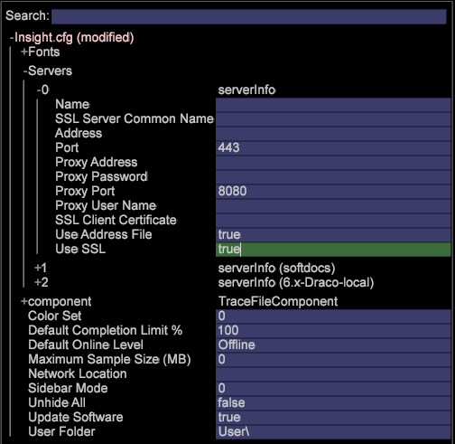

# Opzione di configurazione{#configuration-option}

L’opzione Configurazione apre il file Insight.cfg, che controlla le connessioni a vari server.

**Per modificare il file Insight.cfg**

1. Nella finestra [!DNL Insight.cfg], modifica i parametri come desiderato. Per descrizioni dettagliate dei parametri nel file [!DNL Insight.cfg], consulta [Parametri di configurazione di Insight](../../../home/c-get-started/c-insght-config-param.md#concept-14da97d0756348e885c08ca9e866074b).
1. Per salvare le impostazioni di configurazione, fai clic con il pulsante destro del mouse su **[!UICONTROL Insight.cfg (modified)]** nella parte superiore della finestra e fai clic su **[!UICONTROL Save as Insight.cfg]**.

**Aggiunta di nuovi server**

1. Nella finestra [!DNL Insight.cfg], fai clic con il pulsante destro del mouse su **[!UICONTROL Servers]** e fai clic su **[!UICONTROL Add new child]** > **[!UICONTROL Server]**.

   

1. Completa o modifica i parametri del server per fornire a Data Workbench l’accesso al server desiderato. Per descrizioni dettagliate dei parametri nel file [!DNL Insight.cfg], consulta [Parametri di configurazione di Insight](../../../home/c-get-started/c-insght-config-param.md#concept-14da97d0756348e885c08ca9e866074b).
1. Ripetere i passaggi 1 e 2 per ogni server in cui si desidera configurare una connessione.
1. Per salvare le impostazioni di configurazione, fai clic con il pulsante destro del mouse su **[!UICONTROL Insight.cfg (modified)]** nella parte superiore della finestra e fai clic su **[!UICONTROL Save as Insight.cfg]**.

Data Workbench tenta di connettersi ai server utilizzando le impostazioni specificate. Se viene stabilita una connessione, nel [!DNL Servers Manager] viene visualizzato un nodo verde come mostrato di seguito. Se Data Workbench non è in grado di connettersi al server, viene visualizzato un nodo rosso.

