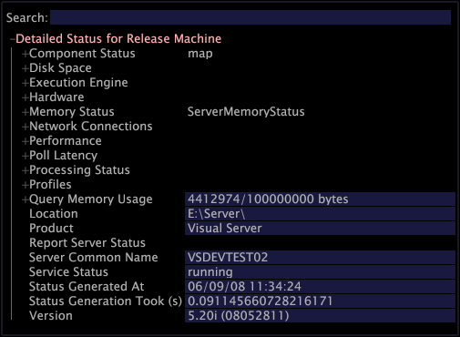

# Interfaccia di stato dettagliata{#detailed-status-interface}

{{eol}}

L&#39;interfaccia di Stato dettagliata è utile per la risoluzione di errori o altri problemi relativi ai computer del server Data Workbench.

Questo include [!DNL Transform] profili in esecuzione su tali computer, oppure [!DNL Report] computer che sono client del server Data Workbench. Puoi accedere a [!DNL Master Server] e [!DNL Query Server Detailed Status] attraverso [!DNL Admin] menu. Per accedere al [!DNL Detailed Status] interfaccia per altri computer, nella [!DNL Servers Manager], fare clic con il pulsante destro del mouse sul nodo del server per il quale si desidera visualizzare lo stato e fare clic su **[!UICONTROL Detailed Status]**. Vedi [Server Manager](../../../home/c-get-started/c-admin-intrf/c-svrs-mgr.md#concept-2dfff1ca5bce470a8ee854ed57cbe5ba).

Per ulteriori informazioni sul server Data Workbench, consulta la sezione *Guida all’installazione e all’amministrazione dei prodotti server*.

>[!NOTE]
>
>Per aggiornare le informazioni in un [!DNL Detailed Status] interfaccia, fai clic con il pulsante destro del mouse **[!UICONTROL Detailed Status]** intestazione e fai clic su **[!UICONTROL Refresh]**.

Nella tabella seguente sono elencate le attività che possono essere completate utilizzando [!DNL Detailed Status] interfaccia.

<table id="table_E685F31DCDB343F49FFA1019F2E8DA85"> 
 <thead> 
  <tr> 
   <th colname="col1" class="entry"> Per eseguire questa operazione.. </th> 
   <th colname="col2" class="entry"> Fai questo... </th> 
  </tr> 
 </thead>
 <tbody> 
  <tr> 
   <td colname="col1"> 
Visualizzazione di ciascun componente del computer e del relativo stato corrente 
 </td> 
   <td colname="col2"> 
Fai clic su  Stato del componente. 
 </td> 
  </tr> 
  <tr> 
   <td colname="col1"> 
Per visualizzare la quantità di memoria utilizzata nel computer 
 </td> 
   <td colname="col2"> 
Fai clic su  Stato della memoria &gt;  Caricamento dello spazio degli indirizzi. 
 
Per ulteriori informazioni sul monitoraggio del carico dello spazio degli indirizzi, consulta la sezione <i>Guida all’installazione e all’amministrazione dei prodotti server</i>. 
 </td> 
  </tr> 
  <tr> 
   <td colname="col1"> 
Per determinare se il computer è configurato per utilizzare lo switch /3GB 
 </td> 
   <td colname="col2"> 
Fai clic su  Stato della memoria &gt;  Spazio degli indirizzi di processo. 
 
Se la  Totale visualizza più di 300000 KB, il computer è configurato per utilizzare lo switch /3GB. 
 
Per ulteriori informazioni sullo switch /3GB, vedere la <i>Guida all’installazione e all’amministrazione dei prodotti server</i>. 
 </td> 
  </tr> 
  <tr> 
   <td colname="col1"> 
Per monitorare la quantità di spazio su disco e di memoria utilizzati per memorizzare ciascuna dimensione e quella utilizzata per memorizzare i nomi dei relativi elementi 
 </td> 
   <td colname="col2"> 
Fai clic su  Prestazioni &gt;  Dimension &gt;  Utilizzo del disco &gt; <i>&lt; nome profilo&gt; </i>o  Prestazioni &gt;  Dimension &gt;  Utilizzo della memoria &gt; <i>&lt; nome profilo&gt;</i>. 
 
La  Utilizzo del disco i campi forniscono il nome e la quantità di spazio su disco (in MB) necessari per memorizzare ciascuna dimensione. I numeri di utilizzo di dischi di grandi dimensioni possono influire negativamente sui tempi di query perché il server di Data Workbench deve leggere tutti i dati per completare le query correlate. Abbassare l'utilizzo del disco per una dimensione può ridurre il tempo necessario per completare le query correlate. 
 
La  Utilizzo della memoria i campi forniscono il numero di elementi in ogni dimensione e la quantità di memoria necessaria per memorizzare l’elenco dei nomi degli elementi. Un numero elevato di elementi può influire negativamente sulla quantità di memoria utilizzata durante una query, perché il server di Data Workbench deve leggere attraverso ogni elemento. La riduzione del numero di elementi in una dimensione può ridurre il tempo necessario per completare le query correlate. 
 
Esempio: <code>+&nbsp;Performance
      &nbsp;&nbsp;&nbsp;&nbsp;&nbsp;-&nbsp;Dimensions&nbsp;
      &nbsp;&nbsp;&nbsp;&nbsp;&nbsp;&nbsp;&nbsp;&nbsp;&nbsp;&nbsp;-&nbsp;Disk&nbsp;Usage
      &nbsp;&nbsp;&nbsp;&nbsp;&nbsp;&nbsp;&nbsp;&nbsp;&nbsp;&nbsp;&nbsp;&nbsp;&nbsp;&nbsp;&nbsp;&nbsp;&nbsp;&nbsp;&nbsp;-&nbsp;ProfileName
      &nbsp;&nbsp;&nbsp;&nbsp;&nbsp;&nbsp;&nbsp;&nbsp;&nbsp;&nbsp;&nbsp;&nbsp;&nbsp;&nbsp;&nbsp;&nbsp;&nbsp;&nbsp;&nbsp;&nbsp;&nbsp;&nbsp;&nbsp;&nbsp;&nbsp;-&nbsp;DimensionName&nbsp;1.386&nbsp;MB
      &nbsp;&nbsp;&nbsp;&nbsp;&nbsp;&nbsp;&nbsp;&nbsp;&nbsp;&nbsp;&nbsp;&nbsp;&nbsp;&nbsp;&nbsp;&nbsp;&nbsp;&nbsp;&nbsp;&nbsp;&nbsp;&nbsp;&nbsp;&nbsp;&nbsp;&nbsp;.&nbsp;.&nbsp;.
      &nbsp;&nbsp;&nbsp;&nbsp;&nbsp;&nbsp;&nbsp;&nbsp;&nbsp;&nbsp;-&nbsp;Memory&nbsp;Usage
      &nbsp;&nbsp;&nbsp;&nbsp;&nbsp;&nbsp;&nbsp;&nbsp;&nbsp;&nbsp;&nbsp;&nbsp;&nbsp;&nbsp;&nbsp;&nbsp;&nbsp;&nbsp;&nbsp;-&nbsp;ProfileName
      &nbsp;&nbsp;&nbsp;&nbsp;&nbsp;&nbsp;&nbsp;&nbsp;&nbsp;&nbsp;&nbsp;&nbsp;&nbsp;&nbsp;&nbsp;&nbsp;&nbsp;&nbsp;&nbsp;&nbsp;&nbsp;&nbsp;&nbsp;&nbsp;&nbsp;-&nbsp;DimensionName&nbsp;21&nbsp;elements,&nbsp;0.001&nbsp;MB
      &nbsp;&nbsp;&nbsp;&nbsp;&nbsp;&nbsp;&nbsp;&nbsp;&nbsp;&nbsp;&nbsp;&nbsp;&nbsp;&nbsp;&nbsp;&nbsp;&nbsp;&nbsp;&nbsp;&nbsp;&nbsp;&nbsp;&nbsp;&nbsp;&nbsp;&nbsp;.&nbsp;.&nbsp;.</code> 
 </td> 
  </tr> 
  <tr> 
   <td colname="col1"> 
Per monitorare l’utilizzo della CPU per le fasi di Log Processing e Transformation 
 </td> 
   <td colname="col2"> 
Fai clic su  Prestazioni &gt;  Utilizzo CPU &gt;  Elaborazione del registro &gt; <i>&lt; nome profilo&gt;</i> o  Prestazioni &gt;  Utilizzo CPU &gt;  Trasformazione &gt; &lt; nome profilo&gt; 
 
Ognuno di questi set di campi fornisce l’utilizzo della CPU (in secondi) per ciascuna delle fasi nell’elaborazione e nella trasformazione del registro. 
 
Esempio: <code>+&nbsp;Performance
      &nbsp;&nbsp;&nbsp;&nbsp;&nbsp;-&nbsp;CPU&nbsp;Usage&nbsp;
      &nbsp;&nbsp;&nbsp;&nbsp;&nbsp;&nbsp;&nbsp;&nbsp;&nbsp;&nbsp;-&nbsp;Log&nbsp;Processing
      &nbsp;&nbsp;&nbsp;&nbsp;&nbsp;&nbsp;&nbsp;&nbsp;&nbsp;&nbsp;&nbsp;&nbsp;&nbsp;&nbsp;&nbsp;-&nbsp;ProfileName&nbsp;158.9&nbsp;sec
      &nbsp;&nbsp;&nbsp;&nbsp;&nbsp;&nbsp;&nbsp;&nbsp;&nbsp;&nbsp;&nbsp;&nbsp;&nbsp;&nbsp;&nbsp;&nbsp;&nbsp;&nbsp;&nbsp;&nbsp;-&nbsp;Built-in&nbsp;158.1&nbsp;sec
      &nbsp;&nbsp;&nbsp;&nbsp;&nbsp;&nbsp;&nbsp;&nbsp;&nbsp;&nbsp;&nbsp;&nbsp;&nbsp;&nbsp;&nbsp;&nbsp;&nbsp;&nbsp;&nbsp;&nbsp;&nbsp;&nbsp;&nbsp;&nbsp;&nbsp;-&nbsp;StageName&nbsp;13.0&nbsp;sec
      &nbsp;&nbsp;&nbsp;&nbsp;&nbsp;&nbsp;&nbsp;&nbsp;&nbsp;&nbsp;&nbsp;&nbsp;&nbsp;&nbsp;&nbsp;&nbsp;&nbsp;&nbsp;&nbsp;&nbsp;.&nbsp;.&nbsp;.
      &nbsp;&nbsp;&nbsp;&nbsp;&nbsp;&nbsp;&nbsp;&nbsp;&nbsp;&nbsp;&nbsp;&nbsp;&nbsp;&nbsp;&nbsp;&nbsp;&nbsp;&nbsp;&nbsp;&nbsp;-&nbsp;Log&nbsp;Processing\ProfileName&nbsp;0.8&nbsp;sec
      &nbsp;&nbsp;&nbsp;&nbsp;&nbsp;&nbsp;&nbsp;&nbsp;&nbsp;&nbsp;&nbsp;&nbsp;&nbsp;&nbsp;&nbsp;&nbsp;&nbsp;&nbsp;&nbsp;&nbsp;&nbsp;&nbsp;&nbsp;&nbsp;&nbsp;-&nbsp;StageName&nbsp;0.8&nbsp;sec</code> 
 
Il tempo necessario per completare una query è in genere proporzionale alla dimensione totale di tutte le dimensioni. Dopo aver esaminato le dimensioni di ciascuna dimensione, puoi valutare se una particolare dimensione è sufficientemente utile e utilizzata con frequenza sufficiente a giustificare il costo di prestazioni della dimensione. In caso contrario, puoi eliminare la dimensione nel  Profile Manager.
Una dimensione il cui elenco di nomi di elementi è eccessivamente grande (ovvero superiore a 128 MB) può causare errori di "memoria esaurita" anche se l’utilizzo totale dello spazio degli indirizzi non è vicino al limite. 
 
Inoltre, se utilizzi un cluster di server Data Workbench ma non utilizzi la normalizzazione centralizzata, una dimensione con un elenco di nomi di elementi di grandi dimensioni ha un impatto significativo sui budget di invio della memoria. Per ulteriori informazioni sulla normalizzazione centralizzata, consulta la sezione <i>Guida alla configurazione del set di dati</i>. Se la quantità di memoria necessaria per memorizzare tutti gli elenchi di nomi di elementi combinati è superiore a 100 MB su tutti i server del cluster, si potrebbero ricevere errori "Invia budget di memoria superato" anche quando l'attività di query è leggera. Ad esempio, se disponi di un cluster a quattro server con più di 25 MB su ogni server utilizzato per memorizzare gli elenchi dei nomi degli elementi, potresti ricevere errori. 
 </td> 
  </tr> 
  <tr> 
   <td colname="col1"> 
Per monitorare il tempo trascorso nell’elaborazione e nella trasformazione del registro 
 </td> 
   <td colname="col2"> 
Fai clic su  Prestazioni &gt;  Utilizzo CPU &gt;  Elaborazione del registro &gt; <i>&lt; nome profilo&gt;</i> o  Prestazioni &gt;  Utilizzo CPU &gt;  Trasformazione &gt; <i>&lt; nome profilo&gt;</i>. 
 
La revisione dei campi in queste sezioni ti consente di identificare i filtri e le trasformazioni che possono influenzare negativamente il tempo necessario per l’elaborazione e la trasformazione del registro. Puoi quindi prendere decisioni di progettazione relative ai singoli filtri e trasformazioni con tempi di elaborazione lunghi. 
 </td> 
  </tr> 
  <tr> 
   <td colname="col1"> 
Per monitorare l'utilizzo dello spazio su disco e aumentare la velocità della query 
 </td> 
   <td colname="col2"> 
Fai clic su  Prestazioni &gt;  Campi di elaborazione del registro &gt; <i>&lt; nome profilo&gt;</i>. 
 
Ogni voce in questa sezione corrisponde a un parametro nel  Log Processing.cfg file. La revisione di questi campi consente di vedere la quantità di memoria utilizzata da ogni parametro. Puoi quindi prendere decisioni di progettazione riguardo a singoli elementi che sono piuttosto grandi. 
 </td> 
  </tr> 
  <tr> 
   <td colname="col1"> 
Per determinare il tempo trascorso della trasformazione o del ritrattamento precedente 
 </td> 
   <td colname="col2"> 
Fai clic su  Stato di elaborazione &gt; <i>&lt; nome profilo&gt;</i> &gt;  Cronologia delle modalità di elaborazione. 
 
 
     <ul id="ul_B7CC0DF54E004C72B220F928CF223F8E"> 
      <li id="li_2707D8C0D52A44C8BADA4D9AFB5EB2BC">Tempo reale: tempo in cui il server Data Workbench era disponibile per l’esecuzione di query. </li> 
      <li id="li_3A3B490D70864A259780FC9FFC9AC15E">Fast Input - Questo tempo più il tempo di Fast Merge è il tempo totale necessario per l'elaborazione del set di dati. </li> 
      <li id="li_B754C6DECD924170A15721EA4C942E3D">Fast Merge: tempo totale necessario per la trasformazione del set di dati. </li> 
     </ul> 
 </td> 
  </tr> 
  <tr> 
   <td colname="col1"> 
Per diagnosticare i problemi "al momento" 
 </td> 
   <td colname="col2"> 
Fai clic su  Stato di elaborazione &gt; <i>&lt; nome profilo&gt;</i> &gt;  A partire dal tempo &gt;  Fonti a partire da. 
 
La revisione del numero di volte per ogni origine può essere utile per determinare quali origini possono influenzare negativamente il valore di A complessivo. Puoi quindi affrontare i problemi con quelle particolari fonti. 
 </td> 
  </tr> 
  <tr> 
   <td colname="col1"> 
Per stimare il tempo necessario al completamento di una query in esecuzione 
 </td> 
   <td colname="col2"> 
Fai clic su  Motore di esecuzione. 
 
Revisione dei  Tempo di sweep dei dati fornisce una stima del tempo necessario al completamento di una query. 
 </td> 
  </tr> 
  <tr> 
   <td colname="col1"> 
Per elencare tutti i profili disponibili nel computer e i dettagli sul loro stato 
 </td> 
   <td colname="col2"> 
Fai clic su  Profili. 
 </td> 
  </tr> 
  <tr> 
   <td colname="col1"> 
Per visualizzare lo stato della replica 
 </td> 
   <td colname="col2"> 
Fai clic su  Stato del componente. 
 
Controlla lo stato del componente Replicare. Se la replica è in esecuzione, viene visualizzato OK. Se il componente Replica non è riuscito, viene visualizzato un messaggio di errore. 
 </td> 
  </tr> 
  <tr> 
   <td colname="col1"> 
Per visualizzare  Server di rapporto stato di un  Rapporto computer che si connette al server Data Workbench 
 </td> 
   <td colname="col2"> 
Fai clic su  Stato del server di rapporto. 
 
Questa sezione del  Stato dettagliato l'interfaccia include una copia del  Report Server.cfg file , informazioni sul numero di report in esecuzione (Sezione corrente) e sull'errore più recente (Ultimo errore). 
 
Per i passaggi da eseguire per modificare le  Report Server.cfg vedi <i>Guida ai rapporti di Data Workbench</i>. 
 
 
Nota: Se la  Stato del server di rapporto la sezione non viene visualizzata nella sezione  Stato dettagliato interfaccia, potrebbe essere necessario configurare il server Data Workbench per la visualizzazione  Stato del server di rapporto. Per i passaggi, consulta la sezione <i>Guida ai rapporti di Data Workbench</i>. 
 
 </td> 
  </tr> 
  <tr> 
   <td colname="col1"> 
Per visualizzare le informazioni sull'utilizzo della memoria per Transform 
 </td> 
   <td colname="col2"> 
Fai clic su  Stato di elaborazione &gt;  Trasforma. 
 
Per ulteriori informazioni sulla trasformazione, consulta la sezione <i>Guida all’installazione e all’amministrazione dei prodotti server</i> e <i>Guida alla configurazione del set di dati</i>. 
 </td> 
  </tr> 
  <tr> 
   <td colname="col1"> 
Per salvare il  Stato dettagliato come interfaccia  *.cfg file che può essere aperto in un editor di testo come Blocco note o distribuito ad altri 
 </td> 
   <td colname="col2"> 
Fai clic con il pulsante destro del mouse sul pulsante  Stato dettagliato intestazione e fai clic su  Salva copia con nome. 
 
Nota:  
Fai clic con il pulsante destro del mouse sul pulsante  Stato dettagliato intestazione e clic  Salva a <i>nome server</i>/Status/ non funziona nel  Stato dettagliato interfaccia. Viene visualizzato il seguente messaggio di errore: 
 
Impossibile salvare /Status/. 403 Vietato 
 
 </td> 
  </tr> 
  <tr> 
   <td colname="col1"> 
Per visualizzare  Righe per origine registro metrica 
 </td> 
   <td colname="col2"> 
Se le righe per metrica Origine registro devono essere riportate in Stato dettagliato, l’amministratore della Data Workbench deve definire l’"ID origine registro" e fornire un nome univoco nel file Log Processing.cfg del profilo personalizzato. 
 </td> 
  </tr> 
 </tbody> 
</table>
