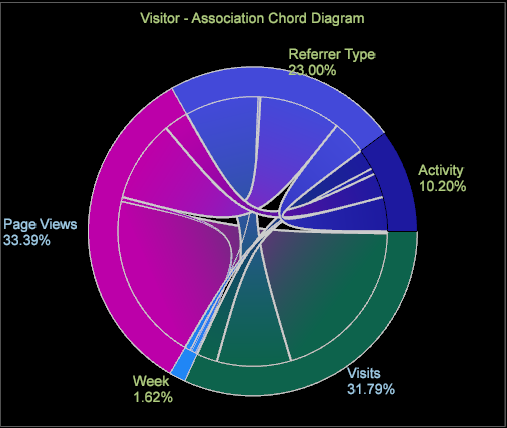

# Visualizzazione di Association Chord (Accordi associazioni){#association-chord-visualization}

{{eol}}

La visualizzazione di Association Chord (Accordi associazione) consente di mostrare sia la proporzione che l’associazione tra metriche, dimensioni ed elementi, mostrando accordi più grandi come indicazione di un’associazione più forte.

La tabella delle associazioni confronta i valori con il calcolo del V di Cramer piuttosto che utilizzare il coefficiente di correlazione di Pearson come impiegato nel [Matrice di correlazione](/help/home/c-get-started/c-analysis-vis/c-correlation-analysis/c-correlation-analysis.md) e [Accordo di correlazione](/help/home/c-get-started/c-analysis-vis/associations-visualization.md) Visualizzazioni (queste possono solo confrontare metriche, mentre la tabella delle associazioni e la corda possono confrontare metriche, dimensioni ed elementi). Associations Chord (Accordi associazioni) fornisce anche un&#39;altra vista in una build precedente [Tabella associazioni](../../../home/c-get-started/c-analysis-vis/associations-visualization.md#concept-9d937dda38174875b32095c6eaf22f2f).

**Per creare un accordo di associazione**

1. In un’area di lavoro, fai clic con il pulsante destro del mouse su **Visualizzazione > Predictive Analytics > Association Chord**.

   Viene visualizzato un menu che consente di selezionare una dimensione estesa dall’elenco.

   

   Una volta selezionata, si apre la tabella associazioni vuota con il Dimension selezionato identificato nel titolo. 

1. **Selezionare una metrica, una dimensione o un elemento dimensione**.

   Fai clic con il pulsante destro del mouse sulla visualizzazione a corda e seleziona **Aggiungi metrica** o **Aggiungi Dimension**. Selezionare gli elementi dal menu da aggiungere alla corda.

   Puoi anche trascinare metriche e dimensioni dal **[!UICONTROL Finder]** facendo clic su **[!UICONTROL Ctrl-Alt]** e trascinamento di metriche e dimensioni nell’accordo. Oppure trascina gli elementi dimensionali direttamente da una tabella aperta alla visualizzazione a corda.

1. **Scegli metriche, dimensioni ed elementi aggiuntivi da associare**.

   Dopo aver selezionato due o più valori, il grafico si aggiorna automaticamente e inizia a visualizzare i dati delle associazioni. Continua ad aggiungere metriche in base alle esigenze per associare i punti dati.

   

   La visualizzazione Chord (Corda) mostra la proporzione dell’intero rappresentato dall’area di ciascun segmento. Continua ad aggiungere metriche/dimensioni/elementi per identificare e approfondire le relazioni significative.

1. **Visualizzare la visualizzazione Chord**.

   Passa il puntatore del mouse su ciascun valore della visualizzazione per visualizzare le relazioni.

1. **Modificare le impostazioni.** Fai clic con il pulsante destro del mouse sulla visualizzazione accordi per aprire un menu per modificare la metrica, la dimensione o gli elementi per visualizzare le dimensioni come numeri assoluti o come percentuali, rimuovere la metrica selezionata o tutte le metriche, modificare i colori e i dettagli ed esportare i valori in una tabella associazioni.

**Per creare un accordo di associazione da una tabella di associazione:**

1. Apri un **Tabella associazioni** visualizzazione.
1. Fai clic con il pulsante destro del mouse e seleziona **Esportazione della visualizzazione a corda**. Viene aperto un diagramma di Association Chord con i valori selezionati nella tabella di associazione. 

>[!IMPORTANT]
>
>L’esportazione di una tabella di associazione da un diagramma di accordo di associazione contenente almeno una metrica determina la duplicazione di elementi nelle righe/colonne della tabella di associazione. Per evitare elementi duplicati, crea una nuova tabella di associazione e aggiungi gli elementi desiderati anziché esportare gli elementi da un diagramma di accordo di associazione.
