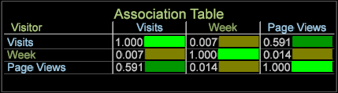

# Visualizzazione tabella di associazione{#association-table-visualization}

La visualizzazione Tabella associazione consente di associare metriche, dimensioni ed elementi dimensione utilizzando l&#39;algoritmo V di Cramer.

La tabella di associazione confronta i valori con il calcolo V di Cramer anziché utilizzare il coefficiente di correlazione di Pearson come utilizzato nelle visualizzazioni Matrice [di](https://docs.adobe.com/content/help/en/data-workbench/using/client/analysis-visualizations/correlation-analysis/c-correlation-analysis.html) correlazione e Correlazione [(queste possono solo confrontare le metriche, mentre la tabella di associazione e il cordo](https://docs.adobe.com/content/help/en/data-workbench/using/client/analysis-visualizations/c-chord-visualization.html) di  associazione possono confrontare metriche, dimensioni ed elementi).

## Creazione di una tabella di associazione {#section-87ed12ccc1af4196a1b6534e621c4cbb}

La tabella di associazione confronta le metriche su una dimensione numerabile o non calcolabile. La tabella può essere modificata per evidenziare le associazioni all’interno della visualizzazione mediante la selezione del colore o per renderla una mappa di testo, una mappa di calore o entrambe.

1. Aprite una tabella di associazione.

   Right-click [!DNL Visualization] > [!DNL Predictive Analytics] > [!DNL Association Table].

   

1. Seleziona una dimensione estesa: ClickThrough, Hit, Product, Visit o Visitor. Viene aperta una tabella di associazione con la dimensione estesa identificata nell&#39;angolo e la metrica associata inserita sia nella riga che nella colonna.

   

   La tabella Associations (Associazioni) utilizza il V di Cramer come correlazione simmetrica, generando metriche, dimensioni ed elementi selezionati che si riflettono sia nelle colonne che nelle righe di una tabella Association. Ad esempio, se selezionate la dimensione estesa del **prodotto** , la metrica viene usata come metrica **[!UICONTROL Visits]** associata sia nella riga che nella colonna della tabella, generando un confronto perfetto ma inutile (1,00) perché i valori confrontati sono identici.

1. Aggiungete altri valori alla tabella di associazione.

   Fare clic con il pulsante destro del mouse in una colonna o riga e selezionare **Aggiungi metrica** o **Aggiungi dimensione**. Puoi anche trascinare metriche e dimensioni da un pannello **Finder** . È inoltre possibile trascinare gli elementi dimensione da una tabella aperta alla visualizzazione tabella.

   

   >[!NOTE]
   >
   >Nella tabella di associazione è consentito un limite di dieci righe e colonne.

