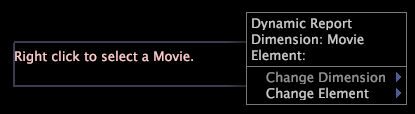

# Annotazioni titolo dinamiche{#dynamic-title-annotations}

{{eol}}

Utilizzando Report puoi generare rapporti in modo dinamico per gli elementi dimensionali specificati in un file di ricerca o per un numero particolare di elementi dimensionali, ad esempio per gli utenti con i 10 conteggi d’ordine più elevati.

Utilizzando un’annotazione titolo dinamica, puoi visualizzare un titolo in un rapporto dinamico che identifica il nome dell’elemento dimensione attualmente in fase di elaborazione da [!DNL Report] o il nome dell’elemento di dimensione selezionato per la visualizzazione. Le annotazioni di titolo dinamiche consentono di identificare i dati dell’elemento che si visualizzano nel rapporto senza modificare altre visualizzazioni o ordinare accidentalmente una selezione per un particolare elemento.

>[!NOTE]
>
>Questa funzionalità è disponibile solo se si dispone di una licenza [!DNL Report]. Per ulteriori informazioni [!DNL Report], vedi *Guida ai rapporti di Data Workbench*.

Per ulteriori informazioni sulla generazione dinamica dei rapporti, consulta la sezione *Guida a un rapporto di Insight*.

**Impostazione di un’annotazione titolo dinamica**

* Fai clic con il pulsante destro del mouse nell’annotazione titolo dinamica e fai clic su **[!UICONTROL Change Dimension]** > *&lt;**[!UICONTROL dimension name]**>*.

   

* Per visualizzare le informazioni di un particolare elemento, fai clic su **[!UICONTROL Change Element]** e fai clic sull’elemento desiderato per visualizzare in anteprima il rapporto per quel particolare elemento.

   

   **Esportazione in Microsoft Excel**

   Per informazioni sull&#39;esportazione di finestre, vedere [Esportazione dei dati delle finestre](../../../../home/c-get-started/c-wk-win-wksp/c-exp-win-data.md#concept-8df61d64ed434cc5a499023c44197349).
