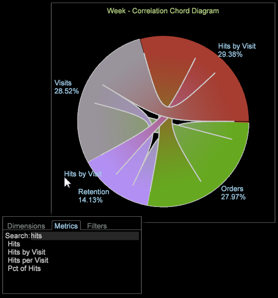

# Visualizzazione accordi{#chord-visualization}

La visualizzazione Chord (Accordi) consente di mostrare sia la proporzione che la correlazione tra le metriche, mostrando accordi più grandi come indicazione di una correlazione più forte.

La visualizzazione Chord (Accordi) consente di visualizzare l’identificazione delle correlazioni tra metriche, consentendoti di aggiungere e valutare facilmente le possibili correlazioni. Fornisce inoltre un&#39;altra visualizzazione in qualsiasi [Matrice di correlazione](https://experienceleague.adobe.com/docs/data-workbench/using/client/analysis-visualizations/correlation-analysis/c-correlation-analysis.html) creata in precedenza. Con la visualizzazione Chord (Corda) non è possibile identificare una correlazione positiva o negativa tra le metriche, ma solo che esiste una correlazione. In alcuni casi, la determinazione di una relazione diretta o inversa può essere identificata applicando metriche di contatore.

1. **Apri la **[!UICONTROL Chord]**visualizzazione**.

   Nell’area di lavoro, fare clic con il pulsante destro del mouse su [!DNL Visualization > Predictive Analytics > Chord].

1. **Seleziona un Dimension dal menu**.

   Viene visualizzata una visualizzazione vuota per la selezione di una dimensione. Il nome della dimensione viene visualizzato nella parte superiore della visualizzazione a corda vuota.

   >[!NOTE]
   >
   >Se nell’area di lavoro è già aperta una Matrice di correlazione, puoi anche eseguirne il rendering come visualizzazione Chord.

1. **Scegli le metriche da correlare**.

   Trascina le metriche dalla sezione **[!UICONTROL Finder]** facendo clic su **[!UICONTROL Ctrl-Alt]** per trascinare le metriche dalla tabella al grafico. Dopo aver selezionato due o più metriche, il grafico si aggiorna automaticamente e inizia a visualizzare i dati di correlazione. Continua ad aggiungere metriche in base alle esigenze per correlare i punti dati.

   

   La visualizzazione Chord (Corda) mostra la proporzione dell’intero rappresentato dall’area di ciascun segmento. Continua ad aggiungere metriche necessarie per identificare e analizzare relazioni significative.

   

1. **Visualizza la visualizzazione** Chord (Accordi).

   Passa il puntatore del mouse su ciascuna metrica della visualizzazione per vedere le relazioni. Nell’esempio, puoi vedere una correlazione tra Unità e la maggior parte delle altre metriche (ad eccezione della metrica **Visita Durata** ).

   

   Quando passi il cursore del mouse sulla metrica **Visit Duration** nella visualizzazione Chord (Durata visita), puoi notare che la correlazione tra tutte le altre metriche è molto ridotta o al massimo debole.

   

1. **Modificare le impostazioni.** Fai clic con il pulsante destro del mouse sulla visualizzazione Accordi per aprire un menu per modificare la dimensione, visualizzare le dimensioni come numeri assoluti o come percentuali, rimuovere la metrica selezionata o tutte le metriche, modificare i colori e i dettagli ed esportare i valori in una matrice di correlazione.

   
