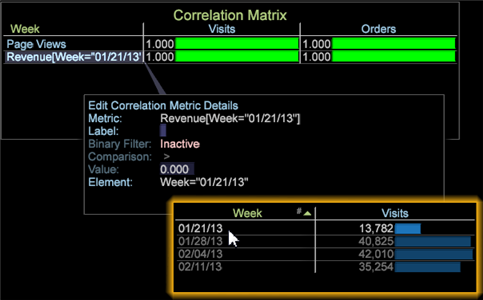

# Filtro binario nella matrice di correlazione{#binary-filter-in-the-correlation-matrix}

{{eol}}

Un filtro binario nella matrice di correlazione consente di vincolare i valori per una o entrambe le metriche correlate per rendere più mirato il confronto.

Per impostare un filtro binario su una matrice di correlazione:

1. Dalla matrice di correlazione, fai clic con il pulsante destro del mouse sul nome di una metrica.
1. Seleziona **Modifica dettagli metrica**.

   

   La **[!UICONTROL Edit Correlation Metric Details]** si aprirà la finestra.

   

1. Impostare un filtro binario.

   Per prima cosa, fai clic sul pulsante **[!UICONTROL Inactive]** impostazione. Il filtro viene attivato come **[!UICONTROL Active]** e visualizzano **Confronto** e **Valore** campi.

   Quindi, seleziona una **[!UICONTROL Comparison]** e imposta il suo **[!UICONTROL Value]** per impostare un filtro per la metrica selezionata.

>[!IMPORTANT]
>
>Il filtro binario per Data Workbench 6.2 è stato aggiornato con nuove funzioni e richiede di ricostruire qualsiasi matrice di correlazione con un filtro binario costruito nelle versioni precedenti.

## Aggiunta di elementi Dimension {#section-f19f4e0368ca488e92d1e28bcc24417c}

Puoi anche aggiungere un elemento dimensionale per vincolare una metrica. A una metrica può essere associato solo un elemento.

Fai clic con il pulsante destro del mouse nell’area di lavoro e seleziona **Tabella**. Apri una dimensione con i relativi elementi e trascina **[!UICONTROL Element]** nella finestra Modifica dettagli metrica correlazione o nella matrice di correlazione.
