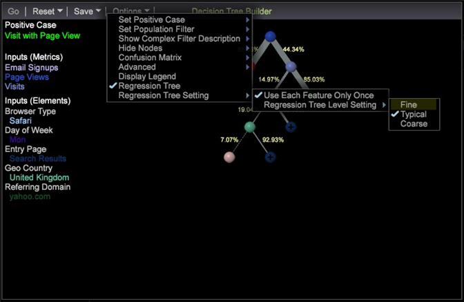

# Opzione albero di regressione per la struttura decisionale{#regression-tree-option-for-decision-tree}

Valutare un albero decisionale utilizzando l&#39;opzione Albero di regressione con nuove funzioni di campionamento e visualizzazione.

Valutare una struttura decisionale utilizzando l&#39;opzione Albero di regressione facendo clic con il pulsante destro del mouse e selezionando Opzioni > Albero **di** regressione all&#39;interno di una visualizzazione Albero decisionale.

**Generatore** albero decisionale aggiornato: Il nuovo algoritmo è stato introdotto per la creazione di un albero decisionale. Gestisce dati più generali e fornisce una visualizzazione più informativa per migliorare la precisione della previsione.

**Modulo** di campionamento dei dati migliorato: Uno schema di campionamento adattivo aggiornato consente di ottenere risultati più precisi grazie all&#39;albero decisionale e al punteggio tendenza.

Il verde e il rosso indicano vero o falso. La saturazione del colore, ad esempio rosso scuro o rosso chiaro, viene usata per indicare la probabilità. Ad esempio, un nodo con il rosso profondo ha una probabilità molto elevata di essere falso, mentre un nodo con il rosso chiaro ha una probabilità inferiore di essere falso. Un nodo con un colore verde profondo ha una probabilità molto elevata di essere vero.

Tutte le strutture decisionali hanno larghezze di ramo diverse per indicare il livello di traffico per quel ramo della struttura.

Nella visualizzazione Albero decisionale, fare clic con il pulsante destro del mouse e selezionare Opzioni > Albero **** regressione. Quando questa opzione è selezionata, vengono fornite impostazioni aggiuntive:

<table id="table_39E025A3E0B549B4BEDCE0D30A499211"> 
 <thead> 
  <tr> 
   <th colname="col1" class="entry"> Impostazione di regressione </th> 
   <th colname="col2" class="entry"> Descrizione </th> 
  </tr>
 </thead>
 <tbody> 
  <tr> 
   <td colname="col1"> 
<b>Usa ogni funzione solo una volta</b> 
 </td> 
   <td colname="col2"> 
Selezionando questa opzione non si utilizzerà più di una feature (come la struttura decisionale originale); quindi, se sono presenti cinque input, la struttura ad albero non sarà più di cinque livelli e la struttura ad albero sarà simile a una struttura ad albero decisionale (ma un po' più complessa). Questa opzione rende la struttura ad albero veloce utilizzando ogni feature solo una volta (come un albero decisionale originale). L'utilizzo di questa funzione è un'impostazione predefinita. 
 </td> 
  </tr> 
  <tr> 
   <td colname="col1"> 
<b>Impostazione livello albero di regressione </b> 
 </td> 
   <td colname="col2"> 
Questa opzione controlla la complessità della struttura ad albero della regressione. A seconda dei dati, potrebbe essere necessario creare una struttura ad albero <i>fine</i> (con una struttura complessa con più nodi) per ottenere una classificazione ad albero più significativa. Se si dispone di molti dati, allora una struttura ad albero relativamente <i>grossolana</i> (meno complicata con meno nodi ad albero) potrebbe funzionare bene. 
 
 
Nota: L’impostazione predefinita è <i>Tipico</i> . Ci sono alcuni casi estremi in cui l'impostazione <i>Tipica</i> non funziona bene e l'impostazione <i>Grande</i> o <i>Fine</i> può fornire una migliore visualizzazione dei dati. 
 
 </td> 
  </tr> 
  <tr> 
   <td colname="col1"> </td> 
   <td colname="col2"> 
<i>Fine</i>: La struttura ad albero più complessa con i livelli più granulari di reporting e la maggior parte dei rami. 
 </td> 
  </tr> 
  <tr> 
   <td colname="col1"> </td> 
   <td colname="col2"> 
<i>Tipico</i>: Livello medio di granularità e rami. 
 </td> 
  </tr> 
  <tr> 
   <td colname="col1"> </td> 
   <td colname="col2"> 
<i>Grosso</i>: L'albero meno complesso con meno categorie definite e meno rami. 
 </td> 
  </tr> 
 </tbody> 
</table>

