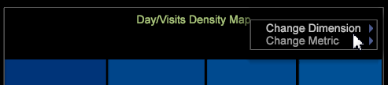
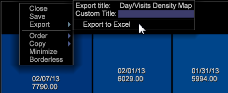

# Mappa di densità{#density-map}

La visualizzazione mappa di densità visualizza gli elementi come rettangoli ombreggiati all’interno di una mappa quadrata.

Le dimensioni dei rettangoli dipendono dai valori degli elementi, dove i valori più grandi sono rappresentati da rettangoli di area più grande. Simile a un grafico a torta, questa visualizzazione ti consente di vedere rapidamente quali elementi costituiscono la percentuale maggiore della dimensione selezionata.

Per creare una mappa di densità:

1. Apri una nuova area di lavoro.

   Dopo aver aperto una nuova area di lavoro, potrebbe essere necessario fare clic su **Aggiungi** > **Sblocca temporaneamente**.
1. Fai clic su **[!UICONTROL Visualization]** > **[!UICONTROL Density Map]**.

1. Seleziona un **[!UICONTROL Dimension]** dal menu .

   Ad esempio, seleziona **[!UICONTROL Time]** > **[!UICONTROL Days]**.

   Al contrario, selezionando **[!UICONTROL Time]** > **[!UICONTROL Hours]** si otterrebbero più elementi con valori più piccoli da visualizzare come rettangoli più piccoli.

   >[!NOTE]
   >
   >Scegli una dimensione con più elementi in base alle tue esigenze. Il limite attuale è 200 degli elementi più grandi per ciascuna dimensione.

1. Per modificare le visualizzazioni delle dimensioni, apri **[!UICONTROL Visualization]** > **[!UICONTROL Table]** e seleziona tra gli elementi della tabella da visualizzare nella mappa.

   

   La mappa risponderà alle selezioni dalla tabella.

1. Passando il puntatore del mouse su elementi di piccole dimensioni, il nome e il valore verranno visualizzati nel testo visualizzato accanto al cursore del mouse.
1. Maschera gli elementi facendo clic con il pulsante destro del mouse e selezionando **[!UICONTROL Mask]**, quindi scegli un&#39;opzione.

   

   Per visualizzare tutti i nodi mascherati, seleziona **[!UICONTROL Unhide All]**.

1. Per evidenziare gli elementi, fai clic con il pulsante destro del mouse e seleziona **[!UICONTROL Spotlight]** , quindi scegli un’opzione. L’evidenziazione consente di evidenziare e attenuare gli elementi in un intervallo.
1. Aggiungi una legenda colore all’area di lavoro. Puoi identificare i valori nella mappa utilizzando la legenda del colore.

   È possibile aggiungere una legenda colore all’area di lavoro e i nodi cambieranno colore in base alla dimensione aggiuntiva dei dati.
1. Per modificare la dimensione o la metrica, fai clic con il pulsante destro del mouse sul titolo della mappa e seleziona dal menu .

   

1. Aggiungi i callout facendo clic con il pulsante destro del mouse su una cella e selezionando **[!UICONTROL Add Callout]**. Puoi scegliere tra diversi tipi o visualizzazioni dal menu .

   

1. Come in tutte le visualizzazioni, puoi fare clic con il pulsante destro del mouse sopra la barra del titolo per visualizzare i comandi di base Chiudi, Salva, Esporta in Microsoft Excel, Ordina, Copia, Riduci a icona e Senza bordi per visualizzare una visualizzazione senza bordo.

   

1. La mappa di densità consente di selezionare e deselezionare più elementi simili ad altre visualizzazioni:

* Fai clic con il pulsante sinistro del mouse per selezionare un elemento.
* Ctrl + clic per selezionare più elementi.
* Maiusc + clic per deselezionare un elemento.
* Fai clic con il pulsante destro del mouse all’interno degli elementi selezionati per aprire un menu. Quindi scegli **[!UICONTROL Deselect]** o **[!UICONTROL Deselect All]** per cancellare gli elementi selezionati.

## Opzioni aggiuntive {#section-d77defb012424de4a7ced8e5c93115bc}

Fai clic con il pulsante destro del mouse su Mappa densità per aprire un menu con le seguenti opzioni:

<table id="table_3ADA85031C834792BFD041E186962A41"> 
 <thead> 
  <tr> 
   <th colname="col1" class="entry"> Opzione </th> 
   <th colname="col2" class="entry"> Descrizione </th> 
  </tr>
 </thead>
 <tbody> 
  <tr> 
   <td colname="col1"> Add Callout </td> 
   <td colname="col2">Aggiungi un testo o un elemento grafico come callout nella visualizzazione per identificare o descrivere ulteriormente un elemento. 
È inoltre possibile selezionare una legenda metrica vuota, una tabella, un grafico a linee o un grafico a dispersione in base all’elemento selezionato nella mappa di densità. Puoi quindi aggiungere metriche e dimensioni a queste visualizzazioni vuote a seconda delle esigenze. 
 </td> 
  </tr> 
  <tr> 
   <td colname="col1"> Maschera </td> 
   <td colname="col2">Le opzioni di mascheramento consentono di nascondere gli elementi selezionati. Fare clic con il pulsante destro del mouse per visualizzare le opzioni Maschera. 
 Nascondi elemento (Hide this Element) - Scegli questa opzione per mascherare un singolo elemento selezionato. 
 
 Nascondi selezionati (Hide Selected) - Scegli questa opzione per mascherare più elementi selezionati. 
 
 Mostra in alto: scegli questa opzione per visualizzare solo i primi 100, 50, 25 o 10 elementi principali in base ai valori nella mappa di densità. 
 
 Mostra in basso (Show Bottom) - Scegli questa opzione per visualizzare solo i 100, 50, 25 o 10 elementi principali in base ai valori nella mappa di densità. 
 </td> 
  </tr> 
  <tr> 
   <td colname="col1"> Luce </td> 
   <td colname="col2"> L’evidenziazione consente di evidenziare e attenuare gli elementi in un intervallo. Fare clic con il pulsante destro del mouse per aprire un menu di opzioni. 
 Mostra in alto: scegli questa opzione per evidenziare solo i primi 100, 50, 25 o 10 elementi principali in base ai valori nella mappa di densità. 
 
 Mostra in basso (Show Bottom) - Scegli questa opzione per evidenziare solo i 100, 50, 25 o 10 elementi principali in base ai valori nella mappa di densità. 
 </td> 
  </tr> 
  <tr> 
   <td colname="col1"> 
Deseleziona 
 
Deseleziona tutto 
 </td> 
   <td colname="col2"> 
 Selezionare questi comandi per deselezionare l’elemento corrente, se selezionato, oppure deselezionare tutti gli elementi selezionati. 
 </td> 
  </tr> 
 </tbody> 
</table>
