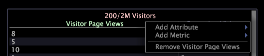

# Tabella dei dettagli{#detail-table}

{{eol}}

Le tabelle dei dettagli consentono di visualizzare informazioni aggiuntive su un sottoinsieme di dati, definito dalle selezioni effettuate in altre visualizzazioni.

Le informazioni aggiuntive visualizzate sono esempi di tutti i dati disponibili.

Nella tabella seguente sono descritti gli elementi di una tabella di dettaglio.

<table id="table_C88C7F7F5AEA4820B908923E45CC0A62"> 
 <thead> 
  <tr> 
   <th colname="col1" class="entry"> Elemento </th> 
   <th colname="col02" class="entry"> Colore </th> 
   <th colname="col2" class="entry"> Descrizione </th> 
  </tr> 
 </thead>
 <tbody> 
  <tr> 
   <td colname="col1"> 
Livello 
 </td> 
   <td colname="col02"> 
Rosa 
 </td> 
   <td colname="col2"> 
Qualsiasi dimensione numerabile per la quale desideri visualizzare informazioni dettagliate su attributi e metriche. Il livello è preceduto dal numero di elementi visualizzati rispetto al numero di elementi disponibili, ad esempio 6/444 indica che 6 elementi sono visualizzati su un possibile 444. Nell’esempio precedente, il livello Visitatori indica che tutti i dettagli forniti sono basati sul visitatore. Il livello Visualizzazioni pagina indica che tutti i dettagli forniti sono basati sulla visualizzazione della pagina. La visualizzazione simultanea di più livelli è utile quando si desidera analizzare i dati con genitori conteggiabili diversi. 
 </td> 
  </tr> 
  <tr> 
   <td colname="col1"> 
Attributo 
 </td> 
   <td colname="col02"> 
Verde 
 </td> 
   <td colname="col2"> 
Qualsiasi dimensione da uno a molti o da uno a uno con il livello, ad esempio da Città a Visitatori. Ogni riga visualizza l’elemento correlato a ciascun elemento del livello selezionato. Nell’esempio precedente, gli attributi Dominio e Città elencano il dominio e la città per ciascuno dei visitatori campione. 
 </td> 
  </tr> 
  <tr> 
   <td colname="col1"> 
Metrica 
 </td> 
   <td colname="col02"> 
Blu 
 </td> 
   <td colname="col2"> 
Dettagli della metrica sul livello selezionato. Nell’esempio precedente, con il livello impostato su Visitatori, la metrica Visualizzazioni pagina mostra il numero di visualizzazioni di pagina per un singolo visitatore, mentre il livello Visualizzazioni di pagina fornisce i dettagli su ciascuna di queste visualizzazioni di pagina. 
 </td> 
  </tr> 
 </tbody> 
</table>

Supponiamo che tu stia lavorando con i dati del sito web e desideri scoprire quali pagine hanno visitato i visitatori in determinate città e da particolari domini in un particolare intervallo di tempo.

Innanzitutto devi creare una visualizzazione che mostri l’intervallo di tempo a cui sei interessato, quindi devi selezionare tale intervallo di tempo. Ora puoi aggiungere una tabella di dettaglio per visualizzare i dettagli desiderati per un numero di visitatori campione nel set di dati.

Per visualizzare i dettagli sopra descritti, devi completare i seguenti passaggi:

1. Fai clic con il pulsante destro del mouse nella tabella dei dettagli e fai clic su **[!UICONTROL Add Level]** > **[!UICONTROL Visitor]**.
1. Fai clic con il pulsante destro del mouse nella tabella dei dettagli e fai clic su **[!UICONTROL Add Level]** > **[!UICONTROL Page View]**.
1. Fai clic con il pulsante destro del mouse sul pulsante **[!UICONTROL Visitors]** intestazione di livello e fai clic su **[!UICONTROL Add Attribute]** > **[!UICONTROL Geography]** > **[!UICONTROL Domain]**.
1. Fai clic con il pulsante destro del mouse nell’intestazione del livello Visitatori e fai clic su **[!UICONTROL Add Attribute]** > **[!UICONTROL Geography]** > **[!UICONTROL City]**.
1. Fai clic con il pulsante destro del mouse nell’intestazione del livello Visitatori e fai clic su **[!UICONTROL Add Metric]** > **[!UICONTROL Page Views]**.
1. Fai clic con il pulsante destro del mouse nell’intestazione del livello Visualizzazioni pagina e fai clic su **[!UICONTROL Add Attribute]** > **[!UICONTROL Page]** > **[!UICONTROL Page]**.

L’area di lavoro di esempio seguente mostra i dettagli correlati per un campionamento casuale di sei visitatori del sito durante l’intervallo di tempo specificato.

## Aggiungi un livello {#section-f948d3361fd84906ac4d9ebce520bfd0}

* Fai clic con il pulsante destro del mouse all’interno della tabella dei dettagli e fai clic su **[!UICONTROL Add Level]** > *&lt;**[!UICONTROL dimension name]**>*.

## Rimuovere un livello {#section-a8c820e0b656451e98e5ea75373edefc}

* Fai clic con il pulsante destro del mouse sull’intestazione di livello esistente e fai clic su **[!UICONTROL Remove Level]** > *&lt;**[!UICONTROL dimension name]**>*.

## Aggiungere attributi e metriche {#section-cdda2df3c9a448d5b9770686c8b8efb3}

* Fai clic con il pulsante destro del mouse su un&#39;intestazione di attributo o metrica e fai clic su **[!UICONTROL Add Attribute]** > *&lt;**[!UICONTROL attribute name]**>* o **[!UICONTROL Add Metric]** > *&lt;**[!UICONTROL metric name]**>*.

## Rimuovere attributi e metriche {#section-4002ac957a2846678f9940270987d651}

* Fare clic con il pulsante destro del mouse sulla colonna da rimuovere e fare clic su **[!UICONTROL Remove Attribute]** > *&lt;**[!UICONTROL attribute name]**>* o **[!UICONTROL Remove Metric]** > *&lt;**[!UICONTROL metric name]**>*.

## Esportare in Microsoft Excel {#section-a9eaba63c88a4598836a34669ba8cac1}

Per informazioni sull&#39;esportazione di finestre, vedere [Esportazione dei dati delle finestre](../../../home/c-get-started/c-wk-win-wksp/c-exp-win-data.md#concept-8df61d64ed434cc5a499023c44197349).
