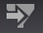

# Editor filtri{#filter-editors}

Un editor di filtri è una visualizzazione speciale per la creazione e la modifica dei filtri.

Mentre altre visualizzazioni in Data Workbench mostrano dati dal set di dati, un editor di filtri consente di specificare quale parte o sottoinsieme di dati viene visualizzato nelle visualizzazioni.

 **Pulsante Salva filtro .** Quando selezioni un elemento all’interno di un’area di lavoro, ovvero una tabella di dettaglio, una visualizzazione, un filtro o un altro elemento, sulla barra degli strumenti viene visualizzato un pulsante  **Salva** filtro che consente di creare un filtro per l’elemento selezionato. L’opzione per l’immissione di un nome viene fornita quando si fa clic sull’icona Salva filtro . Il filtro può quindi essere salvato nel profilo .

Per creare un filtro, apri una finestra dell’editor di filtri nell’area di lavoro e aggiungi una o più condizioni. Per facilitare la definizione delle condizioni del filtro, i campi modificabili nella finestra dell’editor filtri vengono visualizzati come caselle di testo o vengono evidenziati quando si passa il mouse su di esse. Fai clic all’interno della casella di testo per aggiungere testo o fai clic con il pulsante destro del mouse sul campo evidenziato per visualizzare le opzioni disponibili. Il filtro che si crea legge come una frase, rendendo facile capire quale sottoinsieme di dati è incluso o escluso. Se lo desideri, puoi creare una descrizione per ogni condizione di filtro in modo che la relativa etichetta nell’editor filtri sia più significativa per te o per il tuo team.

Inoltre, puoi utilizzare l’editor filtri per aprire e modificare qualsiasi file [!DNL .filter].

>[!NOTE]
>
>Quando apri il filtro per la prima volta, l’editor di filtri aggiorna la definizione del filtro in modo che corrisponda al formato dell’editor di filtri.
