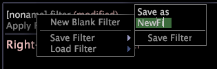

# Salvare e caricare i filtri{#save-and-load-filters}

Passaggi per salvare e caricare i filtri.

1. Fate clic con il pulsante destro del mouse sul nome del filtro (oppure **[!UICONTROL[noname]]** se il filtro è nuovo) e fate clic **[!UICONTROL Save Filter]**.
1. Immettete il nome desiderato per il filtro nell’ **[!UICONTROL Save As]** etichetta.

   

1. Fai clic su **[!UICONTROL Save Filter]** (Fine).

   Dopo aver salvato il filtro, potete caricarlo e usarlo in altre aree di lavoro. Di seguito viene illustrato come caricare un filtro esistente o farvi riferimento per nome in un [!DNL Metric Editor]. Consultate [Creazione e modifica di metriche](../../../../home/c-get-started/c-admin-intrf/c-prof-mgr/c-drvd-mtrcs.md#concept-e41723b342a849309874b26232224a40)derivate.

   >[!NOTE]
   >
   >Se desiderate che tutti gli utenti di un profilo utilizzino i filtri salvati, dovete caricarli nel profilo appropriato utilizzando il [!DNL Profile Manager]. Consultate [Pubblicazione dei file nel profilo](../../../../home/c-get-started/c-admin-intrf/c-prof-mgr/t-pub-files-wkg-prof.md#task-a0106e010c834d16bd60eef4721b6af9)di lavoro.

**Per caricare un filtro esistente**

* Fate clic con il pulsante destro del mouse sul nome del filtro e fate clic su **[!UICONTROL Load Filter]** > **[!UICONTROL `<filter name>`]**.
