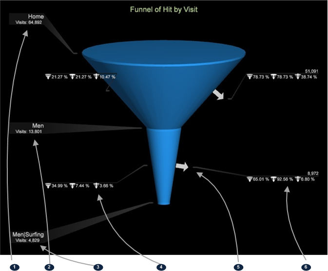

# Funzioni funnel{#funnel-features}

La visualizzazione funnel include funzioni per la creazione di un funnel con più dimensioni, numeri di visitatori non elaborati, percentuale di visitatori in ogni passaggio e ambiti separati.

Di seguito sono elencate le funzioni di base della visualizzazione funnel.

<table id="table_49A08740CEE74D64B6F9C37CD91F1AE5"> 
 <tbody> 
  <tr> 
   <td colname="col01">  </td> 
   <td colname="col1"> Primo elemento </td> 
   <td colname="col2"> Primo passaggio funnel del processo. </td> 
  </tr> 
  <tr> 
   <td colname="col01">  </td> 
   <td colname="col1"> Terzo elemento </td> 
   <td colname="col2">Terzo passaggio funnel nel processo. 

Nota:  Gli elementi selezionati non devono necessariamente provenire dalla stessa dimensione. 

</td> 
  </tr> 
  <tr> 
   <td colname="col01">  </td> 
   <td colname="col1"> Percentuale autunnale </td> 
   <td colname="col2"> Percentuale che ha completato il percorso definito visualizzato in tre ambiti. </td> 
  </tr> 
  <tr> 
   <td colname="col01">  </td> 
   <td colname="col1"> Browser Fallout </td> 
   <td colname="col2">Freccia di abbandono. Fai clic con il pulsante destro del mouse e seleziona  Aggiungi browser del percorso per visualizzare il percorso seguito dagli altri visitatori. </td> 
  </tr> 
  <tr> 
   <td colname="col01">  </td> 
   <td colname="col1"> Abbandono percentuale </td> 
   <td colname="col2">Percentuali che descrivono tre ambiti di abbandono per gli utenti che non hanno completato il percorso. 
Le percentuali sono presentate in tre ambiti: 

 Percentuale di abbandono dal passaggio precedente a questo passaggio. 

 Percentuale di abbandono dal primo passaggio nel funnel. 

 La percentuale di abbandono in base al numero totale di visitatori. 
</td> 
  </tr> 
 </tbody> 
</table>

## Passaggi funnel {#section-96a6732558dd4740b73541844f06d3ef}

I dischi di un funnel rappresentano i passaggi della navigazione, i coni rappresentano il passaggio da un passaggio all&#39;altro e le frecce rappresentano l&#39;abbandono. Facendo clic su un cono verranno selezionati gli utenti che sono passati da quel punto a quello e li includeranno nel filtro area di lavoro corrente. Facendo clic su una freccia verranno selezionati i visitatori che sono stati esclusi.

>[!NOTE]
>
>La visualizzazione Funnel ha un limite di otto passaggi che possono essere applicati.

## Funzionalità e funzionalità aggiuntive per funnel {#section-22a3582db8114ca8bce77f50bbbf296a}

* **Regolare la clip e il livello dell&#39;imbuto**. Seleziona l’opzione Funnel dal menu Visualizzazione. Una volta creato l&#39;imbuto, è possibile fare clic con il pulsante destro del mouse sul titolo per regolare la clip e livellare qualsiasi metrica numerabile nel sistema.

   

* **Trascina altri elementi**. Aggiungi altri elementi all’imbuto trascinandoli dalla tabella del Dimension all’imbuto utilizzando i tasti `<Ctrl>` + `<Alt>`. Puoi trascinare più passaggi contemporaneamente dalla tabella del Dimension selezionando più elementi (utilizzando `<Ctrl>` + clic) e trascinandoli nella visualizzazione Funnel utilizzando i tasti `<Ctrl>` + `<Alt>`.
* **Elimina un passaggio**: Elimina gli elementi facendo clic con il pulsante destro del mouse sul passaggio nella visualizzazione e facendo clic su  **Sì**.

   

* **Ridisponi i passaggi che hai trascinato nell’imbuto**. Fai clic sul passaggio per selezionarlo e trascinalo in un’altra posizione per ridisporre i passaggi.
* **Apri un browser** del percorso. Puoi vedere più dettagli su dove i clienti subiscono o abbandonano il processo tramite la funzione [Aggiungi un browser del percorso](../../../../home/c-get-started/c-analysis-vis/c-funnel-visualization/c-path-browser-funnel.md#concept-b0cedf7a28ae422696ded1258c9a4119) .

* **Aggiungi altri passaggi**. Puoi aggiungere un massimo di otto passaggi a ogni visualizzazione funnel.
* **Modifica la metrica**. La metrica può essere modificata in modo che i passaggi conteggino le visite o qualche altra metrica in ogni passaggio. Le opzioni disponibili variano a seconda del set di dati.
* **Visualizza in visualizzazione** tabulare. Fai clic con il pulsante destro del mouse sul titolo per visualizzare il menu Visualizzazione Funnel e fai clic su **[!UICONTROL Show Tabular View]**. Una volta nella visualizzazione a tabella, è possibile selezionare **[!UICONTROL Show Graph View]** per tornare alla rappresentazione grafica dell&#39;imbuto. Per aprire la Vista tabulare, fare clic con il pulsante destro del mouse sul titolo e selezionare Mostra vista tabulare dal menu.

* **Confrontare le sequenze**. Un modo efficiente per confrontare due sequenze simili è quello di visualizzare le due visualizzazioni affiancate. È inoltre possibile visualizzare sia la vista tabulare che la vista grafico affiancata utilizzando la funzione Duplica . Per aprire, fare clic con il pulsante destro del mouse sul titolo e selezionare Duplica dal menu.
