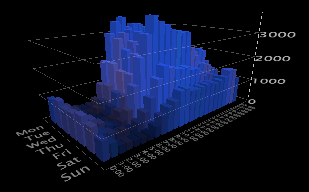

# Grafici 2D{#d-graphs}

I grafici bidimensionali (2D) presentano una metrica su due dimensioni.

Vedi il seguente esempio:

**Per ruotare un grafico**

* Fate clic con il pulsante destro del mouse sul grafico e trascinate il mouse nella direzione di rotazione desiderata.

**Per ingrandire o ridurre il grafico**

* Con il puntatore del mouse in un punto qualsiasi della finestra del grafico, premere contemporaneamente entrambi i pulsanti del mouse e allontanare il mouse dall&#39;immagine per ingrandire e ridurre lo zoom. È inoltre possibile utilizzare la rotellina del mouse, se disponibile.

**Ridimensionamento dell&#39;asse verticale**

1. Spostate il mouse sull&#39;asse verticale per evidenziare un piano del grafico.
1. Mentre il piano è evidenziato, fate clic e trascinate il mouse verso l&#39;alto o verso il basso per ridimensionare l&#39;asse verticale del grafico.

Consulta [Zoom in Visualizations](../../../../home/c-get-started/c-vis/c-zoom-vis.md#concept-7e33670bb5344f78a316f1a84cc20530).
