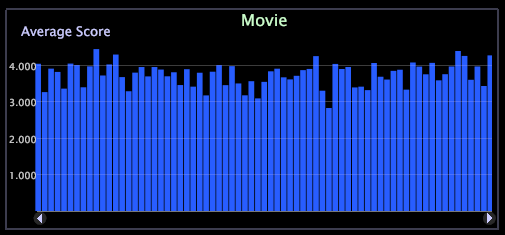

# Grafici{#graphs}

Un grafico può visualizzare una o più metriche in una o due dimensioni di dati.

I grafici sono visualizzazioni molto potenti e l&#39;apprendimento per utilizzarli consente di rispondere a numerose domande.

I grafici consentono di vedere facilmente le tendenze nelle metriche aziendali rispetto ai dati continui, perché puoi selezionare un sottoinsieme di una dimensione su cui le metriche vengono graficate (ad esempio un intervallo di tempo specifico) e ingrandire per esaminare i dati per quel periodo in modo più dettagliato. Per istruzioni su come ingrandire un grafico o una tabella, consulta [Zoom in Visualizations](../../../../home/c-get-started/c-vis/c-zoom-vis.md#concept-7e33670bb5344f78a316f1a84cc20530) (Zoom in visualizzazioni).

Nell’esempio seguente, viene visualizzato un grafico a barre in cui il numero di sessioni associate a ogni giorno è rappresentato dalla lunghezza della barra. Quando si sposta il puntatore del mouse sulla barra per un giorno particolare, viene visualizzato il valore numerico rappresentato dalla barra.

**Sovrapposizione sfumatura su un grafico**

Per visualizzare meglio gli elementi grafici, fai clic con il pulsante destro del mouse e seleziona una **Sovrapposizione sfumatura** dal menu .

* **Nessuna sovrapposizione sfumatura**  (impostazione predefinita). Selezionare questa opzione per visualizzare le barre senza sovrapposizione sfumatura applicata.
* **Sfondo da sinistra**. Selezionare questa opzione per visualizzare la gradazione dei colori su tutte le barre da sinistra a destra.
* **Sfondo da destra**. Selezionare per visualizzare la gradazione dei colori su tutte le barre da destra a sinistra.
* **Cilindro**. Selezionare per visualizzare la gradazione dei colori dal centro di ciascuna barra al bordo di ogni barra.

**Aggiunta di callout a un grafico**

È inoltre possibile aggiungere callout a grafici lineari. Consulta [Aggiunta di callout a un&#39;area di lavoro](../../../../home/c-get-started/c-vis/c-call-wkspc.md#concept-212b09e763044d938987b4a9c658adc0).

Per aggiungere un callout alle visualizzazioni Grafico, fai clic con il pulsante destro del mouse nella parte inferiore della visualizzazione (l’asse di base) per aprire un menu e seleziona **Aggiungi callout**.

