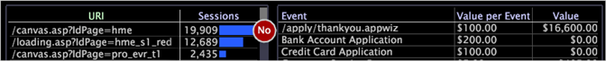

# Legende di valore{#value-legends}

{{eol}}

Una legenda valore visualizza gli eventi dei valori definiti.

La legenda del valore è configurata solo nel HBX e [!DNL Site] , ma possono essere configurate per altre applicazioni. Per ulteriori informazioni, contattare Adobe Consulting Services.

In HBX e [!DNL Site], un evento valore è definito come una sessione che ha generato valore aziendale. Ad esempio, i record di dati evento associati a particolari visualizzazioni di pagina (ad esempio, una pagina di ringraziamento dell’ordine o una pagina di completamento dell’applicazione) potrebbero rappresentare eventi di valore per un’organizzazione aziendale.

Con gli eventi di valore, puoi misurare e monitorare la quantità di valore generato dal sito web. È possibile valutare il valore in dollari per ogni evento e rispondere a domande quali:

* Qual è il percorso più redditizio attraverso il sito web?
* Quale referente o campagna ha generato il maggior valore?

Per ogni evento, la legenda visualizza il valore unitario dell’evento (valore per evento) e il valore totale generato dall’evento. È possibile utilizzare la legenda per definire e modificare gli eventi di valore e per assegnare loro i valori unitari.

Nella tabella seguente sono elencate le metriche relative agli eventi di valore.

| Metrica | Descrizione |
|---|---|
| Conversione | La percentuale di sessioni che ha generato valore aziendale |
| Valore | Valore totale dell&#39;attività generato, in dollari |
| Media Valore | Valore medio dell’attività generato, in dollari, per sessione |

Puoi definire facilmente qualsiasi cosa i visitatori facciano nel sito web come un evento di valore: registrazione di una richiesta di assistenza clienti, completamento di un&#39;applicazione, visualizzazione di un contenuto o completamento di un acquisto. Ogni evento value corrisponde a un utente che accede a una pagina o a un set di pagine particolari del sito web ed è associato a un valore aziendale in dollari. Ad esempio, supponi che ogni utente che raggiunge la pagina &quot;Grazie per l’acquisto&quot; generi in media un margine di contributo di 20 $. È possibile definire un evento value per la pagina con un valore di $20.

## Definire nuovi eventi di valore {#section-2ea4d168336e4d2e98b22b636ed43853}

**Per definire un nuovo evento valore in HBX o[!DNL Site]**

Quando crei un evento value , trascini pagine web che rappresentano un valore da una visualizzazione a una legenda value.

1. Apri una legenda di valore.

   

1. Aggiungi alla legenda eventi di valore da mappe di processo, tabelle di pagine URI o visualizzazioni gerarchiche di pagina:

   * Da una mappa del processo, trascinare i nodi dalla mappa del processo alla legenda.
   * Da una tabella di pagina URI, premere Ctrl+Alt e trascinare una pagina dalla tabella alla legenda.
   * Da una visualizzazione gerarchica della pagina, fare clic a sinistra di un nodo (cartella, pagina o gruppo) e trascinarlo nella legenda.

   

   Il puntatore del mouse visualizza la parola &quot;No&quot; finché il mouse non raggiunge la legenda.

1. Nella legenda valore, assegna un valore aziendale a ogni sessione per la quale si verifica l’evento:

   1. In [!DNL Value per Event] fare clic sulla cella corrispondente alla pagina aggiunta come evento valore.
   1. Digitare l&#39;importo in dollari da assegnare al valore dell&#39;evento e premere Invio.

   

   Per impostazione predefinita, l’URL della pagina definita come evento valore viene visualizzato nella legenda valore. Se lo desideri, puoi fare doppio clic su questo URL nella legenda per accedere alla modalità di modifica e rinominare l’evento. Puoi anche modificare il valore di un particolare evento in qualsiasi momento. Il server Data Workbench ricalcola automaticamente le metriche basate su eventi di valore, ad esempio il valore medio e la conversione.

Dopo aver definito almeno un evento di valore, la dimensione Segmento di valore diventa disponibile per l’uso. Questa dimensione rappresenta il valore totale generato da un visitatore in tutte le sessioni.

## Rimuovi eventi valore {#section-25cd90a859384ca183c0fc0998f888cf}

* Fai clic con il pulsante destro del mouse sull’evento desiderato e fai clic su **[!UICONTROL Delete Event]**.

   

>[!NOTE]
>
>Il server Data Workbench calcola le metriche per l’intero set di dati accessibili al profilo in uso. Per impostazione predefinita, la [!DNL Data Workbench Server] calcola metriche quali Valore, Eventi di valore, Valore medio e Conversione in tutti i dati del set di dati di analisi, anche se i dati non provengono dalla stessa origine logica.

## Esportare in Microsoft Excel {#section-feaa7a8eb8124fafbc74169bebaed6d8}

Per informazioni sull&#39;esportazione di finestre, vedere [Esportazione dei dati delle finestre](../../../../home/c-get-started/c-wk-win-wksp/c-exp-win-data.md#concept-8df61d64ed434cc5a499023c44197349).
