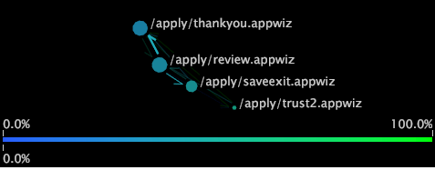

# Tipi di mappe di processo{#types-of-process-maps}

Informazioni sui diversi tipi di mappe di processo.

## Mappe di processo 2D {#section-ea7fbdb80b1b44aebcd9e4090b6540bf}

Le mappe di processo bidimensionali forniscono una visualizzazione bidimensionale dell&#39;attività tra gli elementi dimensionali. La dimensione di un nodo in una mappa di processo 2D è proporzionale al valore della metrica associata a tale nodo. Inoltre, sia lo spessore che l&#39;intensità di una freccia tra due nodi sono proporzionali alla media dei valori della metrica per tali nodi.

All&#39;interno di una mappa di processo 2D, potete eseguire una delle seguenti operazioni:

* Selezionare, spostare, rimuovere ed etichettare i nodi
* Effettuare le selezioni
* Salva dimensioni
* Creare altre visualizzazioni
* Attivare i collegamenti colore
* Visualizzare le quantità delle metriche
* Aggiungere i callout

La mappa di processo 2D nell&#39;esempio seguente mostra i nodi corrispondenti ai nomi dei filmati. Ogni nome del filmato è un elemento della dimensione Filmato, definita in un set di dati costituito da dati del filmato. La dimensione Filmato è la dimensione di base per questa mappa di processo.

Nell&#39;esempio, le dimensioni di ciascun nodo e lo spessore e l&#39;intensità di ciascuna freccia sono proporzionali alla metrica Valutazioni, ossia il conteggio delle valutazioni ricevute da un filmato. Di conseguenza, un filmato con un nodo grande, come il Giorno *dell&#39;* indipendenza, ha più valutazioni di un filmato con un nodo piccolo, ad esempio *Orizzonte* evento. Potete anche vedere che più spettatori di film hanno valutato *Independence Day* prima di *Cold Mountain* che hanno valutato gli stessi film nell&#39;ordine opposto. Si noti che le frecce non indicano che gli utenti hanno valutato *Independence Day* e poi valutato *Cold Mountain* subito dopo, o viceversa. I visualizzatori potrebbero aver valutato altri filmati nel mezzo, ma questi filmati non vengono visualizzati su questa mappa.

## Mappe metriche 2D {#section-a9b846fc71224058918fbc378315effe}

Le mappe metriche bidimensionali sono un tipo di mappa di processo 2D che posiziona i nodi in base al valore di una particolare metrica. In molti casi, la metrica utilizzata con la mappa metrica 2D è Conversione o Mantenimento. Le mappe di conversione e fidelizzazione consentono di comprendere quali passaggi nei processi dei canali rivolti ai clienti influenzano la conversione e la fidelizzazione dei clienti.

>[!NOTE]
>
>La metrica utilizzata con una mappa metrica 2D deve essere espressa come percentuale.

In una mappa delle metriche di conversione, i nodi con conversione dello 0% vengono tracciati a sinistra del grafico, mentre le pagine con conversione del 100% vengono tracciate a destra. L&#39;attività tra i nodi viene visualizzata, rendendo più semplice vedere quali passi di un processo determinano una conversione maggiore o minore e quali passaggi determinano l&#39;abbandono. Un&#39;analisi di conversione dei processi è un modo efficace per confrontare i processi o confrontare diverse implementazioni dello stesso processo.

Allo stesso modo, le mappe di conservazione mostrano gli elementi con un tasso di mantenimento dello 0% a sinistra del grafico e gli elementi con un tasso di mantenimento del 100% a destra. È possibile visualizzare il tasso di mantenimento di ciascun nodo sulla mappa, che consente di determinare quali elementi influenzano i clienti da restituire.

>[!NOTE]
>
>Non è possibile spostare i nodi sulle mappe metriche 2D in orizzontale. Le mappe metriche sono progettate per posizionare i nodi da sinistra a destra in base ai loro valori delle metriche.

## Mappe di processo 3D {#section-80acb63ea0994af1af7faef3c6264e51}

Le mappe di processo tridimensionali forniscono una visualizzazione tridimensionale dell&#39;attività tra gli elementi dimensionali. L&#39;altezza di una barra in una mappa di processo 3D è proporzionale al valore della metrica associata a tale nodo. Come per le mappe di processo 2D, sia lo spessore che l&#39;intensità dei connettori tra due nodi sono proporzionali alla media dei valori della metrica per tali nodi. All&#39;interno di una mappa di processo 3D, potete effettuare una delle seguenti operazioni:

* Selezionare, spostare, rimuovere ed etichettare i nodi
* Effettuare le selezioni
* Salva dimensioni
* Creare altre visualizzazioni
* Attivare i collegamenti colore

La mappa del processo 3D nell&#39;esempio seguente mostra i nodi corrispondenti alle pagine di un sito Web. Ogni pagina è un elemento della dimensione Pagina, definita in un set di dati composto da dati sul traffico Web. La dimensione Pagina è la dimensione di base per questa mappa di processo.

Nell&#39;esempio, l&#39;altezza di ciascuna barra e lo spessore e l&#39;intensità di ciascun connettore sono proporzionali alla metrica Sessioni, un conteggio delle sessioni in cui sono state visualizzate le pagine. Pertanto, una pagina con una barra alta, come /faq/all/FAQ, è stata visualizzata durante più sessioni rispetto a una pagina con una barra breve, ad esempio /vs/demo. I collegamenti tra due pagine non indicano che una pagina è stata visualizzata immediatamente prima o dopo un&#39;altra durante una determinata sessione. È possibile che durante la stessa sessione siano state visualizzate altre pagine, ma queste non vengono visualizzate su questa mappa.
