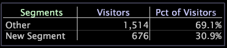

# Creazione di dimensioni di segmento{#create-a-segment-dimensions}

Per creare una dimensione di segmento, si inizia effettuando una selezione all’interno di un’area di lavoro, quindi si aggiunge il segmento a una visualizzazione.

**Per creare una dimensione di segmento**

1. Aggiungi una visualizzazione dei segmenti all’area di lavoro. Ad esempio:

   

1. Aggiungi al tuo workspace delle visualizzazioni che desideri usare per definire il segmento, quindi seleziona i segmenti desiderati.
1. Nella visualizzazione dei segmenti, fai clic con il pulsante destro del mouse sull’etichetta del segmento dopo il quale vuoi aggiungere il nuovo segmento e fai clic **[!UICONTROL Add Segment]**.

   >[!NOTE]
   >
   >Per creare un nuovo primo segmento, fai clic con il pulsante destro del mouse sull’ **[!UICONTROL Segments]** etichetta e fai clic su **[!UICONTROL Add Segment]**.

   

   Nella visualizzazione viene visualizzato un nuovo segmento (denominato Nuovo segmento). Il segmento Altro rappresenta tutti i dati non inclusi nei segmenti definiti: è effettivamente la differenza tra i dati del dataset e i dati del segmento.

1. Fai clic con il pulsante destro del mouse sul segmento appena creato e fai clic su **[!UICONTROL Rename Segment]**.
1. Inserisci un nome descrittivo per il nuovo segmento nel campo del nome.

   >[!NOTE]
   >
   >Se un valore di metrica, come un particolare visitatore in [!DNL Site], soddisfa i criteri di più segmenti, il valore di metrica viene incluso solo nel primo segmento elencato che corrisponde.

**Per salvare la dimensione del segmento**

1. Fai clic con il pulsante destro del mouse sull’etichetta Segmenti e fai clic su **[!UICONTROL Save Dimension]**. Viene [!DNL Save Dimension As] visualizzata la finestra. Il percorso di salvataggio predefinito è la cartella Utente\*nome profilo*\Dimensions.
1. Nel [!DNL File name] campo, digitate un nome descrittivo per i segmenti che state salvando come dimensione e fate clic su **[!UICONTROL Save]**.

Puoi accedere alla dimensione del segmento ogni volta che lavori con una visualizzazione. È inoltre possibile esportare i dati associati agli elementi della dimensione salvata utilizzando la funzione di esportazione del segmento.

Per ulteriori informazioni sulla funzione di esportazione dei segmenti e istruzioni per configurarla in base alle esigenze, consulta [Configurazione dei segmenti per l’esportazione](../../../../home/c-get-started/c-exp-data-seg-exp/t-config-sgts-expt.md#task-8857f221fa66463990ec9b60db6db372).
