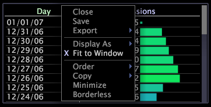

# Adattare dati a una finestra{#fit-data-to-a-window}

L’opzione Adatta a finestra consente alle colonne di dati di una tabella di espandersi o ridursi automaticamente per adattarsi alla finestra ogni volta che la si ridimensiona.

Quando [!DNL Fit to Window] è disattivato, le colonne di dati devono essere ridimensionate manualmente.

**Per attivare o disattivare l&#39;opzione di adattamento alla finestra**

* Fai clic con il pulsante destro del mouse sul bordo superiore della visualizzazione e fai clic su **[!UICONTROL Fit to Window]**.

   

Quando è attivata, una X viene visualizzata a sinistra di [!DNL Fit to Window].

**Ridimensionamento manuale delle colonne di dati**

* Fare clic sulla linea che divide due colonne di dati (nell’area dell’asse superiore) e trascinare fino alla larghezza desiderata.

   
