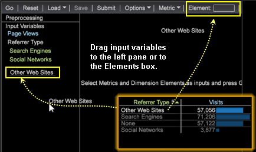
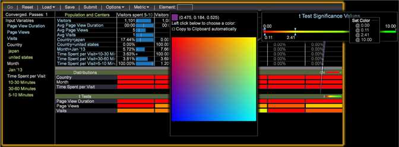

# Creazione di cluster{#building-clusters}

Seleziona le variabili di input, il numero di cluster e una popolazione target (se necessario) per definire i cluster nel set di dati.

**Creazione di cluster**

1. Aprite il **[!UICONTROL Cluster Builder]**.

   Fai clic su **Visualizzazione** > Analisi **predittiva** > **Clustering** > **Cluster Builder**.

   

1. Selezionare le variabili di input.

   * Aggiungere metriche all&#39; **[!UICONTROL Input Variables]** elenco selezionandole dal **[!UICONTROL Metric]** menu nella barra degli strumenti.

      

   * Aggiungere elementi dimensionali all&#39; **[!UICONTROL Input Variables]** elenco trascinandoli dalla tabella di una dimensione.

      Premere **[!UICONTROL Ctrl + Alt]** e trascinare gli elementi dimensionali selezionati nell&#39; **[!UICONTROL Input Variables]** elenco o nella **[!UICONTROL Element]** casella nella barra degli strumenti.

      
   Per impostazione predefinita, il clustering viene eseguito sull&#39;intero set di dati. Nel **[!UICONTROL Preprocessing]** riquadro a sinistra sono visualizzate tutte le variabili di input.
1. Utilizzate il **[!UICONTROL Options]** menu per selezionare il numero desiderato di cluster.

   

1. Se desiderate raggruppare un sottoinsieme di visitatori nel set di dati, potete definire un filtro per la popolazione.

   

   Per iniziare, definisci il sottoinsieme desiderato utilizzando le selezioni in Workspace o utilizzando il **[!UICONTROL Filter Editor]**. Dopo aver selezionato il sottoinsieme desiderato, impostate la popolazione di destinazione nel **[!UICONTROL Options]** menu. Si consiglia di assegnare al gruppo di destinazione un nome identificativo.

   Il **[!UICONTROL Options]** menu dispone anche di impostazioni per controllare il numero massimo di passate e la soglia accettabile per la convergenza centrale.

1. Dopo aver configurato input e opzioni, fate clic sul pulsante **Vai** per eseguire il clustering localmente o premete **[!UICONTROL Submit]** per inviare l&#39;attività al Predictive Analytics Server. Le invii al server salveranno la dimensione risultante nel dataset al termine della convergenza.

   Se eseguito localmente, verrà visualizzato lo spostamento di Cluster Builder attraverso quattro fasi di clustering canoy mentre definisce i centri intelligenti basati sugli input.

   Una volta che i centri dei cluster cessano di cambiare più della soglia di convergenza specificata, la dimensione cluster viene convertita e il Generatore cluster visualizza informazioni aggiuntive su quanto rilevante era un input per ciascun cluster.

1. Personalizzare i cluster.

   Facendo clic con il pulsante destro del mouse sulla barra dei colori delle statistiche si apre un menu di scelta rapida che consente di personalizzare le soglie di rilevanza e, nel caso delle distribuzioni degli elementi di dimensione, di scegliere quale test viene visualizzato.

   

   Gli input delle metriche forniscono un test t per ciascun cluster, mentre gli input degli elementi dimensionali forniscono tre test di distribuzione (chi al quadrato, una statistica U dell&#39;entropia e la statistica V di Cramer) per ciascun cluster.

   >[!NOTE]
   >
   >Se durante la convergenza si aggiungono o si rimuovono gli input, il processo si interrompe finché non si preme di nuovo **Vai** .

   Dopo aver creato i cluster, potete aprire il selettore colore per assegnare i colori per diversi risultati di distribuzione.

   

1. Con la dimensione cluster convertita, puoi aggiungere metriche alla tabella e effettuare selezioni come normali. Puoi anche fare clic con il pulsante destro del mouse sui nomi degli elementi (Cluster 1, Cluster 2, ecc.) per aprire il menu di scelta rapida e rinominarli in modo più significativo.

   

1. Se desiderate utilizzare questa dimensione cluster in altre visualizzazioni, potete **[!UICONTROL Save]** utilizzarla localmente o **[!UICONTROL Submit]** sul server.

Se desiderate eseguire nuovamente la convergenza o visualizzare la rilevanza degli input, Cluster Builder può caricare anche le dimensioni del cluster esistenti.

>[!TIP]
>
>Se questa opzione è selezionata, **[!UICONTROL Reset]** verranno rilasciate tutte le variabili di input e sarà disponibile una visualizzazione vuota per il generatore di cluster per definire nuovi cluster.

