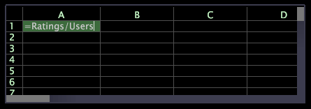

# Fogli di lavoro{#worksheets}

Workbench dati fornisce fogli di lavoro per la creazione di filtri e metriche ad hoc per la visualizzazione corrente.

Un foglio di lavoro è simile a un normale foglio di calcolo, ma a differenza di un foglio di calcolo, ogni cella contenente una formula può definire una metrica.

A differenza delle metriche create con l&#39; [!DNL Metric Editor], le metriche definite utilizzando i fogli di lavoro non vengono visualizzate nei menu delle metriche, ma possono essere salvate e incluse in nessuna delle aree di lavoro.

Per informazioni su [!DNL Metric Editor], consultate [Creazione e modifica di metriche](../../../../home/c-get-started/c-admin-intrf/c-prof-mgr/c-drvd-mtrcs.md#concept-e41723b342a849309874b26232224a40)derivate.
